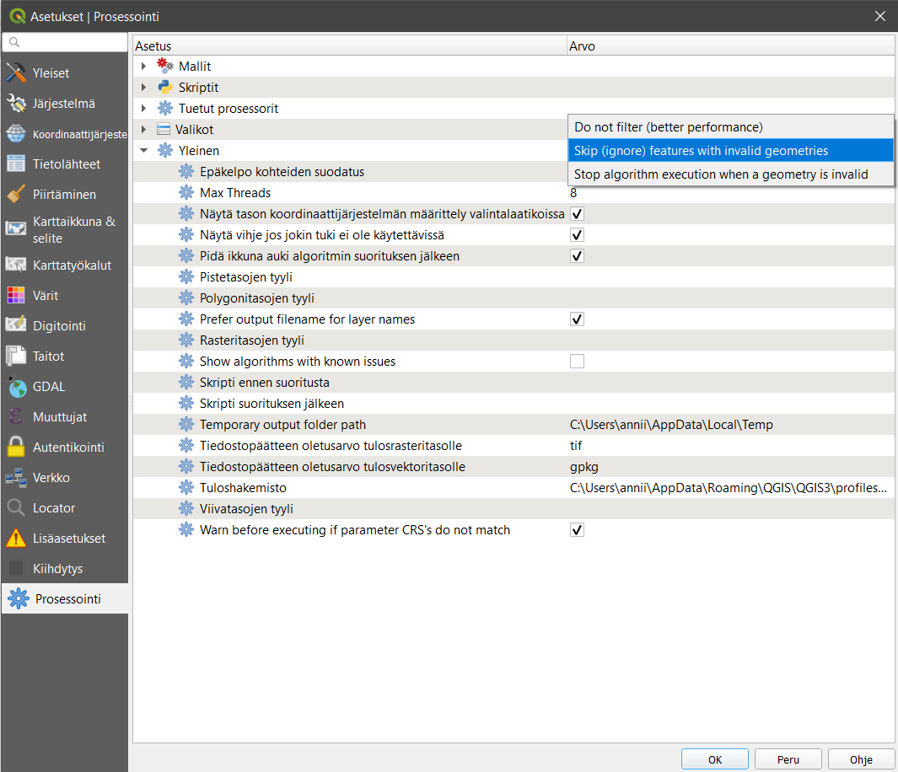
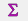
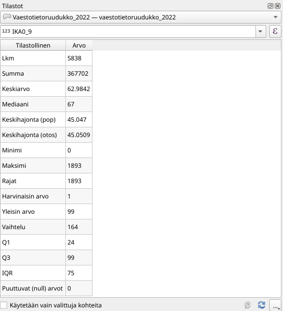
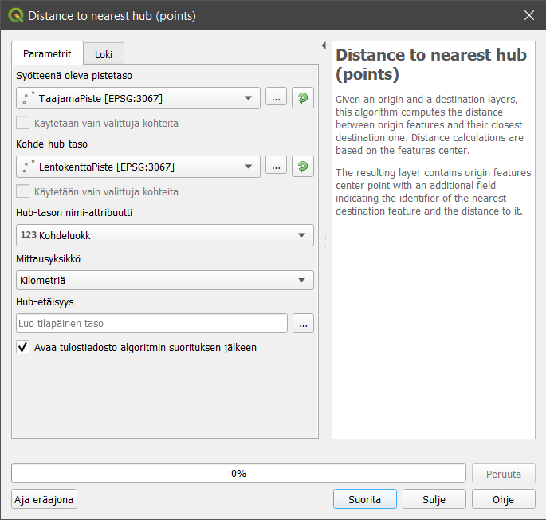
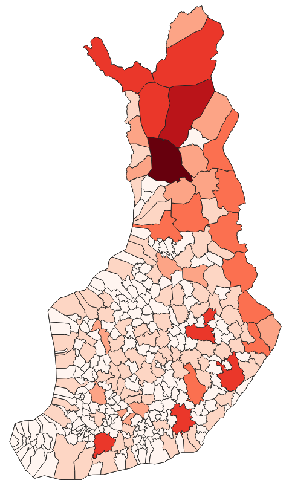
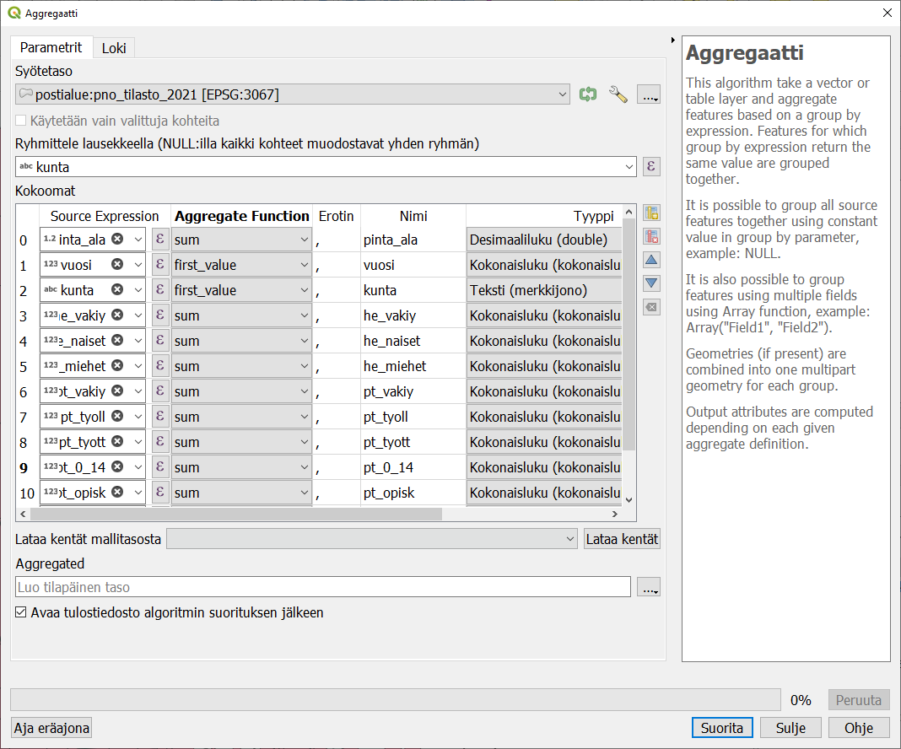

# Harjoitus 3: Vektorianalyysi

**Harjoituksen sisältö**

Harjoituksessa tutustutaan muutamiin hyödyllisiin tilasto- ja vektorianalyysityökaluihin, opitaan yhdistämään aineistoja ja laskemaan uusia ominaisuustietokenttiä.

**Harjoituksen tavoite**

Koulutettava osaa etsiä ja hyödyntää tarkoitukseensa sopivia analyysityökaluja.

**Arvioitu kesto**

30 minuuttia.

## Valmistautuminen

Avaa uusi QGIS-projekti (**Projekti \> Uusi**) ja tallenna se nimellä "**QGIS-harjoitus 3**". Avaa projektiisi kurssihakemiston kansiosta seuraavat aineistot:

-   **TaajamaPiste.shp**

-   **LentokenttaPiste.shp**

-   **HallintoAlue.shp**

-   **HSY_vaestotietoruudukko_2019.gpkg**

## Vektorianalyysi

Tässä harjoituksessa tehdään joitakin vektorianalyyseja ja perehdytään monipuolisten analyysityökalujen maailmaan. Yleisimmin käytetyt analyysityökalut löytyvät päävalikon kohdasta **Vektori**, mutta kattavimman kokoelman QGISin, GRASSin, SAGAn ja GDALin analyysityökaluja saat näkyviin valitsemalla päävalikosta **Prosessointi \> Työkalut**. Tämä avaa Prosessointityökalut-paneelin QGISiin (yleensä oikealle puolelle käyttöliittymää), jonka kautta voit hakea erilaisia analyysejä.

::: hint-box
Psst! QGIS kehittyy jatkuvasti ja suomennos ei aina pysy kaikkien uusien työkalujen perässä. Työkalun nimi saattaa joskus löytyä vain englanninkielisenä.
:::

Useimmat QGISin vektori- ja rasterianalyysityökalut toimivat samalla periaatteella: käyttäjä valitsee projektin tasoista haluamansa lähtötiedot ja muokkaa erilaisia parametreja tarvittaessa. Lopulta analyysin tuloksena syntyy uusi tulostaso. Käyttäjä voi valita tallennetaanko tulos **tilapäiseksi tasoksi** vai **pysyväksi tasoksi**. Tilapäiset tulostasot ovat olemassa auki olevassa QGIS-projektissa vain siihen saakka, kun ohjelma suljetaan. Tilapäisen tulostason voi halutessaan tallentaa myöhemminkin pysyväksi tasoksi. Suurilla aineistoilla jotkin analyysiprosessit voivat kestää pitkään. Tällöin on hyvä valita vaihtoehto **Aja eräajona**, jolloin ohjelman käyttöä voi jatkaa, ja analyysin laskentaan käytetään vain osa tietokoneen kapasiteetista.

Joskus käytettävissä aineistot eivät ole laadultaan täydellisiä. Esimerkiksi virheelliset geometriat eivät aina näy aineistosta päällepäin, mutta voivat estää geometriaan perustuvien analyysien suorittamisen. Tätä voi estää valitsemalla **Prosessointityökalut-paneelista** seuraava vaihtoehto: Asetukset  \> Prosessointi \> Yleinen \> Epäkelpo kohteiden suodatus **\> Ohita kohteet joilla on virheellinen geometria**.

## Tilastot

QGISin **Tilastot-paneelilla** voit tarkastella aineistosi arvojen tilastollista jakaumaa. Saat **Tilastot-paneelin** näkyviin QGISin käyttöliittymään klikkaamalla Näytä tilastollinen yhteenveto -painiketta  tai valitsemalla päävalikosta **Näytä \> Paneelit \> Tilastot**. Avautuvassa ikkunassa valitse pudotusvalikosta **HSY_vaestotietoruudukko_2019-taso** ja sen jälkeen yksi tason attribuuttikenttä. Tarkastele esitettäviä tilastollisia tunnuslukuja. Voit myös valita aineistosta vain osan, jonka tilastoja haluat tarkastella. Valitse osa aineiston ruuduista joko kartalta tai attribuuttitaulusta, ja klikkaa **Tilastot-paneelin** ruutu **Käytetään vain valittuja kohteita** aktiiviseksi.

## Valinta toisen tason sijainnin perusteella

Valitse **Hallintoalue-tasosta** yksi pääkaupunkiseudun kunta (esim. Espoo). Avaa päävalikosta **Vektori \> Tutkimuksen työkalut \> Valitse sijainnin perusteella**. Aseta parametrit: valitse ne väestötietoruudukon kohteet, jotka leikkaavat HallintoAlue-tason valittujen kohteiden kanssa. Klikkaa **Suorita**.

Nyt voit katsella **Tilastot-paneelissa** Espoon alueen väestötietoruutujen tilastoja.

**Tilastot-paneeli** voi näyttää myös muita kuin suoraan attribuuttitaulussa näkyviä lukuja. Lausekkeen muokkaus -toiminnolla  voit laatia monimutkaisempia tilastollisia tunnuslukuja, vaikkapa laskea asukastiheyden asukasluvun ja alueen koon perusteella.

## DataPlotly-lisäosa

QGISin **DataPlotly-lisäosa** piirtää aineistostasi hajontakuvaajia, pylväsdiagrammeja ja monia muita datavisualisoinnista tuttuja esityksiä. Etsi DataPlotly **Lisäosat-valikosta** ja asenna se. Asennuksen jälkeen voit käynnistää sen **Lisäosat-valikosta**.

Laadi **Scatter Plot -kuvaaja Väestötietoruudukko-aineiston** kentistä **ASUKKAITA** ja **ASVALJYYS**. Klikkaa alareunasta **Create Plot** luodaksesi kuvaajan.

Jos palaat **Asetukset-välilehdelle** muokkaamaan kuvaajaa ja klikkaat **Update Plot**, uusi kuvaaja lisätään edelliseen. Valitse **Clean Plot Canvas**, jos haluat kokonaan uuden kuvaajan.

Klikkaamalla yhtä kuvaajan kohdetta sitä vastaava ruutu korostuu karttaikkunassa. Näin näet helposti esim. PK-seudun väkirikkaimman väestötietoruudun sijainnin. Jos valitset kuvaajasta osan piirtämällä hiirellä laatikon, kuvaaja zoomautuu kyseiselle alueelle. Tuplaklikkaus palauttaa koko aineiston näkyviin. 

## Kohteiden etäisyys toisen tason pisteistä

Esimerkkinä vektorianalyysistä lasketaan kaikille taajamille etäisyys lähimpään lentokenttään. Etsi **Prosessointityökalut-paneelista** työkalu **Distance to nearest hub (points)** ja avaa se tuplaklikkauksella. Laita avautuvaan ikkunaan seuraavat parametrit:

Klikkaa sitten **Suorita**. Projektiisi syntyy uusi taso, jonka geometriat vastaavat lähtöaineistona ollutta **TaajamaPiste-tasoa**. Avaa sen attribuuttitaulu: on syntynyt uusi kenttä nimeltä **HubDist**, joka ilmoittaa etäisyyden lähimpään lentokenttään (kilometreinä). Nyt voimme vaikkapa visualisoida taajamat etäisyyden perusteella tai etsiä ne taajamat, jotka ovat kaikista kauimpana lentokentästä. Toinen samankaltainen prosessointityökalu laskee viivamaisten kohteiden etäisyydet piste-hubeihin.

## Pisteiden lukumäärä

Seuraavaksi lasketaan kunkin kunnan sisällä olevien taajamapisteiden lukumäärä. Valitse ylävalikosta **Vektori \> Analyysit \> Laske polygonin sisällä olevien pisteiden lkm**. Anna taas lähtöaineistot: **HallintoAlue** ja **TaajamaPiste**. Lue myös prosessin kuvaus dialogi-ikkunasta: voit painottaa laskuria jollain pisteaineiston attribuutilla tai laskea pisteaineistossa esiintyvien eri luokkien määrän. Huomaa, että voit myös asettaa uuden lukumäärä-kentän nimen. Klikkaa **Suorita**. Eniten taajamia on Lapin suurissa kunnissa, erityisesti Rovaniemellä. Syntyneen **NUMPOINTS-kentän** perusteella voit nyt tehdä vaikka teemakartan.

## Aggregointi ja sulautus

**Aggregointi-työkalulla** voidaan "leipoa" yhteen kohteet, joilla on jokin yhteinen ominaisuustieto ja laskea samalla muista ominaisuustiedoista yhteisiä tunnuslukuja. 

Lisää itsellesi WFS-yhteys Tilastokeskuksen Paavo-postinumeroalueaineistoon:

<http://geo.stat.fi/geoserver/postialue/wfs?version=1.0.0>

Lisää projektiisi taso **Paavo-tilastoaineisto ja -postinumeroalueet 2021**

Tutki tason ominaisuustietoja. Tilastossa on postinumeroaluekohtaiset tarkat tilastot mm. asukkaiden ikäjakaumasta, koulutusasteesta jne. Voit tutustua aineiston kuvaukseen täällä: <https://www.stat.fi/static/media/uploads/tup/paavo/paavo2021_pitkakuvaus_fi.pdf>

Muodostetaan postinumeroalueiden perusteella kuntapolygonit ja lasketaan niille kuntakohtaiset tilastot. Olemme erityisen kiinnostuneita asukkaiden pääasiallisesta toiminnasta (kategoria PT). Avaa **Prosessointityökalut** - valikosta **Aggregaatti**.

Valitse syötetaso ja ryhmittele Kunta-kentän perusteella. Kokoomat -ikkunassa voit määritellä, mitä kaikkia ominaisuustietoja uuteen, alueet yhdistävään tasoon viedään, ja miten ne lasketaan muodostaja-alueiden arvojen perusteella. Poista tarpeettomat kentät  -painikkeella ja valitse säilytettäviin kenttiin oikea muodostajalauseke. Huomaa, että voit myös määritellä, mikä on uusien kenttien tyyppi.

Syntyneet kuntapolygonit saavat määrittelemäsi ominaisuustiedot. 

Huomaa, että postinumeroalueet eivät aina täysin noudata kuntarajoja, joten yhdistelmä ei ole täydellinen. Myöskään aineiston tunnusluvut he_vakiy (väkiluku yhteensä) ja pt_vakiy (pääasiallinen toiminta, väkiluku yhteensä) eivät täsmää!

Jos et ole kiinnostunut ominaisuustiedoista, vaan haluat vain sulauttaa geometrioita yhteen, yksinkertaisempi työkalu on **Sulauta (dissolve)**. Se muodostaa samanlaisen omainaisuustietotaulukon kuin lähtöaineistossa, mutta valitsee vain satunnaisesti jonkin muodostajan tiedot kaikkiin kenttiin.

## Uusien kenttien laskeminen

Olemassa olevien attribuuttikenttien perusteella voi laskea uusia. Tähän käytetään **Kentän arvojen laskin** -työkalua . Lasketaan äsken muodostetulle aggregoidulle kunta-aineistolle poligonigeometrian ja asukasluvun perusteella asukastiheys. 

## Päivittyvät arvot

Kentän arvojen laskin laskee arvot annetulla kaavalla olemassa olevien tietojen perusteella. Se on kuitenkin kertaluonteinen toimenpide, ja jos myöhemmin jokin muodostajana olleista arvoista muuttuu, ei kenttä päivity.

Kun halutaan mahdollistaa kentän arvojen päivittyminen lähtötietojen muuttuessa, asetetaan tason **ominaisuudet** -ikkunan **Attribuuttilomake**-välilehdellä oletusarvo. Syötä **Oletusarvo** -kenttään sama lauseke, jolla laskit kentän arvon alunperin, ja ruksi kohta **Käytä oletusarvoa päivityksessä**.

Testaa lausekkeen toimintaa. Tutki jonkin polygonin ominaisuustietoja, muokkaa sitten polygonin geometriaa ja tarkista, muuttuuko asukastiheys.

## Etsi omia analyysityökaluja

Tutustu **Prosessointityökalut-paneelin** toimintoihin. Se mm. muistaa viimeksi käyttämäsi työkalut. Työkalun nimen edessä oleva symboli kertoo, minkä ohjelman valikoimaan työkalu kuuluu. Tee joitakin hakuja etsiäksesi itseäsi kiinnostavia työkaluja. Huomaa, että jotkin analyysiprosessit ovat saatavilla usean eri ohjelman versiona.

Kun olet valmis, tallenna projektitiedosto kurssihakemistoon pikanäppäimellä **CTRL + T** tai päävalikosta **Projekti \> Tallenna**.

::: hint-box
Psst! Koulutuksen jälkeen saat henkilökohtaista tukea Gispon tukipalvelusta. Lähetä kysymyksesi tai kommenttisi osoitteeseen tuki\@gispo.fi!
:::
