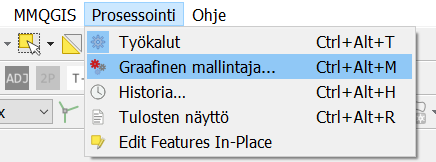
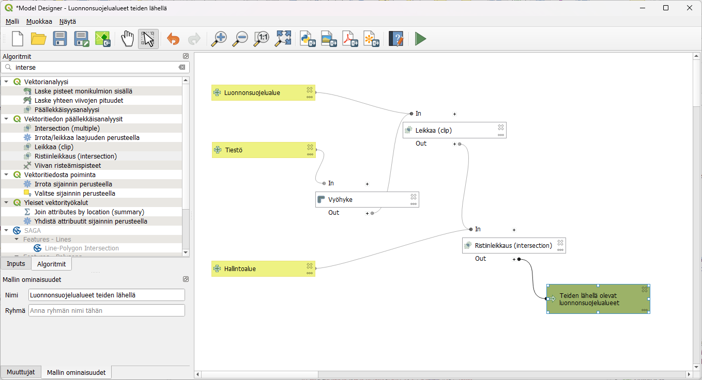
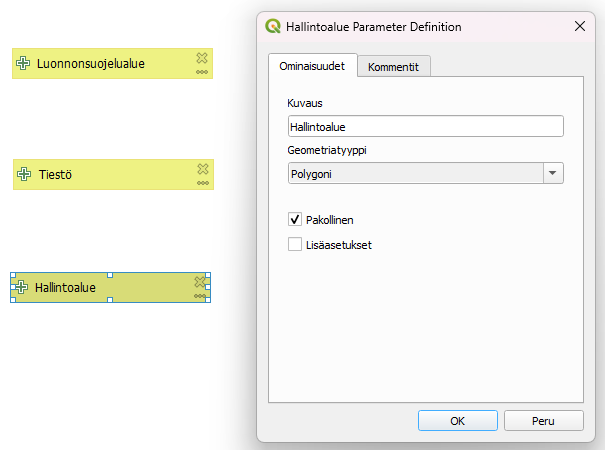
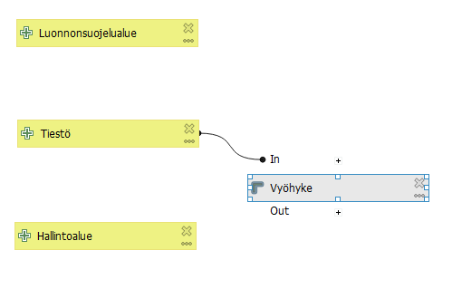
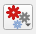
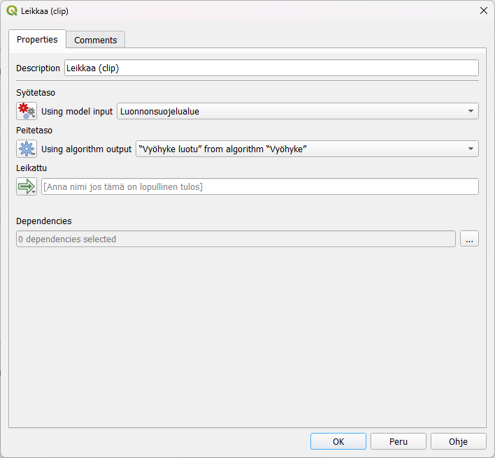

# Harjoitus 4: Graafinen mallintaja

**Harjoituksen sisältö**

Harjoituksessa tutustutaan graafiseen mallintajaan. Mallintajalla laaditaan prosessi ja se tallennetaan myöhempää käyttöä varten.

**Harjoituksen tavoite**

Koulutettava oppii laatimaan monivaiheisen analyysiprosessin graafisen mallintajan avulla ja oppii käyttämään aiemmin ladattuja prosessimalleja.

**Arvioitu kesto**

30 minuuttia.

## Valmistautuminen

Avaa uusi QGIS-projekti (**Projekti \> Uusi**) ja tallenna se nimellä "**QGIS-harjoitus 4**". Avaa projektiisi kurssihakemistosta aineistot 

-   **TieViiva.gpkg**

-   **kunnat2024.gpkg**

-   **NaturaKohde.gpkg**

## Graafisen mallintajan toiminnot

Graafisella mallintajalla voit automatisoida ja tallentaa usein toistuvia, monivaiheisia analyysiprosesseja. Prosessin voi jakaa muille käyttäjille, ja sitä käytettäessä valitaan lähtöaineistot aina uudelleen. Prosessinmallintaja avataan yläpalkin valikosta **Prosessointi \> Graafinen mallintaja...** 
Harjoituksessa käytettävässä aineistossa on muutamia geometriavirheitä, joten varmista, että olet laittanut QGISin asetuksista päälle epäkelpojen kohteiden suodatuksen edellisen harjoituksen alun ohjeiden mukaisesti.

Aukeavassa ikkunassa on vasemman reunan paneelissa kaksi välilehteä: **Inputs** ja **Algoritmit**. Näistä valitaan prosessin lähtötiedot ja työkalut, ja ne viedään kaaviomaisen esityksen laatikoiksi ikkunaan raahaamalla tai tuplaklikkaamalla.

## Prosessin laatiminen ja testaus

Tehdään graafisessa mallintajassa prosessi, jossa lasketaan suojelualueiden lähellä olevat tiet. Prosessissa tarvitaan useampia eri vektorityökaluja, joten mallintajalla saat tehtyä helposti toistettavan ja  myöhemminkin muokattavan prosessin ja työkalun.

Anna ensimmäiseksi prosessillesi nimi, esimerkiksi "Luonnonsuojelualueet teiden lähellä". Valitse **Inputs-välilehdeltä Vektoritaso** ja anna sille nimeksi **Luonnonsuojelualueet**. Aseta tason geometriatyypiksi **Polygoni** ja ruksi **Pakollinen**. Lisää vielä kaksi vektoritasoa, jotka voit nimetä **Hallintoalueet** ja geometriatyypiksi **Polygoni**. Toiselle uudelle tasolle voit antaa nimeksi **Tiestö** ja antaa geometriaksi **Viiva**.

Tehdään ensin tiestölle vyöhykkeet, joiden alueelta etsimme niille osuvia luonnonsuojelualueita. Siirry nyt **Algoritmit-välilehdelle**. Etsi työkalu **Vyöhyke**, lisää se malliin ja anna sille syötetasoksi **Tiestö** ja vyöhykkeen etäisyydeksi 200 m. Koska tiestö koostuu pienistä risteyksiin päättyvistä osioista, sulautetaan vielä vyöhykkeet toisiinsa. Valitse vyöhykkeen asetuksista **Yhdistä päällekkäiset** -osioon Kyllä. Huomaa, että voit siirrellä **Input-** ja **Algoritmilaatikoita** ja järjestää ne siistiksi prosessiksi.

Seuraavaksi leikataan luonnonsuojelualueet tehdyllä vyöhykkeellä. Etsi työkalu **Leikkaa (clip)**. Valitse syötetasoksi Luonnonsuojelualue. Peitetasoon vaihda tason asetuksista  vaihtoehdoksi **Algorithm output** ja tasoksi Vyöhyke luotu.

Lopuksi lisätään tieden lähellä oleviin luonnonsuojelualueisiin tieto alueen maakunnasta. Etsi siis vielä työkalu **Ristiinleikkaus (intersection)**, jolla saamme yhdistettyä tiedot hallintoalueista. Valitse syötetasoon asetuksista  taas **Algorithm output** ja tasoksi Leikattu. Peitetasoksi tulee Hallintoalue. Koska tämä on mallissa lopullinen tulos, lisää lopputuloksen nimi ristiinleikkauksen asetuksissa  jälkeen. Voit nimetä tason esimerkiksi: Teiden lähellä olevat luonnonsuojelualueet.

Testaa malliasi klikkaamalla **Suorita malli -painiketta** . Käynnistyvä prosessi kysyy lähtöaineistoja: valitse kutakin syötetasoa vastaava taso, niistä jotka lisäsit aiemmin projektiisi. Kun klikkaat **Suorita**, laatimasi prosessi käynnistyy ja tulostiedosto ilmestyy tasoluetteloon. Tallenna toimiva prosessi -painikkeella graafisen mallintajan ikkunassa. Tallenna myös QGIS-projektisi.

Valmiista tulostasosta voit laskea vielä esimerkiksi teiden varsille osuvien suojelualueiden pinta-alan avaamalla attribuuttitaulukon ja lisäämällä sinne uuden sarakkeen. Pinta-aloja voit tarkastella tilastollisesti maakunnittain esimerkiksi Prosessointityökaluista löytyvällä **Tilastotiedot ryhmiteltynä luokittain**. Valitse kentäksi, josta tilastot lasketaan juuri tekemäsi pinta-ala ja kategoriatiedon sisältävä kenttä -listasta esimerkiksi **Maaku_ni1**. Paina Suorita. Syntyneestä taulukkoaineistosta voit tarkastella pinta-alan tärkeimpiä tunnuslukuja maakunnittain.

## Tallennetun prosessin käyttöönotto

Avaa uusi, tyhjä QGIS-projekti. Saat hyödynnettyä myös muiden tekemiä malleja graafisen mallintajan kautta. Edellisessä harjoituksessa laskimme vaarallisia tieristeyksiä Uudellamaalla. Kurssihakemistosta löytyy samaan prosessimalli. Lisää se itsellesi Prosessointityökaluista painamalla  ja **Lisää malli työkaluihin**. Navigoi kurssihakemistoosi ja lisää Vaaralliset tieristeykset.model3.

Avaa tallennetut mallisi Prosessointityökalupalkista Mallit-kohdasta. Voit valita lähtöaineistot kurssihakemistosta suoraan  -kohdasta, koska projektissa ei ole mitään tasoja avoinna. Kurssihakemistossa on valmiina vuoden 2021 tieliikenneonnettomuudet, joita voit hyödyntää. Paina vielä **suorita** 

Onnistunut prosessi luo uuden tulostason, jossa on samalla tavalla vaaralliset tieristeykset pistetasona. Lähtötietona olleet aineistot eivät avaudu QGISiin lainkaan. 

Kun olet valmis, tallenna projektitiedosto kurssihakemistoon pikanäppäimellä **CTRL + T** tai päävalikosta **Projekti \> Tallenna**.

::: hint-box
Psst! Koulutuksen jälkeen saat henkilökohtaista tukea Gispon tukipalvelusta. Lähetä kysymyksesi tai kommenttisi osoitteeseen koulutustuki\@gispo.fi!
:::
