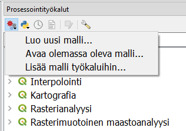
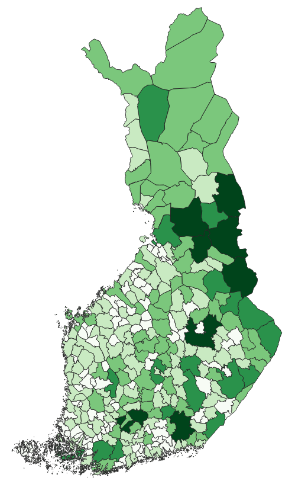

# Harjoitus 4: Graafinen mallintaja

**Harjoituksen sisältö**

Harjoituksessa tutustutaan graafiseen mallintajaan. Mallintajalla laaditaan prosessi ja se tallennetaan myöhempää käyttöä varten.

**Harjoituksen tavoite**

Koulutettava oppii laatimaan monivaiheisen analyysiprosessin graafisen mallintajan avulla ja oppii käyttämään aiemmin ladattuja prosessimalleja.

**Arvioitu kesto**

30 minuuttia.

## Valmistautuminen

Avaa uusi QGIS-projekti (**Projekti \> Uusi**) ja tallenna se nimellä "**QGIS-harjoitus 4**". Avaa projektiisi kurssihakemistosta aineistot 

-   **HallintoAlue.shp**

-   **SuojeluAlue.shp**

## Graafisen mallintajan toiminnot

Graafisella mallintajalla voit automatisoida ja tallentaa usein toistuvia, monivaiheisia analyysiprosesseja. Prosessin voi jakaa muille käyttäjille, ja sitä käytettäessä valitaan lähtöaineistot aina uudelleen. Prosessinmallintaja avataan yläpalkin valikosta **Prosessointi \> Graafinen mallintaja...** 

Aukeavassa ikkunassa on vasemman reunan paneelissa kaksi välilehteä: **Inputs** ja **Algoritmit**. Näistä valitaan prosessin lähtötiedot ja työkalut, ja ne viedään kaaviomaisen esityksen laatikoiksi ikkunaan raahaamalla tai tuplaklikkaamalla.

## Prosessin laatiminen ja testaus

Anna ensimmäiseksi prosessillesi nimi, esimerkiksi "Suojelualueet kunnissa". Valitse **Inputs-välilehdeltä Vektoritaso** ja anna sille nimeksi **Kunnat**. Aseta tason geometriatyypiksi **Monikulmio** ja ruksi **Pakollinen**. Lisää toinenkin vektoritaso, anna sille nimeksi **Suojelualueet**,  geometriatyypiksi **Monikulmio** ja ruksi **Pakollinen**.

Siirry nyt **Algoritmit-välilehdelle**. Etsi työkalu **Painopisteet**, lisää se malliin ja anna sille syötetasoksi **Suojelualueet**. Huomaa, että voit siirrellä **Input-** ja **Algoritmilaatikoita** ja järjestää ne siistiksi prosessiksi.

Lisää seuraava työkalu: etsi algoritmi **Laske polygonin sisällä olevien pisteiden lkm** ja anna sille lähtötasoiksi **Kunnat** (alueet) sekä äsken laskettu **Painopisteet**. Anna lisäksi tulostason nimi.

Nyt mallisi määrittää suojelualueiden painopisteet, laskee kuinka monta pistettä kunkin kunnan sisällä on, ja luo uuden aluemaisen tulostason kunnista, joka sisältää tiedon suojelualueiden lukumäärästä.  

Testaa malliasi klikkaamalla **Suorita malli -painiketta** . Käynnistyvä prosessi kysyy lähtöaineistoja: valitse Kunnat-tasoksi **HallintoAlue** ja Suojelualueet-tasoksi **SuojeluAlue**. Nämä ovat valmiiksi avattuina projektissasi. Kun klikkaat **Suorita**, laatimasi prosessi käynnistyy ja tulostiedosto ilmestyy tasoluetteloon. Tallenna toimiva prosessi -painikkeella graafisen mallintajan ikkunassa. Tallenna myös QGIS-projektisi.

## Tallennetun prosessin käyttöönotto

Avaa uusi, tyhjä QGIS-projekti. Löydät laatimasi prosessin **Prosessointityökalut-paneelista** omalta välilehdeltään.

Avaa äsken luomasi malli ja käynnistä se -painikkeella. Valitse nyt lähtöaineistot -kohdasta, koska projektissa ei ole mitään tasoja avoinna. Valitse kunnat-aineistoksi tällä kertaa kurssihakemistosta **Kunta1000k_2017.shp** ja suojelualueet-aineistoksi **NaturaKohde_ma.shp**. Klikkaa **Suorita**.

Onnistunut prosessi luo uuden tulostason, jossa kuntageometrioilla on lisätietona kunnan sisällä olevien Natura-alueiden lukumäärä. Lähtötietona olleet aineistot eivät avaudu QGISiin lainkaan. 

Tätä prosessia voi siis käyttää minkä tahansa aluemaisten kohteiden painopisteiden laskurina toisten alueiden sisällä. Annoimme tässä harjoituksessa lähtötiedoille melko yksiselitteiset nimet, mutta ne voi myös nimetä yleisemminkin, esim. "rajaavat alueet" ja "sisältyvät alueet".

Kun olet valmis, tallenna projektitiedosto kurssihakemistoon pikanäppäimellä **CTRL + T** tai päävalikosta **Projekti \> Tallenna**.

::: hint-box
Psst! Koulutuksen jälkeen saat henkilökohtaista tukea Gispon tukipalvelusta. Lähetä kysymyksesi tai kommenttisi osoitteeseen tuki\@gispo.fi!
:::
