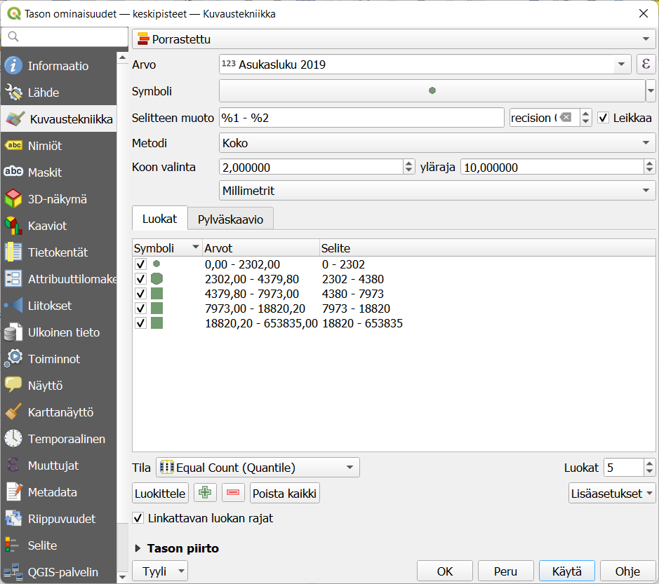
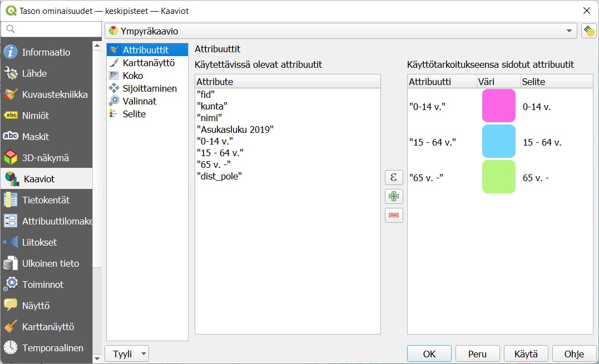
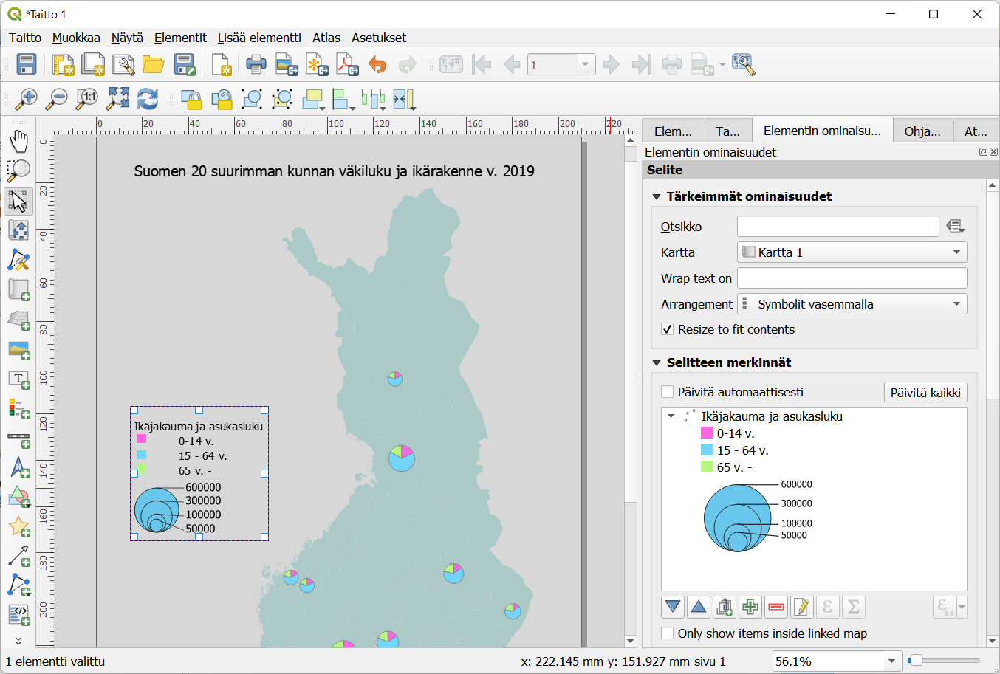

# Harjoitus 5: Python-konsoli

**Harjoituksen sisältö**

Harjoituksessa tutustutaan QGISin toiminnallisuuksien laajentamiseen Python-konsolin avulla.

**Harjoituksen tavoite**

Koulutettava oppii hyödyntämään Python-konsolia ja etsiä verkosta ohjelmointikoodeja siihen.

**Arvioitu kesto**

30 minuuttia.

## Valmistautuminen

Avaa uusi QGIS-projekti (**Projekti \> Uusi**) ja tallenna se nimellä **"QGIS-harjoitus 5"**. Lisää projektiin seuraavat aineistot:

-   **..kurssihakemisto/HSY/HSY_vaestotietoruudukko_2019.gpkg**

## Python-konsolin perusteet

QGISin Python-konsolin avulla voit automatisoida useita paikkatietoprosesseja QGISissä. Käytännössä pystyt nopeuttamaan useiden paikkatietoprosessien toimittamista opiskelemalla Python-ohjelmointikieltä sekä QGIS-kohtaisten PyQGIS-komentojen käyttöä.

Python on ohjelmointikieli, joka on paikkatieto-ohjelmistojen lisäksi kasvavasti käytössä eri toimialoilla. Pythonia kutsutaankin niin sanotusti lingua francaksi, sillä sen käyttötapaukset ulottuvat niin laajalle ja sen käyttöönotto ohjelmointikielenä on verrattain nopeaa. QGISissä Pythonia voi hyödyntää eri tavoilla. Niistä tärkeimmät alla:

-   Python-kielen avulla voidaan **automatisoida** monia paikkatiedon prosessointiin ja analysointiin liittyviä **toimintoja**. Tämä nopeuttaa, helpottaa ja parantaa paikkatiedon käsittelyä.

-   Python-kielen avulla voidaan lisätä **toistettavuutta** paikkatietoprosesseissa. Näin Python-komentoja seuraamalla kuka vain voi toistaa paikkatietoprosessin jälkikäteen.  

-   Python-kielen avulla voidaan tuottaa **QGIS-lisäosia** (eng. plugins) organisaation tai laajempien työprosessien ratkaisemiksi.

-   Python-kielen avulla voidaan tuottaa **prosessointialgoritmeja** (eng. processing algorithms). Näillä algoritmeilla viitataan Python-skripteihin, jotka tallennetaan QGISiin ja niistä tulee omia pientyökaluja esim. paikkatietojen prosessoinnin tehtävien toteuttamiseen.

QGISissa Pythonin käyttö pohjautuu ennen kaikkea QGISin Python-konsoliin, jolla voidaan ajaa Python-komentoja. Avaa konsoli klikkaamalla  tai valikosta menemällä **Lisäosat \> Python-konsoli**.

Konsoli aukenee karttaikkunan alapuolelle.

**Python-konsolissa** voit ajaa normaalia Python-koodia. Syötä ja aja ensimmäiseksi seuraava koodi:

::: code-box
print('Gispo loves FOSS4G')
:::

## Python-skriptien ajaminen: Globe Builder -lisäosan komentojen hyödyntäminen

Käyttötapauksissa, joissa nähdään hyödylliseksi Python-ohjelmointikielen hyödyntäminen QGISissä, voidaan etsiä verkosta hakukoneen avulla (esim. Google) valmiita Python-skriptejä QGISiin.

Ajetaan nyt yksi Python-skripti, niin näet miten Python-skriptejä voi ajaa QGISissä. Tässä haluamme nopeuttaa työprosessia, joten hyödynnämme Python-skriptiä tuottamaan karttavisualisoinnin QGISissä. Olet ehkä jo nähnyt Gispon toteuttaman [Globe Builder -lisäosan](https://github.com/GispoCoding/GlobeBuilder), jota kokeilemme nyt Python-konsolin kautta.

Lisäosaa käytetään pääasiallisesti lisäosan käyttöliittymän avulla. Käyttöliittymässä määritetään valintoja visualisaation tuottamiseksi. Haluamme nyt tuottaa maapallon muotoisen karttavisualisoinnin hyödyntäen Python-skriptiä käyttämättä lisäosan käyttöliittymää. Näin voimme mahdollisesti nopeuttaa toimiamme. Tämä olisi myös hyödyllistä mikäli tekisimme usean iteraation karttavisualisaation toteuttamiseksi tai jos hyödyntäisimme lisäosan toiminnallisuuksia osana jotakin muuta tietojärjestelmää, joka komentopohjaisesti voisi komentaa QGISiä toteuttamaan karttavisualisoinnin. Näin voisimme automatisoida työprosessejamme, minkä lisäksi kuka tahansa voi toistaa komentopohjaisen työprosessimme.

Voimme nähdä haluamme koodin [GitHubista](https://gist.github.com/Joonalai/7b8693ef904df75cb15cb9af0e82c032), mutta se löytyy myös kurssihakemistosta **Muuta-kansion** alta nimellä **globeBuilder.py**. Kyseessä on tekstitiedosto, johon on tallennettu Python-ohjelmointikielellä muutama toiminallisuus GlobeBuilderiin liittyen.

Avaa nyt kyseinen tiedosto QGISissä Python-konsoliin, konsolin koodi-editorin puolelle eli oikealle:

Kyseessä on lista erilaisia Python-komentoja, jotka tallennamme QGISiin ajamalla tekstitiedoston sisällön -painikkeesta. Klikkaa painiketta, joka ajaa koko komentosarjan kertaheitolla:

Aja nyt tiedoston omien ohjeiden (keltaisella) mukaisesti **load_natural_earth_data()-komento** konsolin puolella:

Huomaa: hyödynnettäesi load_natural_earth_data()-komentoa QGIS lataa ikään kuin automaattisesti verkosta datan ja visualisoi sen suoraan QGISissäsi. Näin näemmekin karttanäkymässämme metodin lataaman **Natural Earth -aineiston**:

Kokeile myös lisäosan muita toiminnallisuuksia suoraan Python-konsolista. Tutkittuasi kyseistä tekstitiedostoa löydät useamman eri toiminnallisuuden, joita tutkimalla opit hiukan Pythonin hyödyntämisestä QGISissä. Kokeile esim. vaihtaa karttanäkymän taustaväriä mustaksi:

::: code-box
change_background_color(color=QtCore.Qt.black)
:::

Lue lisää komentojen hyödyntämisestä ja esimerkeistä [lisäosan GitHub-repositoriosta](https://github.com/GispoCoding/GlobeBuilder).

## Tee bufferi hyödyntäen Python-skriptiä

Kuvittele nyt toinen paikkatiedon käyttötapaus, jossa haluat tehdä väestötietoruudukolle sisäisen bufferin seuraavan näytönkaappauksen mukaisesti:

Skriptin avulla voidaan tuottaa sisäinen buffer-taso väestötietoruudukolle tai jollekin muulle polygon-aineistolle käyttämättä erinäisiä käyttöliittymään pohjautuvia työkaluja bufferin toteuttamiseen. Lisäksi voi nähdä mahdollisuutena kuvitella monivaiheisen paikkatietoprosessin, jonka yhdessä vaiheessa on toteutettava sisäinen buffer aineistolle. Myös tämänkaltaisissa työprosesseissa kyseisestä skriptistä olisi huomattavasti hyötyä.

Avaa **buffer.py-tiedosto Muuta-kansion** alta:

Tarkastele koodia ja huomioi, että tiedostopolut viittaavat kurssikansioosi. Koodissa on kommentteina eri komentojen toiminnot, lue ne ja kysy kouluttajalta tarvittaessa lisätietoa.

Ennen skriptin ajamista varmista, että sinulla on **vaestotietoruudukko_2019-taso** valittuna tasoluettelossa ja koodin alussa oikea tuloshakemisto valittuna. Sinun pitää muokata tuloshakemisto oman kansiorakenteesi mukaiseksi. 

Aja koodi nyt painamalla editorin yllä olevaa **Suorita-painiketta**. Varmista, että viimeinen komento suoritetaan painamalla rivinvaihtoa. Lopputulos on koodin määrittelemällä paksuudella laskettu puskuritaso.

Kun olet valmis, tallenna projektitiedosto kurssihakemistoon pikanäppäimellä **CTRL + T** tai päävalikosta **Projekti \> Tallenna**.

::: hint-box
Psst! Koulutuksen jälkeen saat henkilökohtaista tukea Gispon tukipalvelusta. Lähetä kysymyksesi tai kommenttisi osoitteeseen tuki\@gispo.fi!
:::
