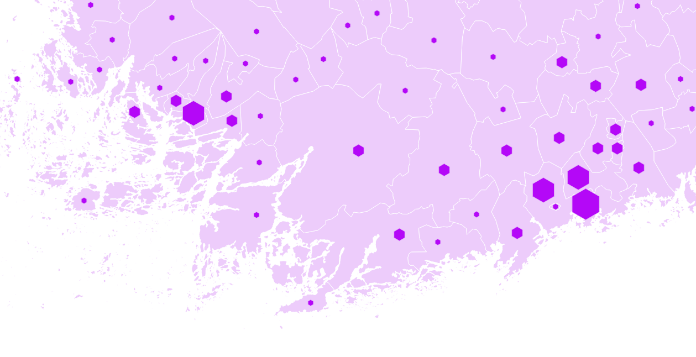
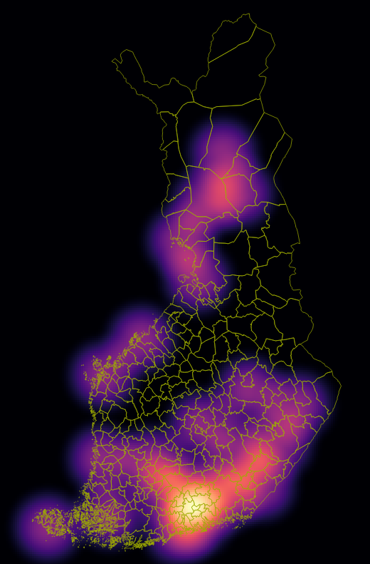
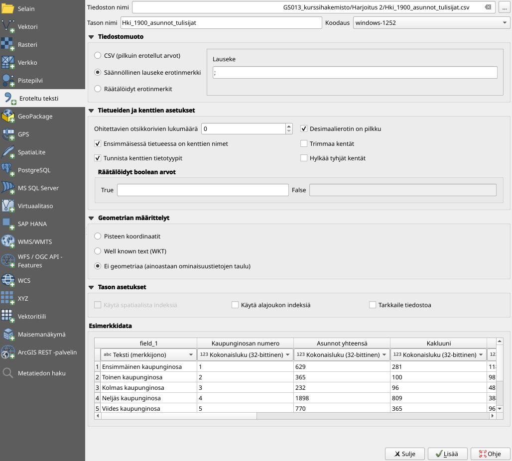
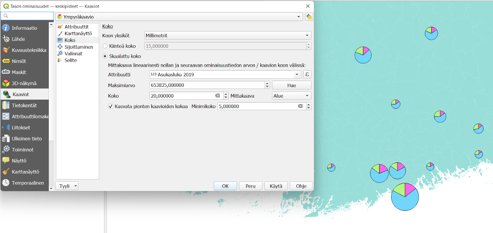

# Harjoitus 5: Luokittelu, heatmap ja diagrammit

**Harjoituksen sisältö**

Harjoituksessa laaditaan teemakartta ordinaalisiin arvoihin perustuen symbolin koon avulla. Kokeillaan myös heatmapin laatimista ja piirakkadiagrammin tekoa.

**Harjoituksen tavoite**

Koulutettava oppii tekemään teemakartan valinnat siten, että ne kuvaavat käsiteltävää ilmiötä ja tuovat esiin aineiston ominaispiirteet.

**Arvioitu kesto**

60 minuuttia.

## **Valmistautuminen**

Avaa uusi QGIS-projekti (**Projekti \> Uusi**) ja tallenna se nimellä \"**QGIS-harjoitus 5**\". Lisää projektiin seuraavat aineistot:

-   **..kurssihakemisto/kuntien ikärakenne 2019.gpkg (tasot: \"kuntien ikärakenne 2019\" ja \"keskipisteet\")**

## **Pistemäisen aineiston luokittelu**

Hyödynnetään pistemäisen aineiston luokittelua attribuuttitiedon perusteella. Avaa **Keskipisteet-tason Kuvaustekniikka** ja aseta kuvaustekniikaksi **Porrastettu**. Valitse sarake, jonka mukaan luokitellaan (esimerkkiaineistossa **Asukasluku 2019**). Vaihda metodiksi **Koko**. Luokittelumenetelmien valinta ja histogrammin tarkastelu toimii täysin samoin kuin aluemaisilla aineistoilla.

Huomaa, että voit asettaa symboliksi muunkin kuin pyöreän pisteen. Lisäksi voit määrittää, minkä kokoinen on aineiston suurin ja pienin symboli. Tällä, samoin kuin luokittelumenetelmällä, on merkittävä vaikutus siihen miten luokkien välinen vaihtelu koetaan. Käytännöllistä on asettaa pienin piste vähintään 3-4 pikselin kokoiseksi, jotta se erottuu taustasta. Suurimman pisteen taas täytyy pysyä riittävän pienenä, jotta se ei peitä taustaa tai muita kohteita sillä zoomaustasolla, jolla karttaa on tarkoitus tarkastella.

## **Heatmap**

Heatmap eli lämpökartta kuvaa pistemäisten kohteiden tihentymiä ja jakaumaa spatiaalisesti. Heatmapia voi myös painottaa jonkin attribuuttitiedon mukaan.

Heatmap-visualisointitoiminto löytyy **Kuvaustekniikka-ikkunasta** yhtenä vaihtoehtona muiden joukossa. Vaihda **Keskipisteet-tasosi** kuvaustekniikka **Heatmapiksi**. Valitse väriliukuma sekä vaikutussäde. Huomaa, että syntyvä heatmap-pinta peittää alleen kaiken, jos et säädä toisen ääripään väriä läpinäkyväksi. Testaa, miten vaikutussäteen muuttaminen vaikuttaa heatmapiisi. Jos säde on annettu **millimetreinä** näytöllä, heatmap tarkentuu kun zoomaat karttaa. Jos vaihdat säteen yksiköiksi **karttayksiköt**, heatmap pysyy saman näköisenä.

Painota vielä heatmapia aineiston **Asukasluku 2019** -kentän tiedoilla, jolloin saadaan todellinen väestöntiheyskartta.

## Diagrammit

QGISillä on helppo tehdä myös esimerkiksi piirakkadiagrammeja aineiston arvojen jakaumasta. Jotta kartta ei ruuhkautuisi liikaa, suodata ensin **Keskipisteet-tasosta** näkyviin vain 20 suurinta kaupunkia (yli 51.000 asukasta). 

Aseta **Kuvaustekniikka-välilehdellä** symbolit kokonaan pois näkyvistä ja siirry **Kaaviot-välilehdelle**. valitse pudotusvalikosta **Ympyräkaavio -vaihtoehto**. **Attribuutit-rivillä** valitaan, mitkä attribuuttitietokentät yhdessä muodostavat halutun arvojoukon. Valitse siis eri ikäryhmät ja siirrä ne oikeanpuoleiseen ikkunaan -painikkeella. Huom! Älä valitse **Asukasluku 2019 -kenttää**, koska silloin se muodostaisi puolet piirakkakaaviosta ja eri ikäryhmät toisen puolen.

Voit vaihtaa eri sektoreiden värejä klikkaamalla värisymbolia sekä sektoreiden järjestystä raahaamalla attribuuttirivejä. **Karttanäyttö-rivillä** voit vaihtaa esim. piirakkakaavion reunaviivojen väriä sekä piirakan muodostumisen suuntaa ja aloituskohtaa.

**Koko-rivillä** voidaan asettaa kaavion koko indikoimaan esimerkiksi kokonaisasukaslukua. Valitse koon määräävä attribuutti, klikkaa Hae ja aseta kaavion minimi- ja maksimikoko samaan tapaan kuin pistesymbolien kanssa. Kokeile miten mittakaavan vaihtaminen **Alueesta** **Läpimittaan** vaikuttaa lopulliseen teemakarttaasi.

**Tulosteenmuodostaja ja kaavion selite**

Ympyräkaavion selite (kaavioiden suhteellinen koko) tulee vielä muodostaa erikseen, jotta se tulee näkyviin tulosteelle. Valitse **Selite** -välilehti ja aseta merkinnät mieleiseksesi esim. oheisen kuvan mukaisesti. Voit asettaa muutaman kokoluokan manuaalisesti tai käyttää valmiita luokkia.

Avaa sitten **Tulosteenmuodostaja** ja uusi taitto. Aseta paperi pystysuuntaiseksi (löydät sivun asetukset klikkaamalla tyhjää paperia hiiren oikealla painikkeella). Voit myös asettaa sivun taustavärin täysin läpikuultavaksi; tällöin valmis tulosteesi ei sisällä valkoista suorakaiteen muotoista taustaa vaan ainoastaan siihen tuodut elementit.

Tuo taittoon karttaelementti sekä selite. Voit muokata selitteen merkintöjä, kun poistat ruksin ruudusta **Päivitä automaattisesti**. Lisää halutessasi kartalle otsikko.

Kun olet valmis, tallenna projektitiedosto kurssihakemistoon pikanäppäimellä **CTRL + T** tai päävalikosta **Projekti \> Tallenna**.

::: hint-box
Psst! Koulutuksen jälkeen saat henkilökohtaista tukea Gispon tukipalvelusta. Lähetä kysymyksesi tai kommenttisi osoitteeseen koulutustuki\@gispo.fi!
:::