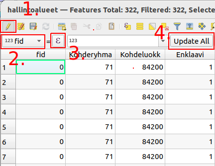

# Kappale 6: Kohteiden muokkaus - Quick Field Calculation ja virtuaalikentät

## Tehtävä 6.1

Tarkastele hallintoalueaineistoa. Luo uusi virtuaalinen kenttä (anna nimeksi esimerkiksi sama_nimen_pituus), jonka tietotyyppi on _boolean_ (totuusarvo). Kirjoita virtuaaliselle kentälle lauseke, joka on **tosi** jos kunnan suomen- ja ruotsinkielinen nimi on saman pituinen.

**Aineisto**: `hallintoalueet.gpkg`

<button onclick="toggleAnswer(this)" class="btn answer_btn">vinkki</button>

::: hidden-box
Käytä yhtä kuin- operaattoria (=). Vertaa sarakkeiden ```Kunta_ni1``` ja ```Kunta_ni2``` arvon pituutta.

Millä funktiolla saat palautettua merkkijonon pituuden?
:::

<button onclick="toggleAnswer(this)" class="btn answer_btn">ratkaisu</button>

::: hidden-box
::: code-box
``` sql
length("Kunta_ni1") = length("Kunta_ni2")
```
:::
:::

## Tehtävä 6.2

**Ennen tehtävää: ** Tehtävän 4.1 tulee olla tehtynä.

Tarkastele hallintoalueaineistoa. Päivitä tehtävässä 4.1 luotu kenttä. Hyödynnä samassa tehtävässä käytettyä lauseketta, mutta laske kuntien sijainti Tampereesta 100km säteellä.

**Aineisto**: `hallintoalueet.gpkg`

<button onclick="toggleAnswer(this)" class="btn answer_btn">vinkki</button>

::: hidden-box


1. Varmista, että tason editointi on päällä.
2. Valitse tehtävässä 4.1 luotu kenttä.
3. Klikkaa ikonista syöttääksesi lausekkeen. Käytä pohjana tehtävässä 4.1 käytettyä lauseketta. Jos lauseke on lyhyt ja yksinkertainen sen voi syöttää myös suoraan tekstikenttään.
4. Kun lauseke on syötetty, klikkaa lopuksi "Update All" painiketta.
:::

<button onclick="toggleAnswer(this)" class="btn answer_btn">ratkaisu</button>

::: hidden-box
::: code-box
``` sql
distance(
	centroid(
		$geometry
		), centroid(
		geometry(
			get_feature(
				'hallintoalueet', 'Kunta_ni1', 'Tampere'
				)
			)
		)
	) < 100000
```
:::
:::

## Lisätehtävä

[Lisätehtävä 8](15_kappale_15.html#lisätehtävä-8)