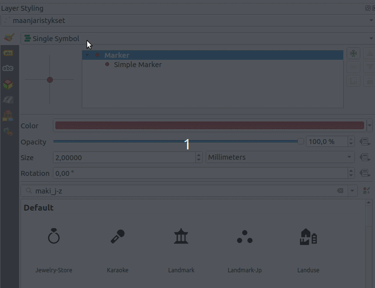
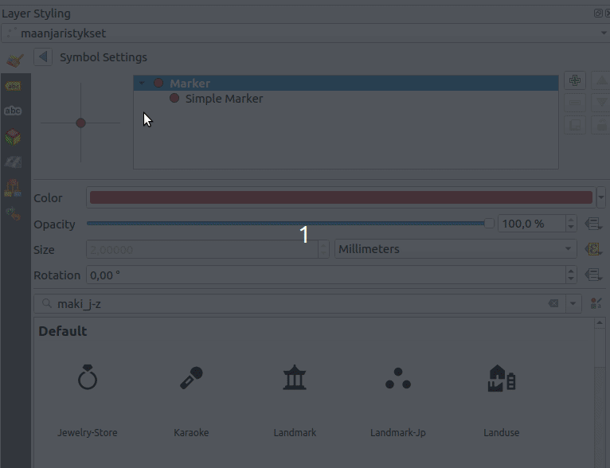

# Kappale 7: Symbologian kustomointi

## Tehtävä 7.1

Tarkastele maanjäristysaineistoa. Visualisoi maanjäristykset siten, että niiden koko (millimetreinä) määräytyy järistyksen voimakkuuden perusteella (```Mag```). Lisää kuvaustekniikkaan myös symbolin väriin vaikuttava logiikka seuraavasti vuodenajan mukaan seuraavasti:

- Talvi: sininen
- Kevät: keltainen
- Kesä: vihreä
- Syksy: oranssi

**Aineisto**: ```maanjaristykset.gpkg```

<button onclick="toggleAnswer(this)" class="btn answer_btn">vinkki</button>

::: hidden-box
Käytä **Categorized**- luokittelua. Lisää pisteen koon määrittävä lauseke seuraavasti:



Määritä 'Categorized'- kuvaustekniikkaan lauseke seuraavasti:



Käytä lausekkeessa CASE WHEN- rakennetta (määritä vuodenajat kuukauden perusteella):

::: code-box
``` sql
CASE
WHEN ... (valitse talvikuukaudet)
THEN 'Talvi'
... (Määritä muut vuodenajat)
END
```
:::

Paina lopuksi **Classify** painiketta. Muokkaa symbolien värit tehtävänannon mukaisiksi kaksoisklikkaamalla eri luokkien symbolia.
:::


<button onclick="toggleAnswer(this)" class="btn answer_btn">ratkaisu</button>

::: hidden-box
::: code-box
``` sql
-- Vaihe 1 (Symbolien koko):
"Mag" -- Lausekkeeksi riittää viittaus ```Mag``` (magnitudi)- kenttään

-- Vaihe 2 (luokitus):
CASE
WHEN "Mo" in (12, 01, 02)
THEN 'Talvi'
WHEN "Mo" in (03, 04, 05)
THEN 'Kevät'
WHEN "Mo" in (06, 07, 08)
THEN 'Kesä'
WHEN "Mo" in (09, 10, 11)
THEN 'Syksy'
END
```
:::
:::

## Lisätehtävä

[Lisätehtävä 9](15_kappale_15.html#lisätehtävä-9)