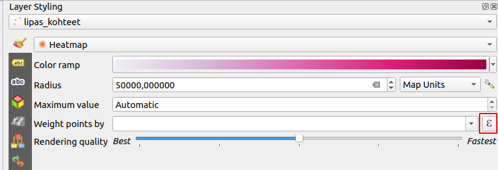
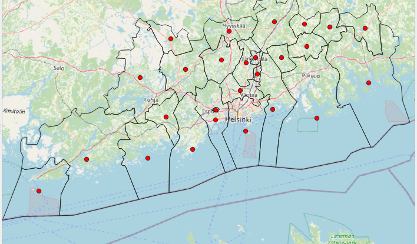

# Kappale 8: Symbologian kustomointi - lämpökartta ja Geometry Generator

## Tehtävä 8.1

Tarkastele Lipas-aineistoa. Luo frisbeegolfrata-tyyppisten liikuntakohteiden esiintyvyystiheyttä kuvaava lämpökartta.

- Käytä säteenä 5 km
  - Määrittää ympyränmuotoisen "vaikutusympäristön" jokaisen pisteen ympärille
  - Sopiva arvo riippuu pitkälti syötedatan sisällöstä

**Aineisto**: ```lipas_kohteet.gpkg```

<button onclick="toggleAnswer(this)" class="btn answer_btn">vinkki</button>

::: hidden-box
Muokkaa tason tyyliä seuraavasti joko tyylipaneelissa tai tason ominaisuuksissa > kuvaustekniikka (symbology):



Syötä ehkolauseke klikkaamalla epsilon-painikkeesta. Pisteen säde kerrotaan lausekkeen tuloksena olevalla painokertoimella. Millä lausekkeella saat vain frisbeegolfradat näkyviin?
:::


<button onclick="toggleAnswer(this)" class="btn answer_btn">ratkaisu</button>

::: hidden-box
::: code-box
``` sql
if("tyyppi_nimi_fi"='Frisbeegolfrata', 1, 0)
```
:::
:::

## Tehtävä 8.2

Tarkastele hallintoalueaineistoa. Luo sille kuvan mukainen kuvaustekniikka käyttämällä Geometry Generatoria. Visualisoi oman maakuntasi kunnat sekä niiden painopisteet (kuvassa Uusimaa).

**Huom!** Tee maakuntaan perustuva suodatus Geometry Generatorilla, eikä muilla keinoilla.



**Aineisto**: ```hallintoalueet.gpkg```

<button onclick="toggleAnswer(this)" class="btn answer_btn">vinkki</button>

::: hidden-box
Täydennä symbolitasoja seuraavasti, siten että Geometry Generator- tasoja on kaksi. Toisen geometriatyyppi tulee olla viiva ja toisen piste.


Lisää seuraavaksi viiva- ja pistesymbolitasolle geometriageneraattorin lausekekenttään lausekkeet. Tee rajaus maakunnan mukaan molemmille tasoille.

Millä funktiolla saat palautettua viivatasolle polygonin ulkoreunat?

Millä funktiolla saat palautettua pistetasolle polygonin painopisteen?
:::


<button onclick="toggleAnswer(this)" class="btn answer_btn">ratkaisu</button>

::: hidden-box
::: code-box
``` sql
-- ulkorajat:
if(Maaku_ni1 = 'Uusimaa', boundary($geometry), 0)
-- painopisteet:
if(Maaku_ni1 = 'Uusimaa', centroid($geometry), 0)
```
:::
:::
