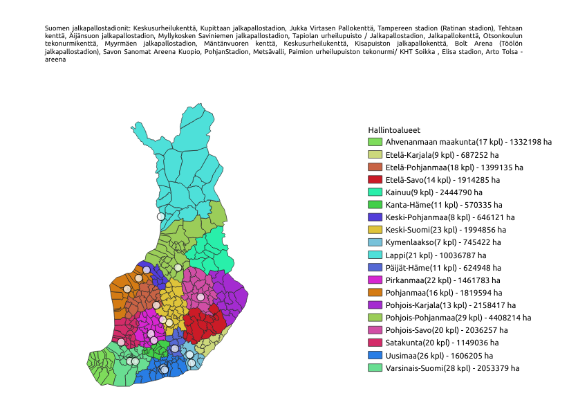
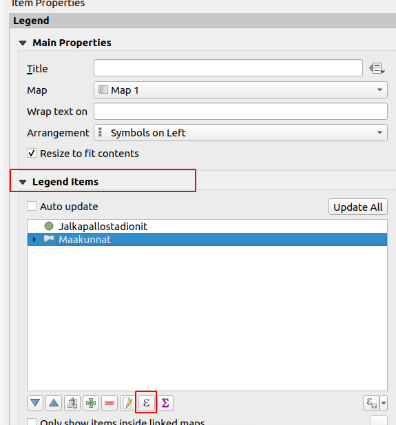
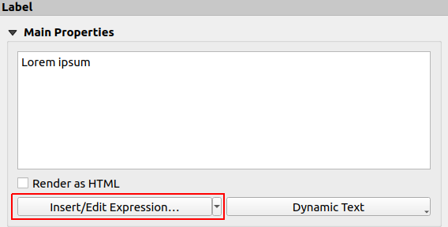

# Kappale 10: Karttatulosteen kustomointi

## Tehtävä 10.1

Tuota kuvan mukainen karttatuloste.



**Aineistot**: 

- ```hallintoalueet.gpkg```
- ```lipas_kohteet.gpkg```

Karttatulosteeseen tulee tehdä seuraavat asiat:

- Luokittele hallintoalueet maakunnan nimen mukaan.
- Suodata Lipas-kohdeaineistoa (voit myös duplikoida tason) siten, että karttataso sisältää vain Jalkapallostadion-tyyppiset kohteet.
- Luo uusi karttatuloste ja siihen karttaikkunaobjekti.
- Muodosta karttatulosteeseen selite, joka sisältää kunkin luokan nimen (maakunnan nimi) lisäksi tiedon ko. luokan sisältämien kohteiden lukumäärästä (ts. **kuntien määrä maakunnassa**) ja niiden yhteenlasketusta pinta-alasta (tyyliin Varsinais-Suomi (11) - 500 ha).
- Luo karttatulostenimiö, joka sisältää listan karttaikkunaobjektin rajojen sisällä sijaitsevista jalkapallostadioneista (huomaa, että listan sisältö muuttuu, kun kartan zoomaustaso muuttuu).

<button onclick="toggleAnswer(this)" class="btn answer_btn">vinkki</button>

::: hidden-box
**Vaihe 1**:

- Käytä luokitteluun ```Maaku_ni1```-kenttää

**Vaihe 2**:

- Suodata ```tyyppi_nimi_fi```-kentästä jalkapallostadionit.

**Vaihe 3**:

- Luo uusi taitto (Project > New Print Layout)

**Vaihe 4**:

- Klikkaa selitteesta automaattinen päivitys (**Auto update**) pois päältä. Uudelleennimeä lipas_kohteet ja hallintoalueet- tasot.
- Valitse uudelleen nimetty hallintoalueet-taso ja klikkaa lausekepainiketta.


- Luo lauseke paloittain:
  - Hae ensin maakunnan kuntien pinta-ala. Käytä ```aggregate()```-funktiota. Viittaa tasoon ```@layer```-muuttujalla. Suorita yhteenlasku. Suodata sen perusteella onko maakunnan nimi yhtäsuuri kuin ```@symbol_label``` muuttuja.
  - Huomioi yksikkö! ```$area```-funktio palauttaa pinta-alan karttayksiköissä, tässä tapauksessa neliömetreinä. Muunna hehtaareiksi.
  - Rakenna seuraavaksi merkkijono. Voit käyttää ```concat()```-funktiota tai yhdistää merkkijonot pystyviivoilla (putkimerkit) ```||```.
  - Millä funktiolla voit pyöristää ```aggregate()```-funktion palauttaman pinta-alan tietyllä tarkkuudella?
  - ```@symbol_label```-muuttuja kertoo maakunnan nimen.
  - ```@symbol_count```-muuttuja kertoo maakuntaan kuuluvien kuntien määrän.
  
**Vaihe 5**:

- Luo uusi karttalehdelle uusi objekti, **Add Label** (nimiö) -työkalulla.
- Pääset muokkaamaan lauseketta **Insert/Edit Expression...** -painikkeesta:


- Määrittele ensin karttaikkunaobjektin laajuus ja tallenna se muuttujaan 'extent'.
  - ```item_variables()```-funktiolla saat haettua karttaobjektin muuttujat ```Map```-datatyypissä.
  - ```map_get()```-funktiolla saat haettua ```Map```-objektista arvon. Hae ```map_extent```.
  - ```with_variable()```-funktiolla voit määrittää muuttujan ja sen arvon, sekä käyttää muuttujaa funktion sisältämässä lausekkeessa. Tallenna muuttujaan ```extent``` karttaobjektin laajuus.
- Käytä ```aggregate()```-funktiota. Yhdistä Lipas-kohteiden merkkijonot. Suodata sillä perusteella leikkaako Lipas-kohde aikaisemmin määritellyn karttaobjektin laajuuden (```intersects()```-funktio).
  - Voit määrittää ```aggregate()```-funktioon myös välimerkin ('concatenator'), jolloin kaikkien kohteiden sisältö ei ole yhdessä "pötkössä".
- Kun olet määrittänyt lausekkeen, se näkyy nimiö-karttaobjektin tekstikentässä [% ... %] symbolien ympäröimänä. Voit kirjoittaa kuvaavan tekstin alkuun, esim. Suomen jalkapallostadionit: [% ...lauseke... %]
:::


<button onclick="toggleAnswer(this)" class="btn answer_btn">ratkaisu</button>

::: hidden-box
::: code-box
``` sql
-- Lipas-kohteiden suodatukseen
"tyyppi_nimi_fi" = 'Jalkapallostadion'

-- Legendan luontiin
concat(
	@symbol_label, ' (', @symbol_count, ' kpl) - ', round(
		aggregate(
			@layer, 'sum', $area, filter:=  "Maaku_ni1" = @symbol_label
			) / 10000.0
		), ' ha'
	)

-- Jalkapallostadion-listan luontiin
Suomen jalkapallostadionit: [%
with_variable(
	'extent', map_get(
		item_variables(
			'Map 1'
			), 'map_extent'
		), aggregate(
			'lipas_kohteet', 'concatenate', "nimi_fi", intersects(
				$geometry, @extent
				), ', '
			)
	)
%]
```
:::
:::
