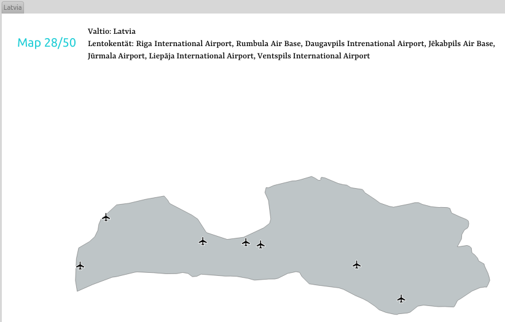
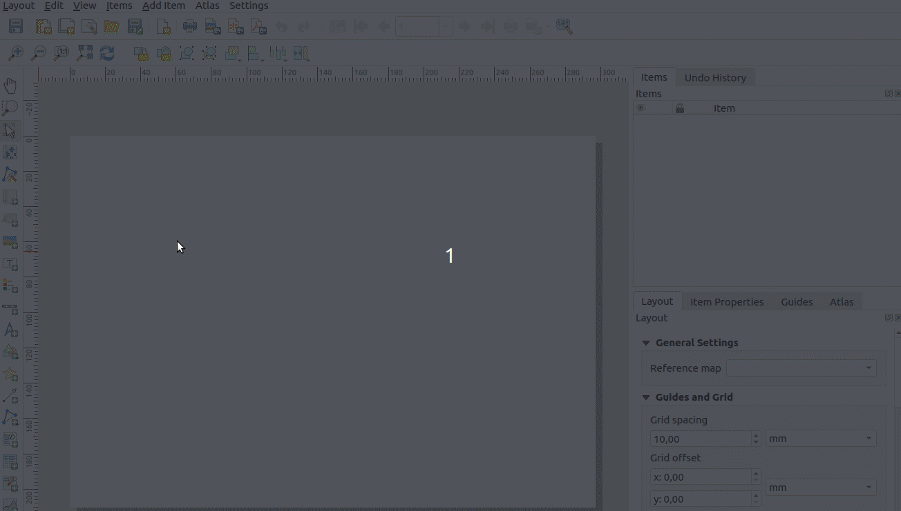

# Kappale 11: Kartta-atlaksen kustomointi

## Tehtävä 11.1

Käytä QGISin kartta-atlas työkalua. Tuota kuvan mukainen karttatulostesarja Euroopan valtioille.



1. Luo uusi karttatuloste ja sille karttaikkuna, jonka sisältöä hallinnoi valtioaineiston perusteella luotu kartta-atlas.
  - Aseta kartta-atlaksen sivun nimeksi ADMIN-attribuuttikentän arvo.
  - Hyödynnä kartta-atlaksen asetuksista löytyvää suodatusmahdollisuutta ja tarkastele vain Euroopan valtioita.
2. Luo dynaaminen otsikkonimiö, joka on muotoa "Map .../50" (atlaksen sivu).
3. Luo dynaaminen karttatulostenimiö, johon muodostuu lista sen hetkisen atlas-sivun kattavuusobjektin alueelle osuvista lentokentistä (nimi-tieto kustakin, pilkulla erotettuina).
4. Säädä valtioiden näkyvyyttä siten, että vain atlas-sivun kattavuusobjektina toimiva valtio näkyy.
5. Säädä lentokenttien näkyvyyttä siten, että vain atlas-sivun kattavuusobjektin alueella sijaitsevat lentokenttäkohteet kuvautuvat karttapohjalle.

**Aineistot**: 

- ```valtiot.gpkg```
- ```lentokentat.gpkg```

<button onclick="toggleAnswer(this)" class="btn answer_btn">vinkki</button>

::: hidden-box
**Vaihe 1 (Atlaksen ja karttaobjektin asetukset)**:



**Vaihe 2 (otsikko)**: ```@atlas_feature``` -muuttuja kertoo sivunumeron.

**Vaihe 3 (lista lentokentistä)**:

- Käytä ```overlay_contains()```-funktiota. Hae sillä lentokenttien nimet. Funktio palauttaa tulokset ```Array```-datatyyppinä.
- Muuta ```Array``` merkkijonoksi (string). Millä funktiolla se onnistuu?

**Vaihe 4 (valtion näkyvyys)**:

- Tee sääntöpohjainen visualisointi valtioille. ```@atlas_pagename```-muuttuja kertoo tämänhetkisen sivun nimen.

**Vaihe 5 (lentokenttien näkyvyys)**:

- Tee sääntöpohjainen visualisointi lentokentille.
  - Millä funktiolla voit tarkastaa leikkaako lentokenttäpiste valtiopolygonin?
  - ```get_feature()```-funktiolla saat haettua toisen tason kohteen.
  - Millä funktiolla saat palautettua kohteen geometrian?
:::

<button onclick="toggleAnswer(this)" class="btn answer_btn">ratkaisu</button>

::: hidden-box
::: code-box
``` sql
-- Atlaksen tarkasteltavien kattavuusobjektien suodatus
"CONTINENT" = 'Europe'

-- Dynaaminen otsikkonimiö (tekstikenttään)
[%
concat(
	'Map ', @atlas_featurenumber, '/', @atlas_totalfeatures
	)
%]

-- Dynaaminen karttatulostenimiö, jossa listaus atlas-objektin alueelle kuuluvista lentokentistä (tekstikenttään)
Valtio: [%
"NAME"
%]
Lentokentät: [%
array_to_string(
	array := overlay_contains(
		layer := 'lentokentat', expression := "NAME"
		), delimiter := ', '
	)
%]

-- Valtioiden näkyvyys
"NAME" = @atlas_pagename

-- Lentokenttien näkyvyys
intersects(
	$geometry, geometry(
		get_feature(
			'valtiot', 'NAME', @atlas_pagename
			)
		)
	)

```
:::
:::
