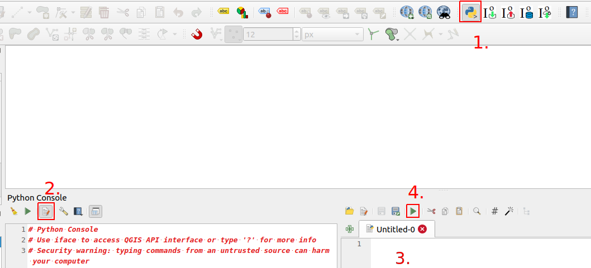

# Kappale 12: Python- konsoli

## Tehtävä 12.1

Tehtävässä on kolme vaihetta. Avaa QGISin Python konsoli.


**Aineistot:** 

- ```valtiot.gpkg```
- ```hallintoalueet.gpkg```

**Vaihe 1:** Lisää ```valtiot.gpkg```-aineisto QGISiin ja valitse taso. Kokeile ensin peruskomentoja konsolissa:

::: code-box
``` python
layer = iface.activeLayer()
```
:::

::: code-box
``` python
print(layer)
```
:::

::: code-box
``` python
print(layer.featureCount())
```
:::

Mitä komennot tekevät?

<button onclick="toggleAnswer(this)" class="btn answer_btn">ratkaisu</button>

::: hidden-box
```layer = iface.activeLayer()```

Tallentaa ```layer```-muuttujaan sen taso-olion, joka on klikattu aktiiviseksi QGISin tasot-paneelissa.

``` print(layer) ```

Tulostaa konsoliin layer-olion tiedot.

``` print(layer.featureCount()) ```

Laskee tason kohteiden määrän ```featureCount()```-funktiolla ja tulostaa sen.

:::

**Vaihe 2:** Käy for-silmukassa läpi "valtiot"-tason kohteet ja tulosta kohteen nimi (ADMIN-kenttä).

<button onclick="toggleAnswer(this)" class="btn answer_btn">vinkki</button>

::: hidden-box
1. Tallenna valtiot-taso muuttujaan joko activeLayer()-funktiolla kuten äsken. Voit myös hakea tason nimen perusteella seuraavasti:

::: code-box
``` python
layer = QgsProject.instance().mapLayersByName('tason_nimi')[0]
```
:::
2. Kirjoita for-silmukka. Taso-olion getFeatures()-funktio (tai tarkemmin sanottuna metodi) palauttaa iteraattori-olion, jota voi käyttää suoraan silmukassa:

::: code-box
``` python
for feature in layer.getFeatures():
    print(feature) # Tämä tulostaa kohde-olion tiedot.
    # Miten saat tulostettua "ADMIN"-kentän arvon?
```
:::

3. Pythonin hyödyntämistä on dokumentoitu QGISin sivuilla. Dokumentaatiosta löytyy QGISin eri luokkien tietoja esimerkiksi niiden metodeista. Yllä olevassa esimerkissä for-silmukan sisällä 'feature'-muuttujassa on sillä hetkellä läpi käytävä ```QgsFeature```-olio. Millä funktiolla tai menetelmällä saat palautettua tietyn kentän arvon kohteesta? Lue [dokumentaatiota täältä](https://qgis.org/pyqgis/3.2/core/Feature/QgsFeature.html).

:::

<button onclick="toggleAnswer(this)" class="btn answer_btn">ratkaisu</button>

::: hidden-box
::: code-box
``` python
layer = QgsProject.instance().mapLayersByName('valtiot')[0]
```
:::

::: code-box
``` python
for feature in layer.getFeatures():
    print(feature["ADMIN"])
```
:::
:::

**Vaihe 3:** Tarkastele seuraavaa skriptiä. Pohdi mitä skripti tekee sen eri vaiheissa.

<button onclick="toggleAnswer(this)" class="btn answer_btn">skripti</button>

::: hidden-box
::: code-box
``` python
from qgis.core import *
from qgis.gui import *

source_layer = QgsProject.instance().mapLayersByName('hallintoalueet')[0]

new_layer = QgsVectorLayer('Polygon?crs=epsg:3067', 'hanko_vyohyke', 'memory')

prov = new_layer.dataProvider()

prov.addAttributes([QgsField("nimi", QVariant.String)])
new_layer.updateFields()

hanko_feature = source_layer.getFeature(1)

hanko_geometry = hanko_feature.geometry()

buffered_geometry = hanko_geometry.buffer(5 * 1000, 5)

new_feature = QgsFeature()

new_feature.setAttributes(["Hanko"])
new_feature.setGeometry(buffered_geometry)

prov.addFeatures([new_feature])

new_layer.updateExtents()

QgsProject.instance().addMapLayer(new_layer)
```
:::
:::

<button onclick="toggleAnswer(this)" class="btn answer_btn">ratkaisu</button>

::: hidden-box
Skripti hakee hallintoalueet-tasosta Hanko-kohteen ja luo sen geometriasta 5 km:n vyöhykkeen. Vyöhyke lisätään uudelle väliaikaiselle hanko_vyohyke-tasolle.

Lisätietoa data provider-luokasta: [https://qgis.org/pyqgis/3.2/core/Data/QgsDataProvider.html](https://qgis.org/pyqgis/3.2/core/Data/QgsDataProvider.html)

Voit ajaa skriptin seuraavasti:



1. Avaa Python-konsoli.
2. Avaa Python-skriptieditori.
3. Kopioi skripti editoriin.
4. Aja skripti.

::: code-box
``` python
# Tuodaan tarvittavat QGIS-paketit
from qgis.core import *
from qgis.gui import *

# Haetaan hallintoalueet-taso
source_layer = QgsProject.instance().mapLayersByName('hallintoalueet')[0]

# Luodaan uusi väliaikainen vektoritaso "suomi_vyohyke", jonka koordinaattijärjestelmä on EPSG:3067
new_layer = QgsVectorLayer('Polygon?crs=epsg:3067', 'hanko_vyohyke', 'memory')

# Tallennetaan tason data provider
prov = new_layer.dataProvider()

# Lisätään attribuuttikenttä ("nimi") uuden tason ominaisuustietoihin
prov.addAttributes([QgsField("nimi", QVariant.String)])
new_layer.updateFields()

# Haetaan Hanko-kohde hallintoaluetasolta
hanko_feature = source_layer.getFeature(1)

# Haetaan Hanko-kohteen geometria
hanko_geometry = hanko_feature.geometry()

# Luodaan puskurigeometria viiden kilometrin etäisyydellä ja viidellä segmentilla
buffered_geometry = hanko_geometry.buffer(5 * 1000, 5)

# Luodaan uusi kohde
new_feature = QgsFeature()

new_feature.setAttributes(["Hanko"]) # Asetetaan kohteelle nimi-attribuutti
new_feature.setGeometry(buffered_geometry) # Asetetaan kohteelle vyöhykegeometria

# Lisätään uusi ominaisuus data provideriin
prov.addFeatures([new_feature])

# Päivitetään tason ominaisuustiedot
new_layer.updateExtents()

# Lisätään uusi vektoritaso QGIS-projektiin
QgsProject.instance().addMapLayer(new_layer)
```
:::
:::


## Tehtävä 12.2

Tutki alla olevaa skriptipohjaa. Selvitä itsellesi, mitä skriptillä pyritään saamaan aikaan. Avaa QGISin python-editori ja kopioi skriptipohja siihen. Tallenna skripti tietokoneellesi esimerkiksi natura_skripti.py-tiedostoon. Tee skriptiin numeroituina kommentteina tallennetut muokkauspyynnöt (10 kpl) ja testaa toimiiko skripti.

<button onclick="toggleAnswer(this)" class="btn answer_btn">skriptipohja</button>

::: hidden-box
::: code-box
``` python
from qgis.core import *
from qgis.gui import *

layera = QgsProject.instance().mapLayersByName('natura_alueet')[0]
## 1. Luo layerb-muuttuja, joka viittaa kunta-nimiseen karttatasoon
layerb =

# Luodaan uusi taso ja määritetään sen geometriatyyppi
layer = QgsVectorLayer('Polygon?crs=epsg:3067', 'tulostaso' , 'memory')

# Asetetaan provider hyväksymään datalähde
prov = layer.dataProvider()

# Luodaan attribuuttikentät
## 2. Lisää kolmas attribuutti, nimeltään area_dif ja tyypiltään Double
prov.addAttributes([QgsField("id",  QVariant.Int), QgsField("name",  QVariant.String)])
layer.updateFields()

## HUOM. Arvoksi pitäisi tulla ajettaessa 3
print("Ominaisuustietosarakkeita yhteensä:")
print(len(layer.fields()))

# Alustetaan muuttujat ennen silmukkaa
laskuri = 0
tempsum = 0

# Käy kaikki layera-tason kohteet (a-muuttuja viittaa sillä hetkellä käsiteltävään kohteeseen)
# Sisennettyt rivit ajetaan joka kierroksella
for a in layera.getFeatures():
    # Haetaan kohteen a geometria
    kpl = a.geometry()
    # Käy kaikki layerb-tason kohteet (b-muuttuja viittaa sillä hetkellä käsiteltävään kohteeseen)
    # Sisennettyt rivit ajetaan joka kierroksella
    for b in layerb.getFeatures():
        ## 3. Tallenna kohteen b geometriaobjekti muuttujaan kpl2
        kpl2 =
        ## 4. Luo ehto, jonka sisään päätyy vain jos kpl leikkaa kpl2:sta
        if :
            ## 5. Kasvata laskurimuuttujan arvoa, joka kerta, kun kpl leikkaa kpl2:sta
            laskuri =
            # Tallennetaan päälle menevä osa geometriana
            geomleik = kpl.intersection(kpl2)
            ## 6. Tallenna geomhu-nimiseen muuttujaan geomleik-objektin konveksipeite (convex hull)
            geomhu =
            ## 7. Laske, kuinka paljon isompi konveksin peitteen pinta-ala on verrattuna geomleik ja tallenna se muuttujaan temp
            temp =
            ## 8. Pidä yllä tietoa siitä, kuinka paljon uutta pinta-alaa on syntynyt tähän mennessä konveksien peitteiden luonnista
            tempsum =
            # Luodaan uusi kohde
            feat = QgsFeature()
            ## 9. Muokkaa siten, että ao. käsky asettaa myös area_dif attribuuttikentän arvoksi temp-muuttujan sisältämä arvo
            feat.setAttributes([laskuri, a['Nimi']])
            # Määritetään geometria uudelle kohteelle
            ## 10. Lisää sen muuttujan nimi (sulkeiden sisään), josta geometriatieto tulee hakea, jotta uuden tason kohteiden
            ## geometriat tulevat vastaamaan leikkaavien polygonien konvekseja peitteitä
            feat.setGeometry()
            # Lisätään kohde uudelle tasolle
            prov.addFeatures([feat])
            # Päivitetään tason laajuus
            layer.updateExtents()

print("Konveksin peitteen luomisesta seurasi")
# Muunnetaan neliömetrit neliökilometreiksi
print(round((tempsum / 1000000.0), 1))
print("km2 pinta-alan lisäys.")
 
# Lisätään uusi taso tasot-paneeliin
QgsProject.instance().addMapLayers([layer])
```
:::
:::

**Aineistot**: 

- ```natura_alueet.gpkg```
- ```hallintoalueet.gpkg``` **HUOM!** Valitse kaksi itseäsi kiinnostavaa kuntaa ja tallenna omaksi geopackageksi, jonka nimi on 'kunta.gpkg'

<button onclick="toggleAnswer(this)" class="btn answer_btn">ratkaisu</button>

::: hidden-box
Skripti:

- tarkistaa onko hallintoaluekohteen sisällä Natura-alue(ita)
- leikkaa (intersection) Natura-aluekohteen kunnan rajojen mukaisesti
- luo leikatulle Natura-aluekohteen geometrialle konveksin peitteen (Convex Hull)
- laskee kuinka paljon suurempi Convex Hull on verrattuna leikattuun kohteeseen ja tallentaa sen uuden kohteen attribuuttitauluun
- tallentaa uudet kohteet väliaikaiselle 'tulostaso':lle

Täydennetty skripti:

::: code-box
``` sql
from qgis.core import *
from qgis.gui import *

layera = QgsProject.instance().mapLayersByName('natura_alueet')[0]
layerb = QgsProject.instance().mapLayersByName('kunta')[0]

# Luodaan uusi taso ja määritetään sen geometriatyyppi
layer = QgsVectorLayer('Polygon?crs=epsg:3067', 'tulostaso' , 'memory')

# Asetetaan provider hyväksymään datalähde
prov = layer.dataProvider()

# Luodaan attribuuttikentät
prov.addAttributes([QgsField("id",  QVariant.Int), QgsField("name",  QVariant.String), QgsField("area_dif",  QVariant.Double)])
layer.updateFields()

print("Ominaisuustietosarakkeita yhteensä:")
print(len(layer.fields()))

# Alustetaan muuttujat ennen silmukkaa
laskuri = 0
tempsum = 0

# Käy kaikki layera-tason kohteet (a-muuttuja viittaa sillä hetkellä käsiteltävään kohteeseen)
# Sisennettyt rivit ajetaan joka kierroksella
for a in layera.getFeatures():
    # Haetaan kohteen a geometria
    kpl = a.geometry()
    # Käy kaikki layerb-tason kohteet (b-muuttuja viittaa sillä hetkellä käsiteltävään kohteeseen)
    # Sisennettyt rivit ajetaan joka kierroksella
    for b in layerb.getFeatures():
        kpl2 = b.geometry()
        if kpl.intersects(kpl2):
            laskuri = laskuri + 1
            geomleik = kpl.intersection(kpl2)

            geomhu = geomleik.convexHull()

            temp = geomhu.area() - geomleik.area()

            tempsum = tempsum + temp
            # Luodaan uusi kohde
            feat = QgsFeature()

            feat.setAttributes([laskuri, a['Nimi'], temp])
            # Määritetään geometria uudelle kohteelle
            feat.setGeometry(geomhu)
            # Lisätään kohde uudelle tasolle
            prov.addFeatures([feat])
            # Päivitetään tason laajuus
            layer.updateExtents()

print("Konveksin peitteen luomisesta seurasi")
# Muunnetaan neliömetrit neliökilometreiksi
print(round((tempsum / 1000000.0), 1))
print("km2 pinta-alan lisäys.")
 
# Lisätään uusi taso tasot-paneeliin
QgsProject.instance().addMapLayers([layer])
```
:::
:::

## Lisätehtävä

[Geoprosessointiesimerkki](15_kappale_15.html#geoprosessointiesimerkki)
