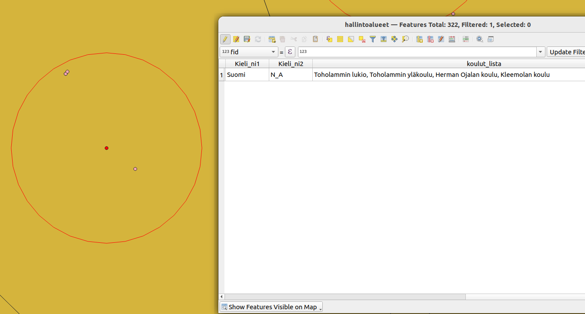

# Kappale 13: Oman funktion luominen

## Tehtävä 13.1

Luo funktio (anna sille nimeksi koululista), jonka avulla voidaan luoda lista oppilaitoksista, jotka sijaitsevat korkeintaan X m päässä hallintoalueiden keskipisteestä.

- Funktion syötteet (argumentit): muokattavan polygonitason nimi, hyödynnettävän pistetason nimi, sovellettava maksimietäisyys (esim. EPSG: 3067 tapauksessa metreinä)
- Tarvittavat rakennuspalikat: ```kohde```.geometry(), ```geometria-objekti```.centroid(), ```geometria-objekti```.distance(```geometria-objekti```)



**Aineistot**: 

- ```oppilaitokset.gpkg```
- ```hallintoalueet.gpkg```

<button onclick="toggleAnswer(this)" class="btn answer_btn">vinkki</button>

::: hidden-box
Tallenna uusi funktio seuraavalla tavalla:


Käytä tätä pohjaa funktiolle:

::: code-box
``` python
from qgis.core import *
from qgis.gui import *

# Dekoraattorifunktio (@qgsfunction). Tärkeää määrittää usesgeometry avainsana-argumentti 'True':ksi
@qgsfunction(args='auto', group='Custom', referenced_columns=[], usesgeometry=True) 
def koululista(layer1, layer2, max_distance, feature, parent):
    """
    Returns list of schools located closer to the each administrative area's centroid than given distance.
    """
    admin_layer = ... # Tallenna annettu hallintoalue- taso muuttujaan.
    # Millä metodilla haet QGIS- projektin instanssista tason nimen perusteella?
    schools_layer = ... # Tallenna annettu oppilaitos- taso muuttujaan samalla tavalla.

    # Funktio suoritetaan joka kohteelle. Tällä hetkellä käsiteltävä kohde on 
    # automaattisesti tallennettu (@qgsfunction- dekoraattori) feature- muuttujaan.

    admin_centroid = ... # Laske painopiste hallintoalue- kohteelle. Millä metodilla voit laskea geometrialle painopisteen?
    
    # Käy läpi for- silmukasssa oppilaitoskohteet. Lisää kohteet listaan 'school_names', jos
    # kohteen hallintoalueen painopisteen etäisyys oppilaitoskohteesta on alle 'max_distance'- argumentin.
    # Voit käyttää joko "perinteistä" for- silmukkaa
    
    for school_feature in school_layer.(...): # Millä metodilla saat palautettua tason kohteet?
      if ...:
        ...
      
    # Tai "list comprehension"- toiminnallisuutta:
    
    school_names = [school_feature[...] for school_feature in school_layer.(...) if ...]

    result = ', '.join(school_names) # Yhdistä school_names listan alkiot, erottimena pilkku ja välilyönti
    
    if (result): # Jos tulos ei ole tyhjä merkkijono, palautetaan tulos
        return result
    else: # Jos tulos on tyhjä, palautetaan NULL
        return NULL
```
:::
:::

<button onclick="toggleAnswer(this)" class="btn answer_btn">ratkaisu</button>

::: hidden-box
::: code-box
``` python
from qgis.core import *
from qgis.gui import *

@qgsfunction(args='auto', group='Custom', referenced_columns=[], usesgeometry=True)
def koululista(layer1, layer2, max_distance, feature, parent):
    """
    Returns list of schools located closer to the each administrative area's centroid than given distance.
    """
    admin_layer = QgsProject.instance().mapLayersByName(layer1)[0] # Tallenna annettu hallintoalue- taso muuttujaan
    schools_layer = QgsProject.instance().mapLayersByName(layer2)[0] # Tallenna annettu oppilaitos- taso muuttujaan

    admin_centroid = feature.geometry().centroid() # Laske painopiste hallintoalue- kohteelle
                                                   
    school_names = [school_feature['onimi'] for school_feature in schools_layer.getFeatures() # Käy läpi for- silmukassa oppilaitoskohteet ja
                   if admin_centroid.distance(school_feature.geometry()) < max_distance] # tarkista onko etäisyys painopisteeseen alle annetun argumentin

    result = ', '.join(school_names) # Yhdistä school_names listan alkiot, erottimena pilkku ja välilyönti
    
    if (result): # Jos tulos ei ole tyhjä merkkijono, palautetaan tulos
        return result
    else: # Jos tulos on tyhjä, palautetaan NULL
        return NULL
```
:::
:::

## Lisätehtävä

[Lisätehtävä 11](15_kappale_15.html#lisätehtävä-11)