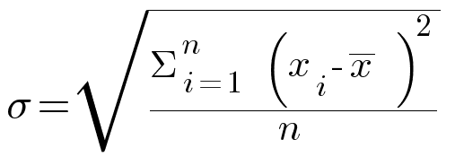

# Kappale 14: Kotitehtävät

## Kotitehtävä 1

Tarkastele tieviiva-aineistoa. Laske kullekkin tielle sen 50m vyöhykkeen (buffer) pinta-ala uuteen sarakkeeseen.

**Aineisto**: `tieviiva_lappi.gpkg`

<button onclick="toggleAnswer(this)" class="btn answer_btn">

vinkki

</button>

::: hidden-box
-   Käytä `buffer()`- funktiota.
-   Millä funktiolla voit laskea pinta-alan?
:::

<button onclick="toggleAnswer(this)" class="btn answer_btn">

ratkaisu

</button>

::: hidden-box
::: code-box
``` sql
area(
    buffer(
        $geometry, 50
        )
    )
```
:::
:::

## Kotitehtävä 2

Tarkastele Helsingin alueen väestöruutuaineistoa. Hyödynnä lausekkeita ja laske asukasmäärän (`asukkaita`- kenttä) keskihajonta.

**Aineisto**: `hsy_vaesto2020_muok.gpkg`

<button onclick="toggleAnswer(this)" class="btn answer_btn">

vinkki

</button>

::: hidden-box
-   Millä funktiolla voit laskea sarakkeen keskihajonnan?
-   Keskihajonnan voi laskea myös "käsin" matemaattisilla funktioilla. Tällöin voi rakentaa lausekkeen matemaattisista funktioista: {width="281"}

x̄ on arvojen aritmeettinen keskiarvo, x~i~ yksittäinen arvo ja n arvojen lukumäärä.
:::

<button onclick="toggleAnswer(this)" class="btn answer_btn">

ratkaisu

</button>

::: hidden-box
::: code-box
``` sql
-- Matemaattisilla funktioilla:
sqrt(
    ( 1 / ( count(
        "fid"
        ) - 1
    )
    )
    *
    (
        sum(
            ( "asukkaita" - mean(
                "asukkaita"
                )
            ) ^2
            )
        )
    )

-- Aggregate- ryhmän funktiolla:
stdev("asukkaita")
```
:::
:::

## Kotitehtävä 3 (haastava)

Luo hallintoalueaineistoon uusi attribuuttikenttä, jonka arvo vaihtelee sen mukaan sijaitseeko kullakin hallintoalueella Natura-alueita ja, jos sijaitsee, onko luonnonsuojelualueita yli 10km² alalta.

Käytä seuraavaa logiikkaa: jos hallintoalueella

-   on Natura-alueita yli 10km² alalta \> arvoksi hallintoalueella osuvien Natura-alueiden lukumäärä
-   on Natura-alueita, mutta ei kuitenkaan yli 10km² alalta \> arvoksi hallintoalueella osuvien Natura-alueiden lukumäärä kerrottuna -1:llä
-   ei ole Natura- alueita \> arvoksi 0

**Aineistot**:

-   `hallintoalueet.gpkg`
-   `natura_alueet.gpkg`

<button onclick="toggleAnswer(this)" class="btn answer_btn">

vinkki

</button>

::: hidden-box
Käytä CASE WHEN ... rakennetta.

-   Leikkaako (intersects) Natura-alue taso hallintoalue tason. Helpointa käyttää `overlay_intersects()`- funktiota.
-   JA onko pinta-ala yli 10km² (huomioi yksikkö). Aggregoi Natura-alueiden geometriat ja laske niille pinta-ala.
    -   Käytä `aggregate()`- funktiota.
    -   Kerää (collect) Natura-alueet tasolta geometriat (`$geometry`).
    -   Suodata (filter) sen perusteella leikkaako tällä hetkellä käsiteltävän hallintoalueen geometria Natura-alueiden geometrioita
        -   Käytä `intersects()` funktiota.
        -   Hae hallintoaluekohteen geometria `geometry()`- funktiolla.
        -   Voit viitata tällä hetkellä käsiteltävään hallintoaluekohteeseen `@parent`- muuttujalla.
    -   Laske geometrioille pinta-ala `area()`- funktiolla.
-   Jos pinta-ala on yli 10km²...
    -   Käytä jälleen `aggregate()`- funktiota.
    -   Laske kohteiden määrä (count). Käytä lausekkeena (expression) jotain natura_alueet- tason saraketta.
    -   Suodata (filter) samalla tavalla kuin aikaisemmassa vaiheessa.
-   Toista sama toimenpide, mutta tarkista onko pinta-ala alle 10km².
    -   Jos on, kerro Natura-alueiden lukumäärä -1:llä
-   Jos kumpikaan ehto ei toteudu (ELSE), aseta arvoksi 0

::: code-box
``` sql
CASE
WHEN
...
AND
...
THEN
...
WHEN
...
AND
...
THEN
...
ELSE 0
END
```
:::
:::

<button onclick="toggleAnswer(this)" class="btn answer_btn">

ratkaisu

</button>

::: hidden-box
::: code-box
``` sql
CASE
WHEN
overlay_intersects(
    'natura_alueet'
    ) = True
AND
area(
    aggregate(
        layer:='natura_alueet', aggregate:='collect', expression:=$geometry, filter:=intersects(
            geometry(
                @parent
                ), $geometry
            )
        )
    ) >= 10000000
THEN
aggregate(
    layer:='natura_alueet', aggregate:='count', expression:="Status", filter:=intersects(
        geometry(
            @parent
            ), $geometry
        )
    )
WHEN
overlay_intersects(
    'natura_alueet') = True
AND
area(
    aggregate(
        layer:='natura_alueet', aggregate:='collect', expression:=$geometry, filter:=intersects(
            geometry(
                @parent
                ), $geometry
            )
        )
    ) < 10000000
THEN
-1 * ( aggregate(
    layer:='natura_alueet', aggregate:='count', expression:="Status", filter:=intersects(
        geometry(
            @parent
            ), $geometry
        )
    )
)
ELSE 0
END
```
:::
:::

## Kotitehtävä 4

Tarkastele globaalia aineistoa paikoista, joissa on asutusta. Luokittele kohteet sen mukaan, mikä on ko. paikassa vallitsevan aikavyöhykkeen (`TIMEZONE`- kenttä) ensimmäinen osamääritelmä (ennen ensimmäistä /- merkkiä).

**Aineisto**: `pop_places.gpkg`

<button onclick="toggleAnswer(this)" class="btn answer_btn">

vinkki

</button>

::: hidden-box
Samaan tulokseen pääsee (ainakin) kahdella tavalla:

-   **Vaihtoehto 1**:
    -   Käytä `substr()`- funktiota. Funktio "leikkaa" merkkijonosta palasen annetun merkkivälin perusteella.
    -   Hae `strpos()`- funktiolla `/`- symbolin paikka käytä sitä `substr()`- funktiossa merkkivälin loppuna.
-   **Vaihtoehto 2**:
    -   Käytä `regexp_substr()`- funktiota. Funktioon tulee syöttää merkkijono ja Regex (Regular Expression)- lauseke.
:::

<button onclick="toggleAnswer(this)" class="btn answer_btn">

ratkaisu

</button>

::: hidden-box
::: code-box
``` sql
-- Vaihtoehto 1
substr(
  "TIMEZONE", 0, strpos(
    "TIMEZONE", '/'
      ) -1
    )

-- Vaihtoehto 2
regexp_substr(
    "TIMEZONE", '(.*?)/'
    )
```
:::
:::

## Kotitehtävä 5

Luo duplikaatti hallintoalue-aineistosta. Tehtävässä 5.2 selvitimme hallintoalueiden (tai niiden alijoukon) asukasmäärät ja tallensimme ne asukkaita- nimiseen attribuuttikenttään. Luokittele sekä hallintoalue-karttataso että siitä luotu duplikaattitaso porrastusperusteisesti Equal Count (Quantile)- menetelmällä ja samalla väriskaalalla; ensimmäinen asukkaita- kentän arvojen perusteella ja toinen sellaisten arvojen perusteella, jotka saadaan kun asukkaita- kentän arvo suhteutetaan hallintoaluepolygonin pinta-alaan (km²). Mitä havaitset?

**Aineisto**: `hallintoalueet.gpkg`

<button onclick="toggleAnswer(this)" class="btn answer_btn">

vinkki

</button>

::: hidden-box
Millä funktiolla saat palautettua kohteen pinta-alan?
:::

<button onclick="toggleAnswer(this)" class="btn answer_btn">

ratkaisu

</button>

::: hidden-box
::: code-box
``` sql
-- area()- funktiolla
"asukkaita" / (area(
    $geometry
    ) / 1000000.0)
    
-- suoraviivaisemmin $area- funktiolla

"asukkaita" / ($area / 1000000.0)
```
:::
:::
