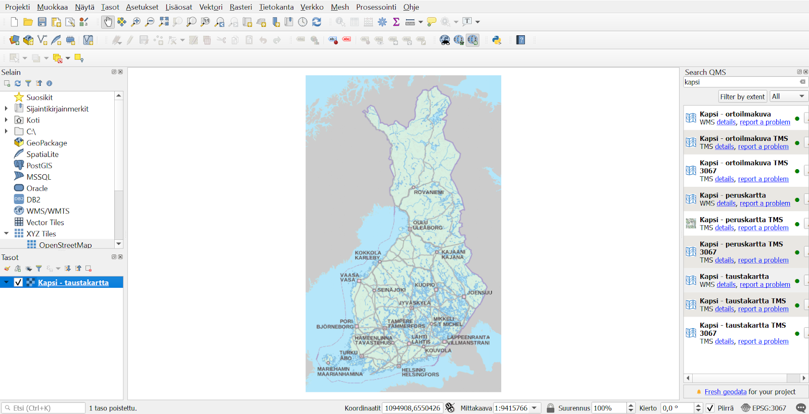
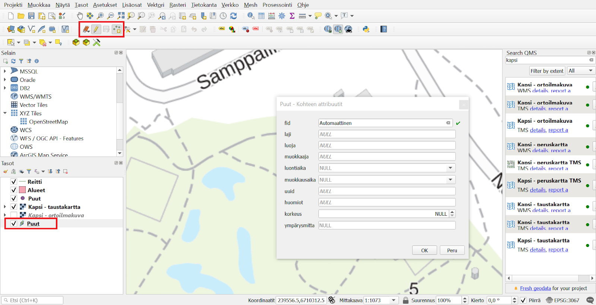
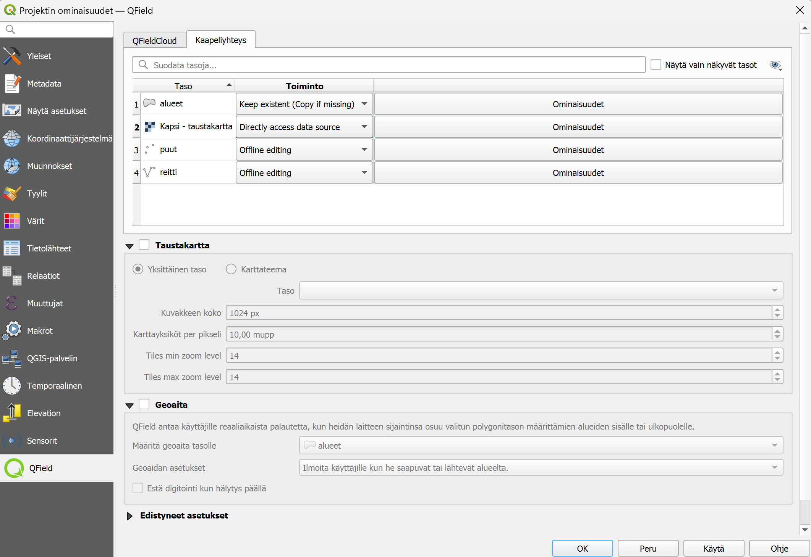
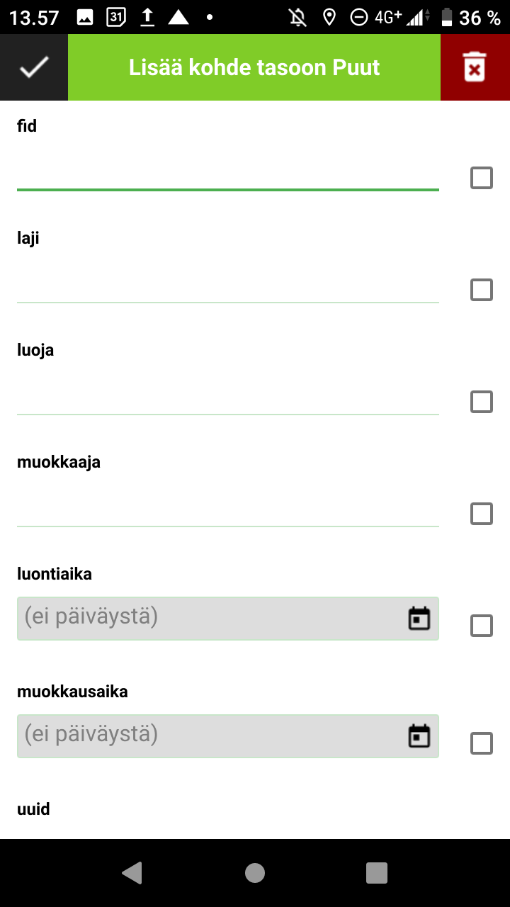

# Harjoitus 2: QGIS-projektin valmistelu, synkronointi ja digitointi

### Harjoituksen sisältö

Harjoituksessa luodaan 1. versio kurssin puutietojen keruuprojektin projektitiedostosta QGIS-työpöytäohjelmistolla. Lisäksi asennetaan QGISin QField Sync -lisäosa, joka mahdollistaa projektitiedostojen siirron tietokoneen ja mobiililaitteen välillä.

### Harjoituksen tavoite

Koulutettava oppii luomaan QGIS-projektin sekä paketoimaan siirtämään sen mobiililaitteeseen QField Sync -lisäosaa käyttäen.

### Arvioitu kesto

45 minuuttia.

## Valmistautuminen

Avaa **QGIS**-työpöytäohjelmistotietokoneellasi ja aloita siellä uusi QGIS-projekti (ylävalikosta **Projekti \> Uusi**). Tallenna projektitiedosto **(Projekti \> Tallenna nimellä\...**) nimellä **"QField-kurssiprojekti"**. Harjoituksessa oletetaan myös, että QField-ohjelmisto on valmiiksi asennettu mobiililaitteeseen (Harjoitus 1).

## QGIS-projektitiedoston valmistelu ja perusasetukset

Avaa QGISin ylävalikosta projektin ominaisuudet (**Projekti \> Ominaisuudet**) ja sieltä **Yleiset**-välilehti. Etsi sieltä asetus **Tallenna polut** ja valitse alasvetovalikosta arvoksi **suhteellinen**. Tällöin projektia siirrettäessä eri laitteille projekti ja sen aineistot löytyvät, sillä hakemistopolut viittaavat ainoastaan projektin kotihakemistoon, eivätkä esimerkiksi C-levyn  juureen ja laitekohtaiseen hakemistorakenteeseen.

Tämän jälkeen mennään vielä samassa **Projektin ominaisuudet** -ikkunassa **Koordinaattijärjestelmä**-välilehdelle ja valitaan koordinaattijärjestelmäksi **EPSG:3067**.

## Taustakarttojen lisäys

Lisätään nyt taustakarttataso paikkatiedon mobiilikeruuta helpottamaan. Tämän voi lisätä sekä esimerkiksi WMS-tasona, jos mobiililaite on varustettu internet-yhteydellä tai se voidaan lisätä tiedostotasona jos yhteyttä ei ole, se on liian hidas, tai sitä ei muusta syystä haluta käyttää.

::: hintbox
Eräs mahdollisuus on myös lisätä taustakartta rajapintana QGIS-projektiin, mutta muuttaa se ilman internet-yhteyttä käytettäväksi Geopackage-tiedostoksi halutulta alueelta projektitiedoston siirron/synkronoinnin yhteydessä. Tästä lisää myöhemmin. \|
:::

Lisätään nyt taustakartta koko Suomen alueelta käyttäen QGISin **QuickMapServices**-lisäosaa. Asennetaan ensin lisäosa QGISin ylävalikosta: **Lisäosat \> Hallitse ja asenna lisäosia**, kirjoita hakukenttään **QuickMapServices** ja klikkaa "**Asenna lisäosa**". Lisäosan asennuttua se löytyy Verkko-ylävalikosta. Lisäksi QGIS-ikkunaan aukeaa "**Search QMS**"-paneeli, jolla saatavissa olevia taustakarttapalveluita voi etsiä. Jos paneeli ei aukea automaattisesti, sen voi avata ylävalikon kautta. Hae paneelin avulla "**Kapsi - taustakartta**" ja lisää projektiin kaksoisklikkaamalla.

::: hintbox
Projektiin voi halutessaan lisätä useammankin taustakartan, joita voidaan käyttää QFieldissä yhtäaikaisesti. Tässä voi myös hyödyntää QGISin karttateemat-ominaisuutta.
:::

::: hintbox
Digitointia auttamaan saattaisi olla hyödyllistä käyttää lisäksi esimerkiksi ortoilmakuvaa, joka löytyy myös QuickMapServicen "Kapsi"-haulla. Pidetään projekti nyt mahdollisimman yksinkertaisena ja pidetään vain "Kapsi - taustakartta" -taso.
:::

## Tasojen luonti

Luodaan uusi GeoPackage, johon kerättävät paikkatiedot tullaan lisäämään eri tasoina (ylävalikosta **Tasot \> Luo taso \> Uusi GeoPackage-taso...**). Valitse **Tietokanta**-kohdasta GeoPackagen tallennuspaikaksi sama kansio jossa itse QGIS-projekti sijaitsee. Tämä onnistuu painamalla **Tietokanta**-kohdan oikealta puolelta (painike, jossa 3 pistettä) ja navigoimalla kyseiseen kansioon. Anna GeoPackage-tiedoston nimeksi **Puu-inventointi** ja paina Tallenna/Save. Seuraavan kohdan **Taulun nimeksi** (eli luotavan tason nimeksi) tulee nyt automaattisesti tämä äsken annettu tiedoston nimi. Koska aiomme kuitenkin lisätä samaan GeoPackageen useamman tason, muutetaan **Taulun nimi** -kohtaan nimeksi nyt **Puut**. Valitaan tason geometriatyypiksi **Piste** ja koordinaattijärjestelmäksi **EPSG:4326 - WGS 84**.

Lisätään vielä **Uusi kenttä** -kohdasta joitakin peruskenttiä tason ominaisuus-taulukkoon. Lisätään ensin **laji**-niminen kenttä ja valitaan alasvetovalikosta tyypiksi **teksti** (**Text Data**). Painetaan **Lisää kenttälistaan** -nappia. Lisätään lisäksi **korkeus**-kenttä kokonaisluku-tyyppisenä sekä **ympärysmitta** desimaalinumerona (double), sekä **valokuva** teksti-tyyppinä (tästä lisää myöhemmin). Muista klikata jokaisen kentän tietojen täytön jälkeen **Lisää kenttälistaan.**

Lisätään tämän jälkeen vielä seuraavat datan hallintaan/ **metatietoihin** liittyvät kentät:

-   **uuid** (tyyppi: teksti)

-   **huomiot** (teksti)

-   **luoja** (teksti)

-   **muokkaaja** (teksti)

-   **luontiaika** (päivämäärä ja aika)

-   **muokkausaika** (päivämäärä ja aika)

Tämän jälkeen klikkaa OK, jolloin taso on luotu ja se ilmestyy QGISin Tasot-selaimen listaukseen.

Lisätään vielä 2 muuta tasoa tähän GeoPackageen (**Tasot \> Luo Taso \> Uusi GeoPackage-taso...** ).

1.  Navigoidaan nyt **Tietokanta**-kohdasta valiten äsken luotu **Puu-inventointi** -GeoPackage-tietokanta. Muutetaan nyt taulun nimeksi **Alueet**, geometriatyypiksi **Polygoni**, koordinaattijärjestelmäksi EPSG:4326 kuten edellä sekä ominaisuustietokentiksi **nimi** (teksti), **tyyppi** (teksti), sekä samat **metatiedot** kuin edellä. Paina sitten OK. Esiin ponnahtaa ikkuna, jossa ilmoitetaan tiedoston jo olevan olemassa ja kysytään mitä sillä halutaan tehdä. Valitse **Lisää uusi taso**, jolloin samaan GeoPackage-tietokantaan lisätään uusi taso (**Huom!** "Korvaa"-vaihtoehto tässä kohtaa kirjoittaa edellä luodun Puut-tason päälle. Älä valitse sitä!).

2.  Toistetaan vaiheet kuten kohdassa 1., mutta laitetaan taulun nimeksi **Reitti** ja geometriatyypiksi **viiva** (koordinaattijärjestelmänä pidetään edelleen EPSG:4326). Ominaisuustietokentiksi asetetaan **tyyppi** (teksti), sekä samat **metatiedot** kuin edellä. Paina sitten OK ja valitse ponnahdusikkunasta **Lisää uusi taso**.

Järjestä vielä projektiin luodut tasot Tasot-paneelissa, kuten alla olevassa kuvassa. Järjestyksen muuttaminen onnistuu esimerkiksi tasoja "raahaamalla" (ns. drag & drop). Ylempänä listassa olevat taso piirretään alempana olevan päälle, joten on luontevaa, että taustakartta ja polygoni-tasot ovat alimpina. Ajan salliessa, voit myös muuttaa tasojen kuvaustyylejä haluamiksesi. Kysy tarvittaessa apua kouluttajalta.

Voit nyt vertailun vuoksi testata, miltä editointi ja tietojen lisäys näyttää QGISissa työskenneltäessä. Aseta siis **Puut**-taso editoitavaksi, esimerkiksi klikkaamalla tason kohdalta hiiren oikealla napilla ja valitsemalla **Tason muokkaus päälle/pois**. Paina **Lisää pistekohde** -nappia digitoinnin työkalupalkista (kts. kuvaa alla). Klikkaa kartalla lisätäksesi pistemäisen kohteen, jolloin lomake aukeaa. Testaa kutakin kenttää ja huomaa, että niihin lisätään tietoja eri tavoilla. Nyt ei kuitenkaan ole tarpeen lisätä kohdetta, joten testattuasi voit klikata **Peru**.

Kun olet valmis, tallenna vielä projektitiedosto pikanäppäimellä **CTRL + T** tai päävalikosta **Projekti \> Tallenna**. Nyt perustasot ja -aineistot on lisätty QGIS-projektiin, joten valmistellaan seuraavaksi projektin siirto mobiililaitteeseen.

::: hintbox
QFieldin kehittäjät suosittelevat GeoPackagen käyttöä myös rasteridatalle, erityisesti mobiililaitteille suurten tiedostokokojen takia. Lisätietoja näiden esivalmistelusta löytyy [dokumentaatiosta](https://qfield.org/docs/data-formats/). \|
:::

## QField Sync -lisäosan asentaminen ja käyttö

Asennetaan nyt **QField Sync** -niminen lisäosa QGISiin samoin kuin QuickMapServices-lisäosa aiemmin: **Lisäosat \> Hallitse ja asenna lisäosia**. QField Sync -lisäosaa käytetään QGIS-projektin paketointiin ja synkronointiin tietokoneen ja mobiililaitteen välillä. Lisäosan asennuttua, se löytyy **Lisäosat**-ylävalikosta.

Valmistellaan nyt projektin siirtoa mobiililaitteeseen konfiguroimalla paketoinnin asetukset QField Syncillä. Asetukset voi avata useammastakin paikkaa:

-   projektin ominaisuuksiin on ilmestynyt uusi välilehti nimeltä **QField** (**Projekti \> Projektin ominaisuudet**)

-   QField Sync -työkalupalkista työkalu-painikkeesta ("**Määritä nykyinen projekti**")

-   QGISin ylävalikosta: **Lisäosat \> QFieldSync \> Määritä nykyinen projekti**

-   **Pakkaa QFieldiä varten** -toimintoa käytettäessä työkalupalkista (**Määritä nykyinen projekti** -nappi)

Käytetään jotakin edellä mainituista tavoista ja konfiguroidaan projekti QFieldiä varten. Huomaa, että valitaan avautuvasta ikkunasta "Cable export" -välilehti QFieldCloudin sijaan. Välilehdellä näkyy nyt myös listaus projektin tasoista. Tasoille voi yksitellen määrittää jokin seuraavista valinnoista:

-   Kopioi: tekee tiedostopohjaisen tason kopion suoraan siirrettävän QField-projektin paketointikansioon

-   Säilytä olemassa olevat (kopioi jos puuttuu)

-   Offline-muokkaus: tasosta luodaan työstettävä kopio paketointikansioon ja tasolle tehtävistä muutoksista luodaan muutosloki, jonka perusteella tehdään muutokset alkuperäiselle datalle kun projektia synkronoidaan takaisin QGIS-projektiin. Tämä ei kuitenkaan sisällä mahdollisten digitoinnissa tapahtuneiden konfliktien ratkaisua.

-   Poista: ei siirrä tasoa QField-projektin paketointiin. Ei kuitenkaan poista sitä vastaavasta QGIS-projektista.

-   Ei toimintoa: säilyttää tason suoran rajapintayhteyden, vaatii datayhteyden mobiililaitteessa.

Valitaan rasterimuotoiselle taustakartalle **ei toimintoa** ja muille tasoille valitse **Offline-muokkaus**.

Taso-asetusten alla voitaisiin määrittää taustakartta-asetukset, jos haluttaisiin että taustakartasta tehtäisiin geopackage-muotoinen tiedostotaso, jolloin datayhteyttä ei sille tarvita. Näissä asetuksissa määritellään minkä pohjalta taustakarttatiilet tehdään (jokin yksittäinen taso vai karttateema), tiilien koko ja resoluutio. Koska taustakarttaa käytetään kuitenkin nyt suoraan rajapinnalta, jätä **Luo taustakartta** -kohta rastittamatta ja paina **OK**.

Suoritetaan nyt paketointi: **Lisäosat \> QFieldSync \> Pakkaa QFieldiä varten**. Valitaan pakatun projektin tallennuskansio, joka on siis eri kuin mihin vastaava QGIS-projekti aiemmin luotiin (oletuskansion pystyy muuttamaan QFieldSync-lisäosan asetuksista). Voimme nyt myös panoroida sen karttanäkymän laajuuden, jonka halutaan näkyvän kun projekti avataan QFieldissä. Paina **Luo**.

## QGIS-projektin siirto mobiililaitteeseen

QGISillä paketoitu QGIS-projekti ja sen mukana kulkeva datatiedosto **data.gpkg** (löytyy samasta kansiosta projektitiedoston kanssa) voidaan siirtää mobiililaitteeseen useammalla eri tavalla: joko johdolla suoraan tietokoneelta mobiililaitteeseen, tai pilvipalvelun (esimerkiksi Google Driven) kautta mobiililaitteeseen. Käytetään tässä harjoituksessa ensimmäistä vaihtoehtoa.

Liitä mobiililaitteesi johdolla tietokoneeseesi. Kun tietokone kysyy, miten liitetyn laitteen kanssa toimitaan, valitse **Avaa kansio ja tarkastele tiedostoja**. Kun Windows avaa mobiililaitteen kansioikkunan, siirrä paketoidun QGIS-projektin ja data.gpkg-tiedoston sisältävä kansio mobiililaitteeseen esimerkiksi raahaamalla se ikkunasta toiseen. QGIS-projektin kansiosijainnilla ei sinällään ole merkitystä, kunhan projekti on mobiililaitteessa -- paina kuitenkin sijainnin nimi mieleesi, jotta tiedät mistä hakea projektia mobiililaitteesta. Huomaa myös, että tiedostoja ei kannata siirtää yksitellen, vaan kokonainen kansio kerralla.

## Projektin avaaminen QFieldissä

Avataan nyt mobiililaitteeseen siirretty QGIS-projekti QFieldissä. Avaa QField-sovellus (jos QField kysyy hyväksytäänkö paikallisten tiedostojen käyttö ja paikannus, valitse salli), jolloin sinulle ilmestyy jälleen alla olevan kuvan mukainen etusivu. Valitse **Avaa paikallinen tiedosto**.

Tällöin näytölle tulee "QField tiedostojen hakemisto" jonka alihakemistot ovat lähtökohtaisesti tyhjiä Android-käyttöjärjestelmässä. Tämä johtuu Googlen loppuvuonna 2021 tekemistä muutoksista, jotka eivät salli sovellusten suoraa pääsyä laitteen tallennusmuistiin. Siksi onkin  ensin importoitava se kansio, jonne projektin siirsit, jotta QField voi käyttää sitä. Se tapahtuu painamalla oikean alalaidan vihreää plus-nappia, valitse **"Import project from folder"** jonka jälkeen navigoi mobiililaitteen kansioon johon projekti siirrettiin ja klikkaa **"Use this folder"**. Tämän toimenpiteen jälkeen projektin pitäisi löytyä kansion "QField tiedostojen hakemisto"/"Imported Projects" alta. Avaa QGIS-projekti klikkaamalla mobiililaitteen tiedostoista, jonka jälkeen QFieldiin avautuu karttanäkymä. 

Tarkastele avattua projektia, ja varmistu että **Valikosta** löytyy kaikki lisätyt tasot ja ettei avattaessa esimerkiksi tule mitään virheilmoituksia.

## Digitointitila

Tarkastellaan vielä juuri luodulla projektillamme kuinka pistekohteiden digitointi tapahtuu QFieldissä. Emme ole vielä määrittäneet ominaisuustietojen syöttötapaa sen tarkemmin, vaan käytössä on oletusasetukset. Tietojen syöttäminen helpottuu ja tehostuu kuitenkin merkittävästi seuraavan harjoituksen jälkeen. Perehdymme nimittäin siinä tarkemmin QGISin lomakkeiden käyttöön QFieldissä.

Avaa valikko, aktivoi muokkaus- eli digitointitila kynä-ikonia klikkaamalla. Klikkaa lisäksi Puut-tason kohdalta, jolloin taso tulee aktiiviseksi ja digitointi kohdistuu siihen. Sulje valikko. Huomaa että karttanäkymän keskelle on ilmestynyt tähtäinristikko. Tämä määrää mihin kohtaan digitoitava kohde tulee. Huomaa, että digitointitilassa karttanäkymän oikeasta alakulmasta löytyy myös vastaavankaltainen vihreä ristikkotähtäin-kuvake. Tätä klikkaamalla lisätään uusi kohde Puut-taso on. 

Liikuta nyt karttaa kohtaan, johon haluat lisätä puun ja klikkaa vihreää nappia. Tällöin avautuu ominaisuustietolomake puu-kohteen tietojen lisäämistä varten. Huomaa, että tässä lomakkeessa on kaikki tason kentät, esimerkiksi fid ja uuid, jota emme yleensä halua erikseen manuaalisesti täyttää. Samaten luonti- ja muokkausaikoja lukuunottamatta tietojen syöttö tapahtuu yksinkertaisesti näppäimistön avulla kirjoittamalla, sillä muut kentät ovat joko teksti- tai luku-tyyppiä. Kirjoita nyt lomakkeen laji-kohtaan jotakin ja klikkaa lomakkeen vasemmasta yläkulmasta lisätäksesi kohteen.

::: hintbox
Kohdetta lisättäessä tietojen syöttölomakkeen oikeassa laidassa kenttien kohdalla on  valintalaatikko. Ruksaamalla valintalaatikko QField muistaa kentän viimeksi syötetyn arvon ja täyttää sen valmiiksi seuraavalle kohteelle. Tästä voi olla hyötyä joissakin tilanteissa. Oletusarvoja pystyy toki määrittämään myös QGISin lomake-asetuksissa (Harjoitus 3). \|
:::

Voit poistaa nyt lisätyn Puut-tason yksittäisen testipisteen seuraavasti:

1.  klikkaa kohdetta kartalla. Nyt aukeaa ikkuna, jossa valitut kohteet on listattu. 

2.  Valitse kohde listasta, jolloin kohteen ominaisuustietolomake aukeaa.

3.  Klikkaa yläpalkin kolmea pistettä ja valitse **Poista kohde**. 

Yhden tai useamman kohteen voi poistaa myös hieman eri tavalla: 

1.  Paina pitkään tason nimeä sivuvalikossa, valitse **Näytä kohdelista**. Nyt aukeaa ikkuna, jossa tason kohteet on listattu. 

2.  Klikkaa yläpalkinkolmea pistettä ja valitse **Vaihda kohdevalinta**.

3.   Tämän jälkeen merkkaa listauksen valintalaatikkoon kohteet, jotka haluat poistaa.

4.   klikkaa kolmea pistettä uudelleen ja **Poista valittu kohde/kohteet** 

Kuten ehkä huomasit, kohteiden tunnistaminen kohdelistasta on nykyisellään hieman hankalaa, sillä listauksessa näkyy ainoastaan kohteen id-arvo (esim. 1). Korjaamme myös tämän ongelman seuraavassa harjoituksessa. Nyt voit jälleen sulkea QFieldin.
