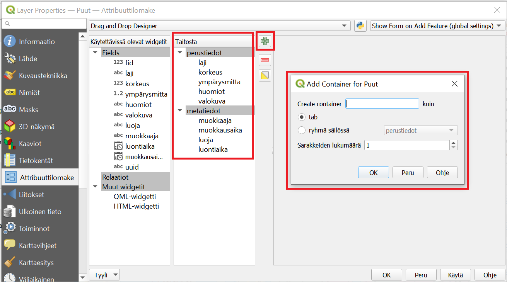

# Harjoitus 3: Lomakkeet

### Harjoituksen sisältö

Tässä harjoituksessa muokataan projektissa olevien tasojen tietojen syötön lomakkeita digitoinnin helpottamiseen ja tehostamiseen.

### Harjoituksen tavoite

Koulutettava oppii muokkaamaan tiedon syöttötapoja QGISin widgettejä käyttäen, sekä osaa tunnistaa mobiilitiedonkeruussa ja etenkin QFieldissä tähän liittyvät erityispiirteet. \|

### Arvioitu kesto

45 min.

## Valmistautuminen

Avaa QGIS tietokoneellasi ja avaa siellä aiemmin luomasi QGIS-projekti (**Projekti \> Avaa**), siirry oikeaan kansioon, valitse projektitiedosto (**"QField-kurssiprojekti")** ja paina **Avaa**.

## Taustatietoja

Tässä harjoituksessa muokataan projektissa olevien tasojen tietojen syötön lomakkeita digitoinnin helpottamiseen ja tehostamiseen. QGISissa on erityyppisille tiedoille ja niiden syöttötavoille valittavissa monenlaisia vimpaimia (widgets). Näitä kaikkia ei kuitenkaan ole vielä tuettuna QFieldissa, joten niitä ei voi siinä siis käyttää. Tuettujen widget-tyyppien ajantasaisen listan näet dokumentaatiosta: <https://qfield.org/docs/prepare/attributes-form.html>

## Ominaisuustietolomakkeen muokkaus

Avaa QGISissa **Puut**-tason ominaisuudet klikkaamalla hiiren oikealla napilla **Tasot**-paneelista tason kohdalta. Valitse **Ominaisuudet...** ja mene **Attribuuttilomake**-välilehdelle. Valitse välilehdellä ylhäällä olevasta pudotusvalikosta **Drag and Drop Designer** -tila (suom. Raahaa ja pudota -muokkain) automaattisen sijaan. Tässä lomakkeeseen sisällytettävät kentät on välilehden keskimmäisessä, **Lomakenäkymä**-nimisessä (ent. taitosta) sarakkeessa. Tähän voidaan lisätä objekteja vasemmanpuolimmaisesta sarakkeesta keskimmäiseen raahaamalla. Samoin tarpeettomia vimpaimia ja kenttiä voi poistaa lomakkeen taitosta klikkaamalla kyseistä objektia ja poistamalla se punaisesta miinus-nappulasta (kts. kuva). Drag and Drop Designer -näkymässä voidaan myös ryhmitellä lomakkeen kenttiä esimerkiksi eri välilehtiin ja nämä ryhmitykset toimivat myös QFieldin käyttöliittymässä.

Pidetään nyt kuitenkin kaikki kentät samassa välilehdessä. Poistetaan sen sijaan lomakenäkymästä kentät **fid** sekä **uuid**, joita ei lomakkeessa haluta manuaalisesti lisätä. **Lomakenäkymä** -sarakkeessa voi myös muuttaa lomakkeen kenttien järjestystä raahaamalla. Muokkaa nyt kenttien järjestys alla olevan kuvan **Taitosta**-osion  mukaiseksi.

## Laji-tietokenttä

Ruvetaan nyt muokkaamaan tietojen syöttötapoja. Klikkaa keskimmäisessä Lomakenäkymä -sarakkeessa **laji**-kenttää. Valitse oikeaan sarakkeeseen aukeavasta Widgetin tyyppi -pudotusvalikosta **Arvoluettelo** Tekstin muokkaus -tyypin sijasta. Tällä tavoin puulajitieto lisätään digitoidessa valitsemalla luettelosta jossa on tiettyjä arvoja. Tällöin myös esimerkiksi kirjoitusasu säilyy yhdenmukaisena ja aineiston myöhempi analyysi todennäköisesti myös helpottuu.  Lisää nyt taulukkoon kohtaan **Arvo** puulajien nimiä, ainakin Suomen yleisimmät puulajit: mänty, kuusi ja koivu. Lisää yksi laji per rivi. Halutessasi voit jatkaa listaa seuraavaksi yleisimmillä lajeilla: haapa, harmaaleppä, kataja, lehtikuuset, pihlaja, raita, tammi sekä tervaleppä, jos arvelet niitä tarvitsevasi. Aseta tämän jälkeen vielä **Ehdot**-osioon alle ruksi valintalaatikkoon **Ei tyhjä (null)**, jolloin ainakin tämä tieto on aina täytettävä.

\

## Ympärysmitta- ja korkeus -tietokentät

Klikkaa nyt ympärysmitta-kenttää Taitosta-sarakkeessa. Sekä tämän että korkeus-kentän  sisältö on numeerista, eli on luontevinta valita widgetin tyypiksi **rajat**. Tehdäänkin näin, mutta muistetaan samalla että tämä tyyppi ei ole tällä hetkellä tuettuna QFieldissä ja sen lomakenäkymässä nämä tiedot joudutaankin syöttämään tekstisyöttönä. Ei-tuettujen widgettien tapauksessa se siis jättää sen huomiotta ja käyttää oletus-syöttötapaa (QField tunnistaa kyllä tässäkin kentän tyypin ja varmistaa että tähän pystyy lisäämään ainoastaan numeroita avaamalla numeronäppäimistön). 

## Huomiot-tietokenttä

Tähän olisi tarkoitus lisätä vapaamuotoisia lisähuomioita, joten tämän voi pitää oletusasetuksilla **Tekstin muokkaus** -tyyppisenä. Valitaan tähän alle lisäksi **Monirivi** (Multiline), jolloin pidemmätkin huomiot voi lisätä kätevästi. Koska huomioita ei toisaalta välttämättä ole, jätetään **Ei tyhjä** -ehto valitsematta.

## Valokuva

Mobiililaitteella otettujen valokuvien lisäys tapahtuu QFieldillä liitteenä, joten valise widgetiksi **Liite** ja sen asetuksista **Suhteelliset polut**.

::: hintbox
Pidä mielessä, että QField tallentaa tasolle kohteen tietoihin valokuvista (ja muista liitteistä) ainoastaan tiedostopolun, ei itse valokuvaa. Valokuvat tallentuvat mobiililaitteen kansioon. Tarkastellaan tätä lisää myöhemmin, kun synkronoidaan kerättyjä tietoja takaisin QGIS-projektiin. Tällöin valokuvat sisältävä kansio on siirrettävä erikseen tietokoneelle, projektitiedoston suhteen samaan paikkaan kuin mobiililaitteella.
:::

## Luoja- ja muokkaaja -tietokenttien automatisointi

Luoja- ja muokkaaja-kentät ovat teksti-muotoisia kenttiä, jotka sisältävät tiedon muokkauksen tekijästä. Pidä siis widgettinä **Tekstin muokkaus**. Koska muokkaaja tietyllä laitteella on yleensä yksi ja sama henkilö, tätä ei haluta joka kerta lisätä manuaalisesti, vaan automaatio on suotavaa, ja se voidaan saavuttaa **Oletusarvot**-kohdan avulla. Olemme aiemmin määritelleet QFieldin asetuksissa käyttäjän oman muuttujan **username**. Tällaiseen muuttujan arvoon voi QGISissa viitata **\@**-merkillä. Kirjoita siis tähän Oletusarvo-kohtaan Luonti- ja muokkauskentille kummallekin erikseen **\@username_full_name**, jolloin QField osaa lisätä kohteelle käyttäjänimen.

Luonti ja muokkaus eroavat toisistaan siinä, että kohde luodaan vain kerran, kun taas sitä voidaan muokata moneen kertaan. **Muokkaaja**-tietokentälle pitääkin varmistaa, että tässä on **Yleistä**-kohdassa valittuna **Muokattava** ja **Oletusarvo**-kohdassa **Käytä oletusarvoa päivityksessä**. Vastaavasti **Luoja**-tietokentässä nämä kaksi kohtaa eivät saa olla valittuna, jotta tietojen syöttö toimisi kuten haluamme! Sen sijaan kohteella tulee aina olla luoja, joten laitetaan sille vielä **Ehdot**-kohdassa ehdot **Ei tyhjä (null)** ja **EI NULL -ehto on pakottava**.

## Luonti- ja muokkausaika -tietokentät

Myös luonti- ja muokkausaika-kentille pätee sama, mitä edellä sanottiin luonnista ja muokkauksesta, ja ne käsitellään kumpikin melko samalla tavalla. Valitse kummallekin Widgetin tyypiksi **Päivä/Aika**. Näidenkin tietojen syöttö halutaan automatisoida, ja tämä onnistuu käyttämällä QGISin sisäistä funktiota **now()**, joka kirjoitetaan **Oletusarvo**-kohtaan kummallekin kentälle. **Muokattava, oletusarvon päivitys** ja **null-ehdot** määritetään täsmälleen kuten edellä **Luoja-** ja **Muokkaaja**-kentille ohjeistettiin.

## Kohteen uuid-kenttä

Vaikka uuid-tietokenttä poistettiinkin taitosta tarpeettomana tietona, määritetään nyt miten kyseinen tieto kohteelle syötetään. Tässäkin apuun tuleen QGISin sisäinen funktio nimeltä **uuid()**, joka luo tarvittavan UUID-koodin. Klikkaa vasemmanpuoleisesta Käytettävissä olevat widgetit -sarakkeesta kohtaa uuid. Pidä widgetin tyyppinä **Tekstin muokkaus**, mutta mene jälleen **Oletusarvo**-osioon ja kirjoita oletusarvoksi funktio **uuid()**. Poista myös **Muokattava**- sekä **Käytä oletusarvoa päivityksessä** -valinnat, sillä kun kohde on luotu, UUID:n ei tule enää muuttua.

## Lomakkeen välilehdet

Kun täytettäviä ominaisuustietokenttiä on paljon, niiden jaotteleminen eri välilehdille saattaa helpottaa työskentelyä. Myös QField tukee välilehtien käyttöä. Välilehti-ominaisuus luodaan QGISissa samassa näkymässä jossa juuri määrittelimme tietojen syöttötavat eri kentille.

Vaikka lisättäviä ominaisuustietoja ei nykyisessä projektissamme aivan valtavasti olekaan, saattaa olla kätevää jaotella metatiedot omalle välilehdelleen, sillä nämä liittyvät toisiinsa eikä niitä myöskään täytetä manuaalisesti. Klikkaa vihreää plus-merkkiä lisätäksesi uuden välilehden (kts. kuva). Anna välilehdelle (tab) nimeksi "metatiedot" ja sarakkeiden lukumääräksi 1. Paina OK, jolloin välilehti ilmestyy Taitosta-sarakkeeseen. Raahaa metatieto-kentät välilehden päälle ja irrota, jolloin ne sisältyvät välilehteen alla olevan kuvan mukaisesti. Lisää sitten toinen välilehti ja anna sille nimeksi "perustiedot". Raahaa loput ominaisuustietokentät tähän välilehteen. Huomaa että pystyt muokkaamaan välilehtien ja niiden sisältämien kenttien järjestystä sopivaksi samaan tapaan raahaamalla.

Tämän jälkeen voit klikata OK, jolloin attribuuttilomakkeen muutokset tulevat voimaan QGIS-projektissa. Muista tallentaa myös projektitiedosto pikanäppäimellä **CTRL + T** tai päävalikosta **Projekti \> Tallenna**.

## Näyttö ja kohdelistaus

Huomasimme edellisen harjoituksen lopussa, että kohdelistauksesta oli hankala erottaa kohteita toisistaan selkeyttävien kohdenimien puuttuessa. Tilannetta voi helpottaa QGISin Näyttö-valikon avulla. Avaa siis jälleen Puut-tason ominaisuudet, ja avaa tällä kertaa **Näyttö**-välilehti. Siellä voidaan määrittää **Näyttönimi**, joka on nimi, joka kohdelistauksessa näkyy. Varsinaisia nimiä puukohteillamme ei nyt ole, mutta voimme yrittää erotella kohteita toisistaan esimerkiksi laji-kentän ja jonkin muun kentän, esimerkiksi luontiajan, arvon avulla. Lausekkeen voi kirjoittaa suoraan kuvassakin näkyvään laatikkoon, tai voi käyttää apuna **Lausekkeen muokkaus** -ikkunaa painamalla "epsilon"-ikonia laatikon oikealta puolelta. Muista, että kenttien nimet tulevat tavallisten, kaksinkertaisten lainausmerkkien sisälle ("laji"), kun taas muut tekstipätkät yksinkertaisten heittomerkkien sisälle (','). Esimerkkinä karttavihjeelle voisi siis olla: **"laji" \|\| ',' \|\| "luontiaika"**. Kirjoita tämä tai muu haluamasi lauseke näyttönimeksi, ja paina OK.

## Tarttumisen asetukset

Määritellään tässä kohtaa projektille vielä toinen digitointia käytännössä helpottava asetus, nimittäin **tarttuminen** (snapping), vaikka tätä tarkastellaankin lähemmin vasta harjoituksessa 5. Mikäli QGISin työkalupalkissa ei näy alla olevan kuvan kaltaista magneetti-ikonia, avaa ylävalikosta: **Näytä \> Työkalut \> Tarttumisen työkalut**. Jotta tarttuminen toimisi QFieldissä, on nämä asetukset määriteltävä QGIS-projektille. Voit käyttää kuvasssa näkyviä asetuksia, eli 

-   magneetti-ikoni on aktivoituna,

-   "kaikki tasot" valittuna,

-   Taitepiste ja Segmentti valittuna

-   etäisyysarvo on 15 pikseliä (px).

## Lomakkeet QFieldissä

Voit testata nyt miltä lomake näyttää tehdyillä muutoksilla. Tutki lomaketta ensin QGISissa lisäämällä joitakin kohteita Puut-tasoon. Tämän jälkeen siirrä projekti jälleen QFieldiin QField Sync -lisäosaa käyttäen (ei tarvitse muuttaa synkronointiasetuksia) ja testaa QFieldissa. Voit joko lisätä uusia kohteita QFieldillä tai vain selata olemassa olevien kohteiden attribuuttitietoja. Kummassakin tapauksessa näet aukeavassa lomakkeessa luodut välilehdet (perustiedot ja metatiedot). Pääset liikkumaan välilehdeltä toiselle joko klikkaamalla välilehden otsikkoa tai liu'uttamalla näyttöä sormella sivulle.

\

::: hintbox
Psst! Koulutuksen jälkeen saat henkilökohtaista tukea Gispon tukipalvelusta. Lähetä kysymyksesi tai kommenttisi osoitteeseen tuki\@gispo.fi! \|
:::
