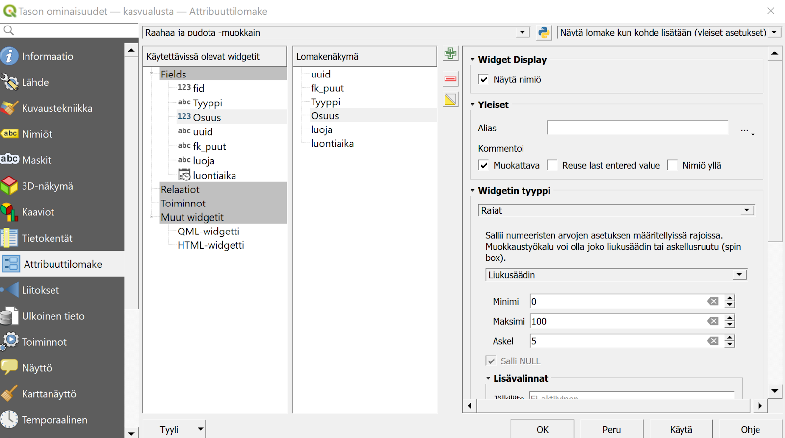
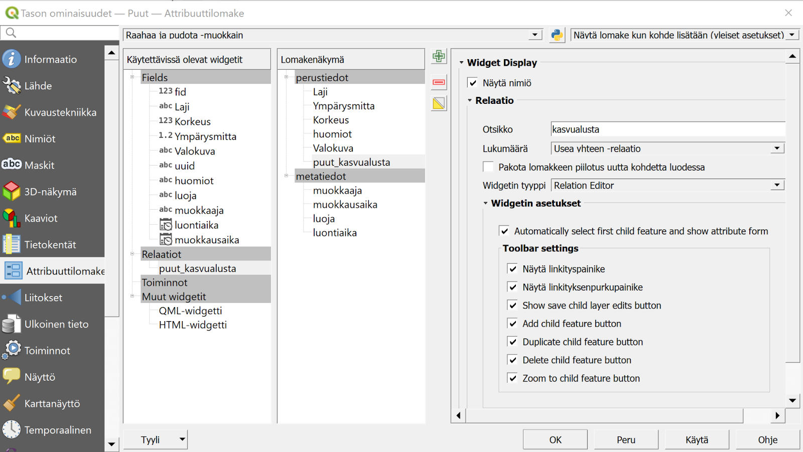
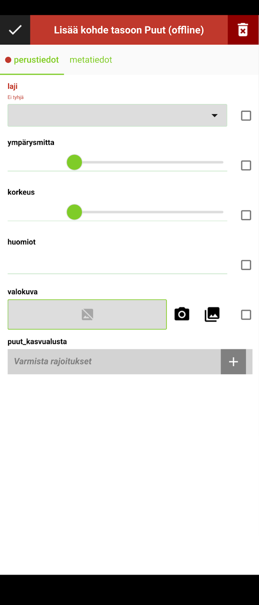
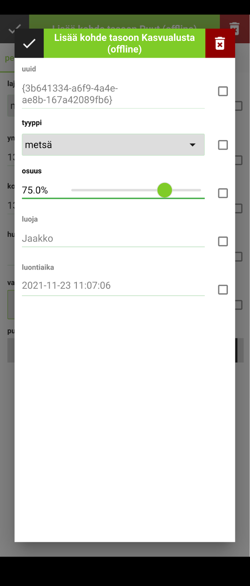
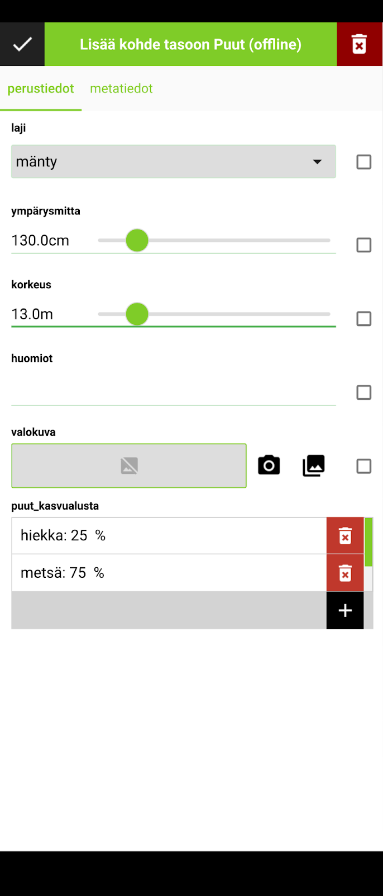

# Harjoitus 4: Relaatioiden käyttö

### Harjoituksen sisältö

Harjoituksessa luodaan QGIS-projektiin uusi Kasvualusta-taso, jonka avulla kerättäviin Puut-tason kohteisiin lisätään tietoa näiden kasvupaikasta. Tasojen välille luodaan relaatio, jonka avulla kyseinen vanhempi-lapsi -suhde saadaan kohteille rakennettua.

### Harjoituksen tavoite

Koulutettava oppii määrittelemään relaatioita tasojen välille QGISin projektin asetuksia käyttäen ja ottamaan tässä huomioon QFieldin ja mobiilikeruun ominaispiirteet.

### Arvioitu kesto

30 min

## Valmistautuminen

Avaa QGIS tietokoneellasi ja avaa siellä aiemmin luomasi QGIS-projekti (**Projekti \> Avaa**), siirry oikeaan kansioon, valitse projektitiedosto (**"QField-kurssiprojekti")** ja paina **Avaa**.

## Kasvualusta-taso

Luodaan nyt uusi taso, joka mahdollistaa yhden tai useamman tiedon (ns. lapsi-kohde/child) liittämiseen kuhunkin Puut-tason kohteeseen (vanhempi-kohde/parent). Kerätään siis puulajien lisäksi summittaista tietoa näiden kasvupaikoista, esimerkiksi maanpinnan koostumuksesta n. 5 metrin säteellä rungosta. Koska tämän säteen sisällä maanpinta voi koostua useammanlaisesta aineksesta, voi yhteen puuhun täten liittyä useampi tämän uuden tason kohde.

Lisätään muut tasot sisältävään GeoPackageen uusi taso (**Tasot \> Luo Taso \> Uusi GeoPackage-taso...** ). Kuten ennenkin, navigoidaan nyt **Tietokanta**-kohdasta aiemmin luotu **Puu-inventointi** -GeoPackage-tietokanta. Muutetaan nyt taulun nimeksi **Kasvualusta**, geometriatyypiksi **Ei geometriaa**, sillä sillä ei ole tässä merkitystä (kaikille samanlainen 5 m ympyrä). Ominaisuustietokentiksi voimme määrittää **tyyppi** (teksti), **osuus** (integer), **uuid** (teksti), **fk_puut** (teksti), **luoja** (teksti) sekä **luontiaika** (päivämäärä ja aika). Paina sitten OK. Esiin ponnahtaa jälleen ikkuna, jossa ilmoitetaan tiedoston jo olevan olemassa ja kysytään mitä sillä halutaan tehdä. Kuten ennenkin, valitse **Lisää uusi taso**, jolloin samaan GeoPackage-tietokantaan lisätään uusi taso.

## Relaatioiden luonti

Mene QGISin päävalikosta **Projekti** \> **Ominaisuudet...** välilehdelle **Relaatiot** ja luo siellä relaatio kohdasta **Lisää relaatio** (vihreästä plus-kuvake). Anna relaatiolle kuvaava nimi, esimerkiksi puut_kasvualusta ja seuraavat kuvanmukaiset asetukset:

-   Referenced layer (parent): Puut

-   Referenced field: uuid

-   Referencing layer (child): Kasvualusta

-   Referencing field: fk_puut

-   Relationship strength: Association

Paina OK ja uudelleen OK sulkeaksesi projektin ominaisuudet saattaaksesi asetukset voimaan.

## Lomakkeen asetusten määrittäminen

Määritetään nyt miten Puut-tason kohteisiin liitettävien Kasvualusta-tason tiedot syötetään. Klikkaa siis QGISissa Kasvualusta-tason kohdalta hiiren oikealla näppäimellä ja valitse **Ominaisuudet...** ja sieltä **Attribuuttilomake**-välilehti. Valitseylhäältä pudotusvalikosta **Drag and Drop Designer** (suom. Raahaa ja pudota -muokkain). Muokkaa lomaketta siten, että Lomakenäkymä-kohtaan tulee vain kuvassa näkyvät kentät, eli **tyyppi**, **osuus**, **luoja** sekä **luontiaika**. Näiden kenttien syöttötavat ovat hyvin samantapaisia kuin ne, joita olemme käsitelleet jo aikaisemmin.

Määritä näiden jäljelle jäävien kenttien syöttötavat siis seuraavasti:

-   Tyyppi: **arvoluettelo**, jossa arvoja esimerkiksi **metsä**, **hiekka**, **rakennettu**, **muu**

-   Osuus: Rajat-widget liukusäätimellä (kts. kuva yllä). Tämä viittaa kunkin kasvualustatyypin prosentuaaliseen osuuteen

-   Luoja ja luontiaika: kuten Puut-tason lomakkeelle

-   uuid (Käytettävissä olevat widgetit -sarakkeessa): muuta ei-muokattavaksi ja aseta oletusarvoksi funktio uuid()

-   fk_puut: tälle ei tarvitse tässä tehdä muutoksia

Lisätään vielä Kasvualusta-tason kohteillekin tunniste QFieldin kohdelistausta varten. Mene siis vielä Tason ominaisuudet -ikkunassa Karttavihjeet-välilehdelle, ja kirjoita lauseke, jossa on yhdistetty kasvualustan tyyppi ja osuus. Katso alla olevasta kuvasta mallia. Paina tämän jälkeen OK.

Lisätään **puut_kasvualusta** -relaatio vielä **Puut-tason** attribuuttilomakkeeseen kuvan mukaisesti. Eli avaa Puut-tason ominaisuudet, ja raahaa Attribuuttilomake-välilehden Drag and Drop Designer -näkymässä käytettävissä olevista widgeteistä lomakenäkymä-sarakkeen perustieto-välilehden viimeiseksi kentäksi:

Paina lopuksi OK. Tallenna myös projekti (**Projekti \> Tallenna**). Pakkaa ja synkronoi muokattu projektitiedosto jälleen QField Sync -lisäosalla. Konfiguroi nyt lisätty Kasvualusta-taso kuten aiemmatkin tasot (Offline). Siirrä lisäosan pakkaama kansio lopuksi mobiililaitteeseen. Kun olet valmis, tallenna projektitiedosto kurssihakemistoon pikanäppäimellä **CTRL + T** tai päävalikosta **Projekti \> Tallenna**.

## Lapsikohteiden luominen QFieldissä

Avaa jälleen kurssiprojekti viimeisine muutoksineen QFieldissä. Luodaan nyt Puut-tasolle uusi kohde, jolle lisätään lapsikohteena tietoa kasvualustasta. Aktivoi digitointitila QFieldissä ja valitse Puut-taso. Digitoi tasolle uusi piste. Attribuuttilomakkeen ilmestyessä huomaat, että perustiedot-välilehdelle on ilmestynyt **puut_kasvualusta** -valinta, joka on mahdollista aktivoida täytettyäsi vaadittavat tiedot Puut-tasolle lisättävästä kohteesta. Täytä tarvittavat tiedot, ja lisää digitoimallesi puulle sen kasvualustatyyppi / -tyypit. Huomaa, että voit lisätä monta eri lapsikohdetta, tässä tapauksessa kasvualustatyyppiä.

