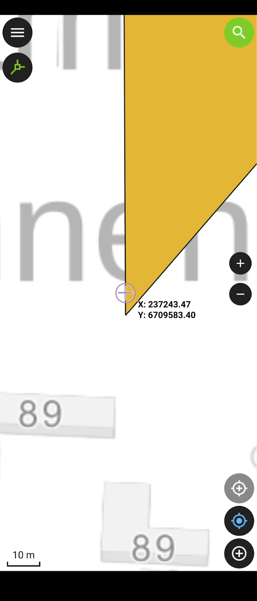
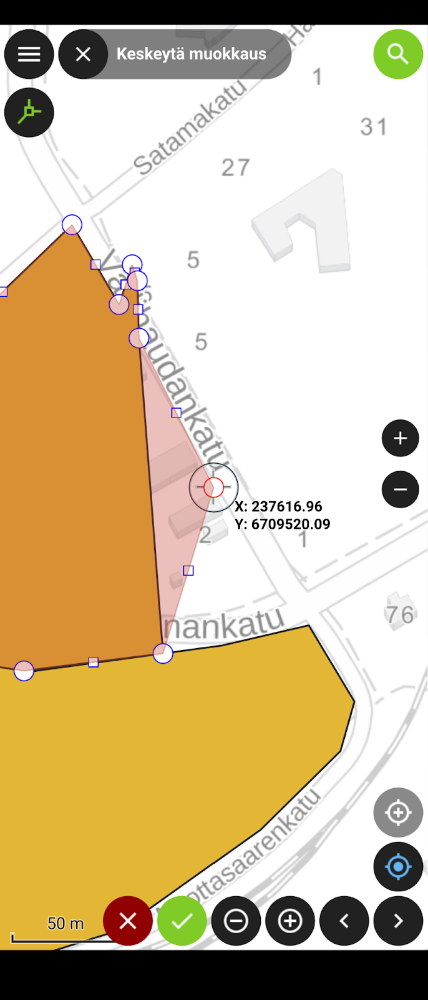
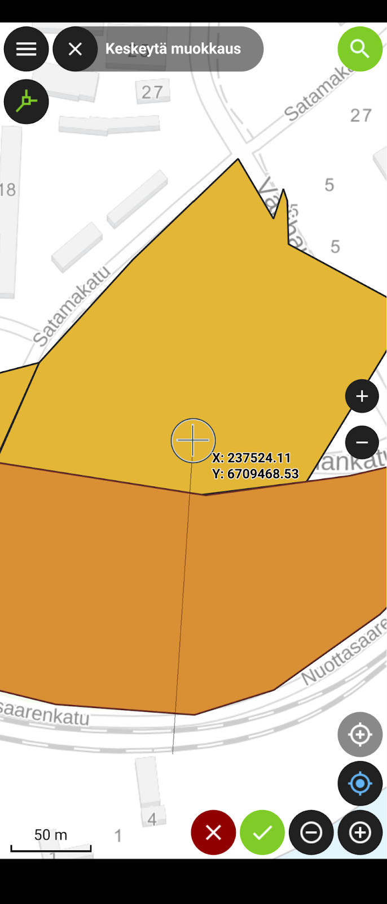

# Harjoitus 5: QFieldin lisäominaisuudet

### Harjoituksen sisältö

Harjoituksessa syvennytään QFieldin edistyneempiin ominaisuuksiin joita ei vielä ole käsitelty, ja jotka voivat olla hyödyllisiä paikkatietojen mobiilikeruun tehostamiseksi käytännössä

### Harjoituksen tavoite

Koulutettava oppii käyttämään etenkin mobiililaitteen paikannusta mobiilikeruun tehostamiseksi QFieldin kanssa toimiessa.

### Arvioitu kesto

30 min.

## Valmistautuminen

Avaa QField, ja klikkaa sen etusivulta viimeisin versio QField-kurssiprojektista. Tämän harjoituksen aikana voi helpottaa jos pystyt hieman liikkumaan lähiympäristössä. Varaudu siis tarvittaessa käymään lyhyesti esimerkiksi ulkona.

## Haku-toiminnot

QFieldin karttanäkymän oikeassa yläkulmassa on suurennuslasin kuva. Klikkaa sitä, jolloin aukeaa hakukenttä ja näppäimistö. Haku toimii automaattisesti monella tavalla. Sillä pystyy hakemaan:

-   Projektissa olevista vektoritasoista, mikäli hakeminen tasoista on sallittu (tämän voi konfiguroida QGISissa: Projekti \> Ominaisuudet... \> Tietolähteet-välilehti \> Etsittävissä oleva). Hakutuloksissa voi klikata joko kohteen nimeä (display name), jolloin kartta kohdistuu kyseiseen kohteeseen, tai sen oikealla puolella attribuuttilomake-ikoniin, jolloin kohteen attribuutti-tiedot aukeavat.

-   koordinaatteja (WGS84-koordinaatit sekä projektin koordinaattisysteemi toimivat)

-   Suomen alueella olevista osoitteista (**HUOM. tämä ominaisuus on rikkoutunut tämänhetkisessä QFieldin versiossa!**)

Testataan nyt lyhyesti kutakin tapaa. Hae:

-   Osoitteen perusteella: esimerkiksi "**Hämeentie**".

-   WGS84-koordinaateilla (leveys- ja pituusasteet), esimerkkiarvot X=24.053647, Y=68.074888. Kirjoita hakukenttään muodossa **24.053647, 68.074888**

-   Vektoritason kohteen avulla: voit hakea Puut-tasosta esimerkiksi jonkin puulajin nimellä.\

## Laitteen paikannuksen käyttäminen

Kun paikannus laitteen GPS:llä on sallittu, pystyy kartan keskittämään omaan sijaintiin oikean alareunan paikannus-napilla. Tätä voi hyödyntää myös lisättäessä tasoille uusia kohteita. Kun digitointi-tila on päällä, tulee paikannus-napin yläpuolelle toinen, samankaltainen valkoharmaa tähtäinristikon näköinen painike. Painamalla tätä kohteen lisäämiseen tarkoitettu painike lukittuu seuraamaan käyttäjän sijaintia tämän liikkuessakin, jolloin tähtäinristikkoa ei tarvitse joka kerta asettaa käsin kohteita lisättäessä, vaan riittää että siirtyy siihen kohtaan johon piste (tai taitepiste) on lisättävä. Painamalla samaa painiketta uudelleen, tähtäin ei ole enää paikannuksen kanssa lukkiutunut, vaan näytön keskellä.

Testaa nyt näiden kahden paikannusnapin käyttöä, jotta niiden sujuva käyttö kenttätöissä (seuraava harjoitus) onnistuu. Varsinkin tähtäinristikon lukittumisen toteamiseksi joutunet liikkumaan hieman esimerkiksi ulkona rakennuksesta tms. Voit käyttää tähän n. 5 minuuttia.

Tarkastellaan tämän jälkeen vielä paikannusasetuksia. Avaa valikko ja sieltä rattaan näköisestä kuvakkeesta Asetukset, josta puolestaan Paikannus-välilehti. Aseta aktiivisiksi valinnat (jos ei ennen valittu):

-   Näytä sijainnin tiedot

-   Aktivoi tarkkuusindikaattori

Huonon ja hyvän paikannustarkkuuden arvot voit pitää oletusarvoissa (Hyvä/Huono tarkkuus alla/yllä). Jos lisäksi aktivoit kohdan "Ota käyttöön tarkkuusvaatimus", QField ei digitoidessa suostu lisäämään pistettä tai taitepistettä mikäli GPS:n tai vastaavan tarkkuus on liian huono (huono tarkkuus -ehto). Voit nyt testata tätä (esimerkiksi sisätiloissa), mutta jätä tämä tarkkuusvaatimus lopulta ottamatta käyttöön. Kun palaat karttanäkymään, näkyy alareunassa tiedot koordinaateista, paikannuksen tarkkuudesta sekä nopeudesta.

## Tracking- eli jäljitys-toiminto

Kun laitteen sisäisen tai siihen mahdollisesti yhdistetyn ulkoisen GNSS-laitteen paikannustoiminto on sallittu, voidaan viiva- ja monikulmio-tasojen yhteydessä käyttää jäljitys-toimintoa. Sen avulla pystytään esimerkiksi kuljettu reitti tallentamaan automaattisesti tai monikulmio-kohde muodostamaan yksinkertaisesti kulkemalla alueen rajaviiva ympäri.

Avaa nyt vasemman yläkulman valikko ja tee pitkä painallus **Reitti**-tasolle (viiva-geometria). Tällöin aukeaa ikkuna lisätoiminnoille. Listassa alimpana on **Aseta seuranta**. Klikkaa sitä. Aukeaa ikkuna, jossa voidaan määrittää seuraavat asetukset

-   Minimiaika (sekunteina)

-   Minimietäisyys (metreinä)

Nämä yhdessä tai erikseen määrittävät minimiarvot milloin QField lisää tässä seuranta-moodissa taitepisteen (vertex) Reitti-tasolle. Lisäksi mikäli viimeinen kohta:

-   Digitoi piste ainoastaan kun molemmat ehdot täyttyvät

on valittuna, taitepisteen digitointi tapahtuu vain, jos molemmat ehdot on asetettu aktiiviseksi, ja jos ne myös täyttyvät. Jos siis esimerkiksi on valittuna oletusarvot 30 s ja 50 m, piste lisätään vasta kun aikaa edellisen pisteen lisäämisestä on kulunut ainakin 30 sekuntia mutta toisaalta vasta sitten kun myös etäisyys viimeisimpään pisteeseen on vähintään 50 metriä.

Aseta nyt minimiaika -asetukseksi 10 s, merkkaa asetuksen valintalaatikosta asetus aktiiviseksi mutta jätä minimietäisyys-asetus valitsematta. Sulje jäljityksen asetukset painamalla **Aloita jäljitys**. Tämän jälkeen QField pyytää syöttämään Reitti-tasolle lisättävän kohteen tiedot, jonka jälkeen reitin muodostuminen jäljitys-menetelmällä voi alkaa. Kirjoita kohteen tyyppi-kenttään vaikkapa "testi". Voit jättää muut kentät tyhjiksi ja klikata jälleen ikkunan vasenta yläkulmaa kohteen lisäämiseksi. Seuranta alkaa. Näet valikon tasolistauksessa **Reitti**-tason perässä vilkkuvan kävelijähahmon. Paikantamalla itsesi kartalla, zoomaamalla reilusti karttaa huomaat kuinka viivatasoon lisätään taitepiste n. 10 sekunnin välein. Tässä kohtaa tietysti auttaa, jos pystyt liikkumaan jonkin verran paikasta toiseen, esimerkiksi ulkona. Huomaa, että seurannan ollessa käynnissä pystyt kuitenkin samalla digitoimaan myös muita tasoja, esimerkiksi lisäämään kohteen **Puut**-tasolle tai vaikkapa toisen kohteen itse **Reitti**-tasolle. Testattuasi seurantaa jonkin aikaa, avaa jälleen valikko, tee **Reitti**-tason kohdalla pitkä painallus jolloin tason lisätoimintojen valinnat aukeaa. Nyt listan alimpana on **Lopeta jäljitys**. Paina sitä jolloin seuranta lakkaa ja kuljettu reitti tallentuu tasolle.

Voit toistaa prosessin **Alueet**-tasolle. Ainoa oleellinen ero on, että nyt piirretty kohde on monikulmio.

## Edistyneemmät digitointityökalut

Edellä käsitelly jäljitys-toiminnon lisäksi, QFieldissä on mukana useita QGISista tuttuja toiminnallisuuksia, jotka ovat hyödyllisiä etenkin viiva- ja monikulmiotasoja editoidessa: tarttuminen, topologinen editointi, taitepistetyökalu sekä halkaisu-, uudelleenmuotoilu- ja Täytä piiri -työkalut. Tutustutaan nyt näistä yleisempiin.

## Tarttuminen sekä topologinen editointi

Määritimme harjoituksessa 3 QGIS-projektissa tarttumisen asetukset (etäisyys 15 px jne.). Nämä asetukset ovat tulevat nyt voimaan suoraan QFieldissäkin. Avaa siis QFieldissä valikko, laita editointi-moodi päälle ja Alueet-taso aktiiviseksi. Sulje valikko. Rupea nyt digitoimaan Alueet-tasolle monikulmiokohdetta, esimerkiksi aluerajausta alueelle, jossa tulet suorittamaan puutietojen keräystä seuraavassa harjoituksessa. Lisää siis tarvittavat taitepisteet aluemaiselle kohteelle oikean alakulman mustasta "ristikko"-symbolista. Kun tarvittavat kulmapisteet on lisätty, klikkaa viereisestä vihreästä ruksista ja lisää ominaisuustiedot kohteelle. Tässä vaiheessa riittää lisätä ainoastaan **"Nimi"**-kenttään esimerkiksi **"1. alue"**.

Koitetaan nyt luoda toinen monikulmio, ("2. alue") edellisen kylkeen. Klikataan ensinnäkin Topologinen editointi käyttöön vasemmasta yläkulmasta, valikon alapuolelta, jotta luodut monikulmiot ovat topologisesti eheitä, eikä niiden väliin esimerkiksi jää pieniä koloja. Tarttuminen puolestaan voidaan todeta asemoimalla näytön keskellä oleva ristikkotähtäin lähelle äsken luotua 1. aluetta. Tarpeeksi lähelle päästyä tähtäin kutistuu ja muuttuu violetin väriseksi, QGISin vastaavan toiminnallisuuden tapaan. Lisäämällä toisen alueen taitepiste nyt, voimme varmistua että se tulee 1. alueeseen kiinni. Digitoi 2. monikulmio loppuun.

## Taitepiste- ja halkaisutyökalut

Luotujen kohteiden geometriaa pystyy jälkikäteen muokkaamaan edellä mainituilla työkaluilla. Nämä työkalut saat käyttöösi valitsemalla geometrian, jota haluat muokata, eli:

-   Klikkaamalla kohdetta kartalla (esimerkiksi monikulmiota "1. alue")

-   Valitsemalla kohteen kohdelistasta ja klikkaamalla geometrian editoinnin kuvaketta aukeavan ikkunan yläpalkista (kynä ja viiva taitepisteineen)

-   Klikkaa oikean alakulman vihreästä napista (3 pistettä) digitointityökalut auki

-   valitse haluamasi työkalu

Valitse nyt vasemmanpuolimmaisin, eli **taitepistetyökalu**. Sen valittuasi alariville aukeaa työkaluun liittyvät napit. Valittu taitepiste näkyy kartalla ympyröitynä, taitepisteestä toiseen siirtymisessä voit käyttää nuolia. Karttanäkymää liikuttamalla voit siirtää taitepisteen paikkaa. Klikkaa vihreätä ruksia hyväksyäksesi muutokset, punaista hylätäksesi.

Testataan vielä **halkaisutyökalua**. Toistetaan samat työkalun valinnan vaiheet kuin edellä, mutta valitaan nyt taitepistetyökalun vierestä seuraava, eli halkaisutyökalu, jonka tunnistaa saksi-ikonista. Nyt alariville jää ainoastaan yksi nappi ("musta tähtäinristikko"). Tällä pystyt piirtämään viivan, joka halkaisee valitun kohteen useampaan osaan. Kun viiva on valmis, klikkaa vihreästä ruksista, jolloin monikulmio-kohde jaetaan. Halkaise nyt luodut alueet kahtia. Voit myös muokata tuloskohteiden ominaisuuksia. Kun olet valmis, voit sulkea QField-sovelluksen.

