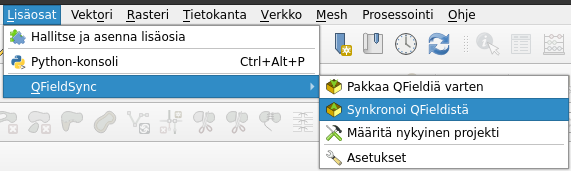
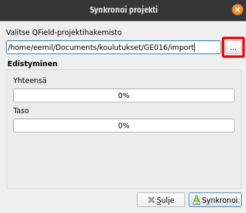

# Harjoitus 6: Kenttätyöt ja tietojen yhdistäminen

### Harjoituksen sisältö

Harjoituksessa yhdistetään käytäntöön kaikki aiemmissa harjoituksissa opittu. Suoritetaan siis varsinainen paikkatietojen mobiilikeruu maastossa kulkien ja luotua projektia hyödyntäen. Lopuksi kerätyt tiedot synkronoidaan takaisin QGIS-projektiin

### Harjoituksen tavoite

Koulutettava oppii keräämään paikkatietoja  tehokkaasti maastossa mobiililaitetta käyttäen.

### Arvioitu kesto

45 min.

## Valmistautuminen

Varmista, että viimeisin versio kurssiprojektista on synkronoituna mobiililaitteeseen, ja että mobiililaitteessa on tarpeeksi akkua jäljellä. Ideana harjoituksessa on saada tuntumaa paikkatietojen mobiilikeräykseen maasto-olosuhteissa ja testata tätä lyhyesti QFieldillä, sekä lisäksi poimia huomioita siitä, miten hyvin keräys onnistuu rakentamallamme projektilla. Sinulla tulisi siis olla myös säänmukainen vaatetus, ja tarvittava muu varustus valmiina.

Voi myöskin olla hyödyllistä ladata kurssin harjoitusmoniste-pdf mobiililaitteelle, josta tarvittaessa voi katsoa ohjeistusta esimerkiksi digitointiin. Kouluttajaan voi myös olla tarvittaessa yhteydessä esimerkiksi avaamalla koulutuksen kalenteritapahtuman joko Google Meet -sovelluksen tai puhelun avulla mobiililaitteessa.

Lue alla oleva ohjeistus kenttätöistä ennen ulos siirtymistä, ja sopikaa yhteisesti mobiilikeruun kesto (n. 30 min.). Kenttätöiden jälkeen data synkronoidaan tietokoneen QGIS-projektiin. Pidä siis myös usb-johto lähistöllä.

## Lyhyt ohjeistus kenttätöihin

**Mistä ja miten?**

-   Liikkuen lähiympäristössä, riippuen siitä millainen ympäristö on

-   Kulje digitoimallasi alueella ja digitoi vaikka yksi puu jokaisesta erillisestä puistikosta tai aiemmin muodostamiesi alueiden sisältä(esimerkiksi yleisin, korkein tai mielenkiintoisimman näköinen).

**Mitä kaikkea kerätään?**

-   Tietoa puista ja niiden kasvuympäristöstä (kasvualusta)

-   Täytä eri ominaisuustiedot: laji, summittainen korkeus, ympärysmitta mikäli halutaan, valokuva

-   Kuljettu reitti, eli **aseta seuranta** aluksi lähtöpisteessäsi Reitti-tasolle 

    -   Aikarajoitteen minimiajaksi vaikkapa 10 s. \> **Aloita jäljitys**

    -   Tyyppi-kenttään vaikka "puu-inventointi"

    -   Huomiot: "harjoitus 6"

    -   Luo kohde Reitti-tasolle painamalla yläkulman "ok"-ruksista

**Kesto ja muita huomioita?**

-   n\. 30 min., tai esimerkiksi n. 10 kerättyä puu-kohdetta

-   Kiinnitetään huomiota mobiilikeruun tehokkuuteen. Montako kohdetta voisi kerätä esim. tunnissa?

-   Voisiko joitakin tietojen syöttötapoja käyttää tehokkaammin?

## Tietojen synkronoiminen takaisin tietokoneelle

Synkronoidaan nyt kenttätöissä tuotettu data takaisin tietokoneelta löytyvään alkuperäiseen QGIS-projektiin. Yhdistä mobiililaite tietokoneeseen ja kopioi projektikansio mobiililaitteelta tietokoneelle. Kun projektikansio on tietokoneella, avaa alkuperäinen projektitiedosto QGISillä (**älä siis avaa mobiililaitteelta tuotua projektia**) ja valitse ylävalikosta **Lisäosat \> QField Sync \> Synkronoi QFieldistä**. Valitse avautuvassa ikkunassa **\...-**painike ja etsi mobiililaitteelta tuomasi projektikansio. Kun oikea kansio on valittuna, valitse **Synkronoi**.

Synkronoinnissa kuluu hetki, jonka jälkeen tuottamasi datan pitäisi näkyä QGISissä. Jos lisäsit kuvia keräämiisi kohteisiin, löytyvät ne mobiililaitteelta tuodun projektikansion **DCIM** alikansiosta, QGISin attribuuttitaulusta löytyy vain viittaus tiedostonimeen. Mobiilikerätyn datan analysointia ja käsittelyä voitaisiin nyt jatkaa QGISissä aivan kuin minkä tahansa muun paikkatietoaineiston kanssa.

QFieldin jatkokäyttöä ajatellen on suositeltavaa synkronoida kentällä tuotettu data mobiililaitteelta tietokoneelle vain kerran. Käytännössä tämä tarkoittaa sitä, että jos haluat kerätä lisää dataa projektiin, täytyy projekti välissä pakata uudelleen QField sync lisäosalla ja siirtää sitten takaisin mobiililaitteelle. Näin seuraavan kerran synkronoidessasi projektia QField ei yritä synkronoida jo olemassaolevia kohteita moneen kertaan.

Kun olet valmis, tallenna projektitiedosto kurssihakemistoon pikanäppäimellä **CTRL + T** tai päävalikosta **Projekti \> Tallenna**.

::: hintbox
Psst! Koulutuksen jälkeen saat henkilökohtaista tukea Gispon tukipalvelusta. Lähetä kysymyksesi tai kommenttisi osoitteeseen tuki\@gispo.fi! \|
:::
