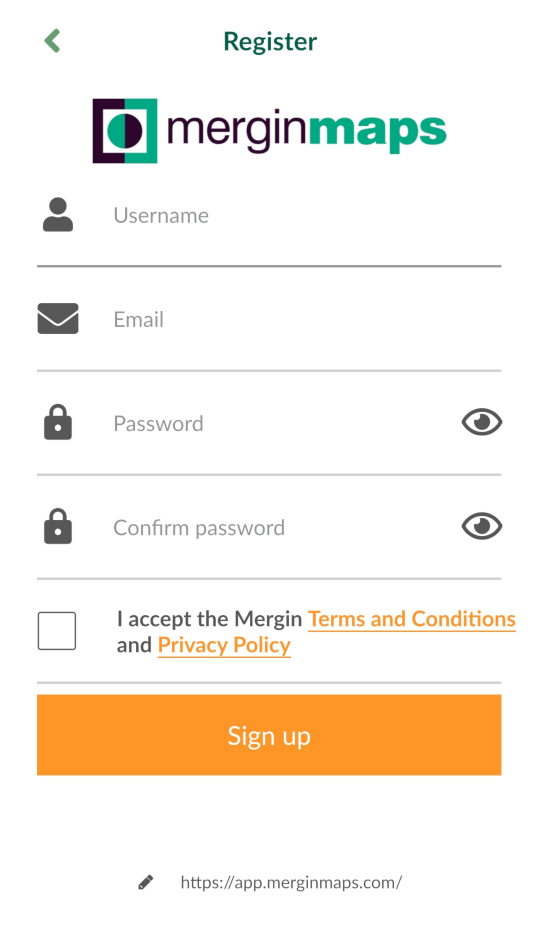

---
editor_options:
  markdown:
    wrap: sentence
---

# **Ennen harjoituksia: Asennus ja käyttöönotto**

**Sisältö**

Harjoituksessa asennetaan Mergin Maps-ohjelmisto mobiililaitteelle ja luodaan tunnukset

**Tavoite**

Tavoite on, että koulutettava saa asennettua Mergin Maps-mobiilisovelluksen käyttövalmiiksi laitteelleen ja saa luotua käyttäjätunnukset pilviympäristöön.

**Arvioitu kesto**

60 minuuttia.

## **Valmistautuminen**

Android- tai IOS-käyttöliittymällä varustettu mobiililaite tulee olla käyttövalmiina sekä yhdistettynä internetiin.

Harjoitusohjeet on tehty Mergin Mapsin suomenkieliselle käyttöliittymälle, joten olisi tarvittaessa hyvä vaihtaa mobiililaitteen käyttöliittymän kieli suomeksi, jolloin Mergin Mapsin kieli on suomi.
Tämä käy esimerkiksi englanninkielisessä Android-käyttöjärjestelmässä seuraavasti: **Settings ("Ratas"-kuvake) \> System \> Languages & input \> Languages**, ja raahaamalla kieli **Suomi (Suomi)** luettelon ensimmäiseksi (kieli on mahdollisesti ensin lisättävä kohdasta **Add a language**).
Apple-käyttöjärjestelmässä seuraavasti: **Settings ("Ratas"-kuvake) \> General \> Languages \> Language.** Kysy tarvittaessa apua kouluttajalta.
Toki käyttöliittymän kielen saa myöhemmin vaihdettua suomeksi myös sovelluksen asetuksista.

## **Sovelluksen asentaminen sovelluskaupasta**

Avaa mobiililaitteesi Play- tai App Store -sovellus klikkaamalla ja kirjoita yläosan haku-palkkiin esimerkiksi "**Mergin maps**".
Hakutuloksen pitäisi olla **Mergin maps** -sovellus.
Klikkaa Asenna-painiketta asentaaksesi ohjelmiston.
Mikäli laitteeltasi löytyy jo aiempi versio sovelluksesta, vaihtoehtona on tällöin ainoastaan **Päivitä.** Klikkaa sitä.

## **Käyttäjätunnusten luominen pilvipalveluun**

Projektin luomista ja tiedonsiirtoa varten käyttäjän tulee luoda tunnukset Mergin Mapsin pilvipalveluun.
Mergin Mapsissa pystyy tarkastelemaan julkisia projekteja ilman kirjautumista, mutta omia projekteja ei kuitenkaan pysty tuomaan tai synkronoimaan laitteiden välillä.
Palvelu on yksilökäytössä täysin maksuton ja täyttää kurssilla vaaditut käyttötarpeet.
Mene sivulle **merginmaps.com** ja klikkaa painiketta "**Start for free**" ja seuraavaksi "**Create free account**".
Täytä vaadittavat tiedot ja paina "**Sign up**".

Tarkastellaan pilvipalvelua ja käyttäjätietoja.
Pääsivulla näet alasivuvalikon sivun vasemmalla puolella, luomasi projektit keskiosassa sivua sekä käyttäjätietosi oikeassa yläkulmassa.

Kun olemme luoneet harjoitusprojektin ja synkronoineet sen pilvipalveluun, ilmestyy projekti Projects-välilehden alle.
Mikäli tilillä on useita käyttäjiä, löytyvät tiedot Members-välilehden alta.
Subscription-välilehden alta löydät tilin kapasiteettia koskevat tiedot ja maksullisten tilien tuomat lisätoiminnallisuudet ja tallennustilan.

User profile -välilehdellä näet käyttäjätunnustasi koskevat perustiedot.
Ota käyttäjätunnuksesi muistiin.
Sinun tulee syöttää samat tunnukset myöhemmin myös QGISin puolella, kun Mergin Maps-lisäosa on asennettu.
Tässä kohtaa voit jo kirjautua tilillesi myös mobiililaitteellasi.
Kun avaat Mergin Mapsin mobiililaitteellasi, aukeaa kirjautumissivu.
Kirjaudu sisään samoilla tunnuksilla mitkä äsken loit pilviympäristöön.

\
\
