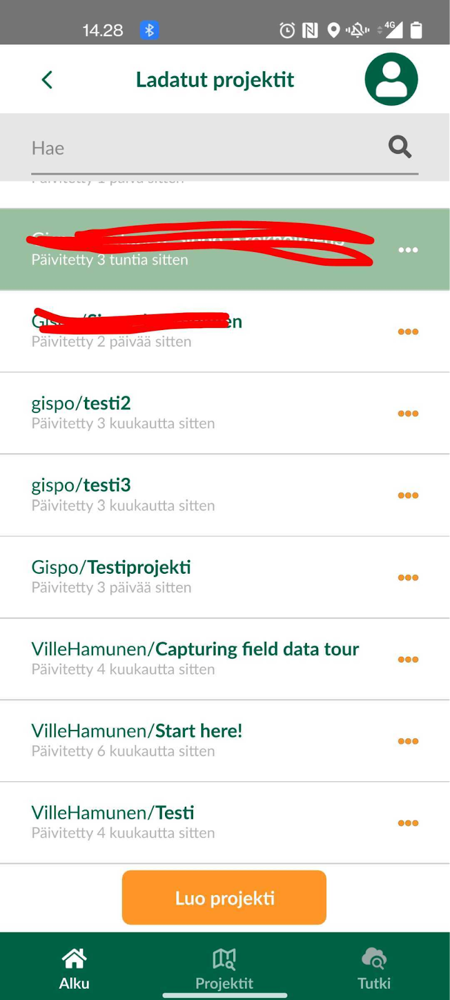
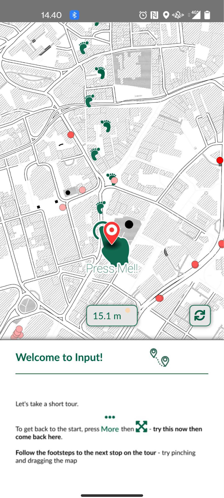
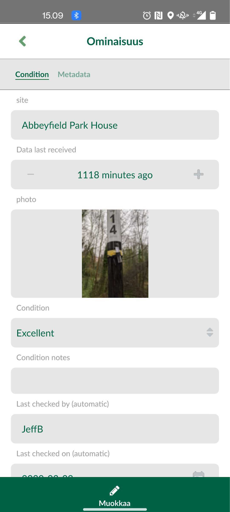
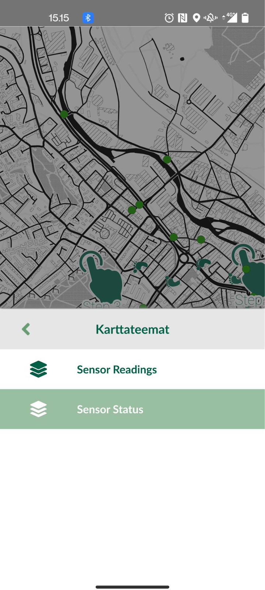
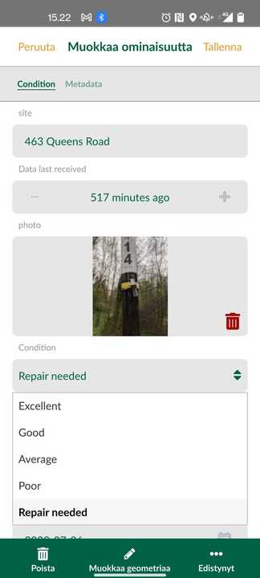
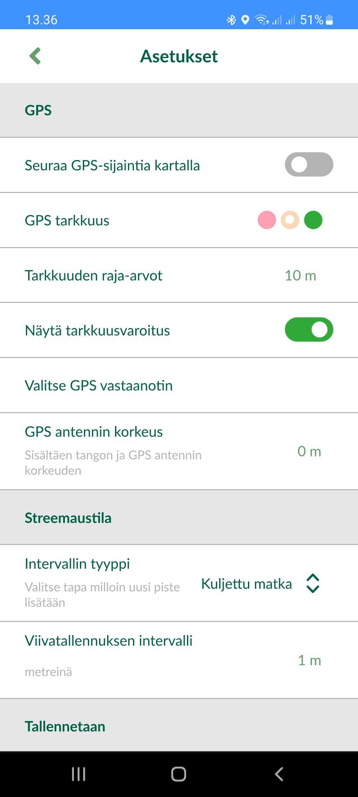

# **Harjoitus 1: Sovelluksen käyttöönotto**

**Harjoituksen sisältö**

Harjoituksessa tutustutaan Mergin Maps -käyttöliittymään.

**Harjoituksen tavoite**

Tavoite on, että kouluttautuja saa asennettua Mergin Maps -mobiilisovelluksen käyttövalmiiksi laitteelleen, oppii sen käyttöliittymän eri osiot sekä osaa tarkastella karttanäkymää ja paikkatietoja sovelluksen avulla.

**Arvioitu kesto**

60 minuuttia.

## **Sovelluksen avaaminen ja käyttöliittymä**

Avataan nyt Mergin Maps -sovellus (jos kysyy hyväksytäänkö paikallisten tiedostojen käyttö ja paikannus, valitse salli), jolloin sinulle pitäisi ilmestyä alla olevan kuvan mukainen etusivu. Siinä näet oletusvaihtoehtoja projektien avaamiseksi. Nyt **Viimeisimmät projektit** -kohdassa on asennuksen mukana tulevia demoprojekteja, joilla voi tutustua Mergin Mapsin käyttöön ilman, että pitää valmistella ensin oma projekti QGISin avulla. Myöhemmin tähän tulee edellisellä kerralla käyttämiäsi projekteja, joita klikkaamalla pääset nopeammin niihin käsiksi.

## **Mergin Mapsin käyttöliittymä**

Tutustutaan aluksi Mergin Mapsin käyttöliittymään ja paikkatietojen tarkasteluun sillä. Käytämme aluksi valmista demoprojektia ennen kuin ryhdymme varsinaiseen paikkatietojen mobiilikeruuseen ja muokkaukseen omaa projektia käyttäen. Klikkaa sovelluksen etusivulla **Start here!** -kohtaa, jolloin kyseisen projektin karttanäkymä avautuu.

Seurataan askeleita ja sormisymboleja. Demoversio pitää sisällään ilmanlaatudataa, jotka näkyvät kartalla pisteinä. Klikkaamalla pistettä saat auki kartan alakulmaan kohteen perustiedot (nimi, pitoisuus, kohde, ryhmä ja ID). Klikkaamalla otsikkoa aukeaa ominaisuustietotaulukko, josta löydät kaikki pisteelle tallennetut ominaisuustiedot. Demoversiossa näkyy hyvin, mitä tietoja kohteelle voi tallentaa ja miten niitä voi jakaa eri välilehdille.

Olet varmasti jo huomannut, että sovelluksen toiminnallisuudet löytyvät sivun alalaidasta. "Projektit"-valikosta pääset takaisin pääsivulle, josta voit vaihtaa toiseen projektiin. "GPS"-valikko paikantaa sinun todelliseen sijaintiin, mikäli olet antanut sovellukselle oikeuden paikantaa sijaintisi. "Tallenna"-valikon takana pääset lisämään ja muokkaamaan tasojen geometrioita. "Lisää"-valikon takaa löytyy demoversion seuraavan vinkin toiminnallisuus "Karttateemat".

Avaamalla karttateemat-valikon pääset valitsemaan kahden olemassa olevan teeman välillä. Omassa projektissa samalle aineistoille on mahdollista luoda eri teemoja eri ominaisuustietojen perusteella, mikäli tämä on oman työn kannalta merkityksellistä. Avaamalla jonkin tason tiedot, näet oikealla kynä-symbolin. Klikkaamalla tätä pääset muokkaamaan kyseisen tason sisältöä. Kynäsymboli löytyy myös ominaisuustietovalikon sisältä alhaalta "Muokkaa geometriaa", jolla pääset siirtämään tallennetun pisteen sijaintia.

Katsotaan tässä kohtaa vielä asetuksia, jotka löydät Lisää-valikon kautta. Ohjelman pitäisi oletusasetuksena aktivoida puhelimen GPS-paikannin. Mikäli näin ei ole eikä ohjelma avautuessaan erikseen pyydä oikeutta käyttää laitteen sisäistä GPS:ää, laita päälle valinta "seuraa GPS-signaalia kartalla". Tämä vie sinut projektissa nykyiseen sijaintiisi. Asetusten kautta voit myös asettaa ulkoisen GPS-vastaanottimen, mikäli sellaisen käytölle on tarvetta tulevissa työtehtävissäsi. Mikäli haluat käyttää automaattista pistetallennusta esimerkiksi kävellessäsi, "Streemaustila"-valikosta voit asettaa aika- tai matkaintervallin pistetallennukselle.

Kun olet tarkastellut asetukset-välilehden toimintoja, voit sulkea ohjelman.

\
