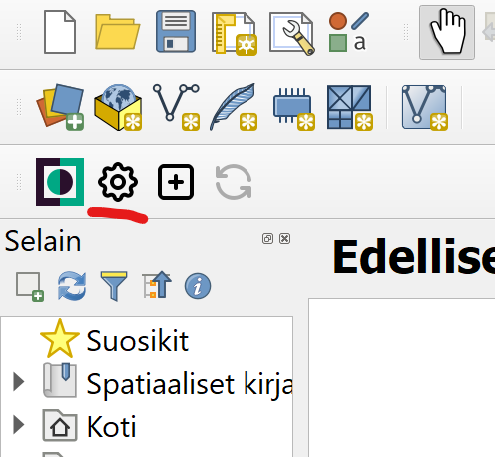
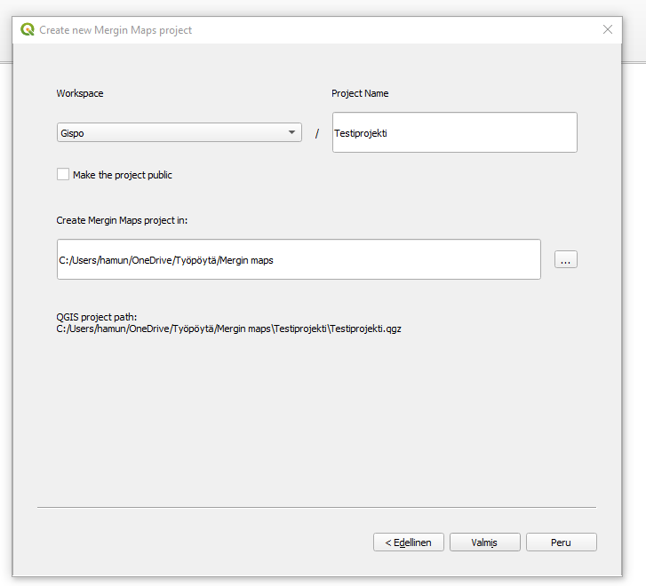
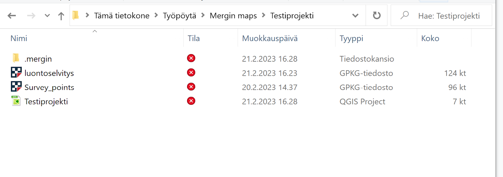
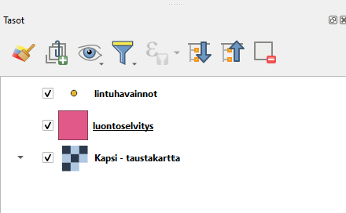
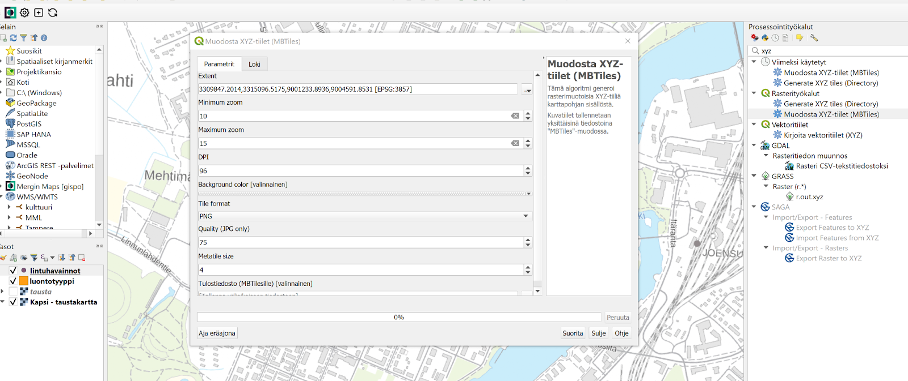
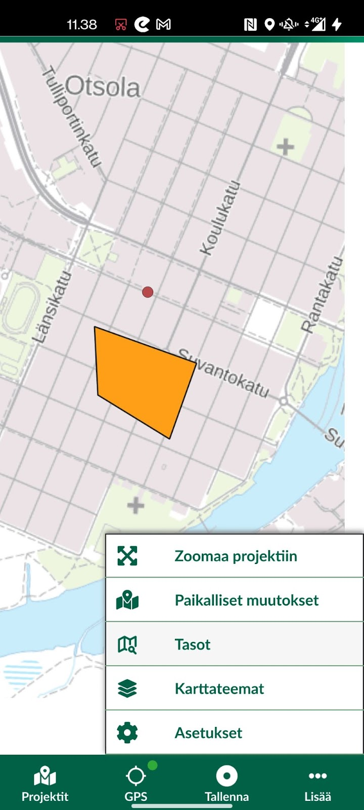
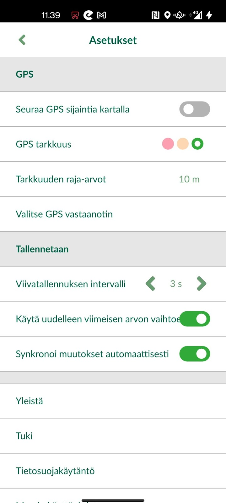

# **Harjoitus 2: QGIS-projektin valmistelu, synkronointi ja digitointi**

**Harjoituksen sisältö**

Harjoituksessa luodaan QGIS-työpöytäohjelmistolla projekti, jota käytetään myöhemmin mobiilisovelluksessa. Lisäksi asennetaan QGISin Mergin Maps -lisäosa, joka mahdollistaa projektitiedostojen siirron tietokoneen ja mobiililaitteen välillä.

**Harjoituksen tavoite**

Kouluttautuja oppii luomaan QGIS-projektin sekä paketoimaan ja siirtämään sen mobiililaitteeseen Mergin Maps -lisäosaa käyttäen.

**Arvioitu kesto**

60 min.

## **Valmistautuminen**

Avaa **QGIS**-työpöytäohjelmisto tietokoneellasi ja aloita siellä uusi QGIS-projekti (ylävalikosta **Projekti \> Uusi**). Tallenna projektitiedosto **(Projekti \> Tallenna nimellä\...**) nimellä **"MerginMaps-kurssiprojekti"** tai vastaava. Harjoituksessa oletetaan, että Input-ohjelmisto on valmiiksi asennettu mobiililaitteeseen.

## **Projektin perusasetukset**

Avaa QGISin ylävalikosta projektin ominaisuudet (**Projekti \> Ominaisuudet**) ja sieltä **Yleiset**-välilehti. Etsi sieltä asetus **Tallenna polut** ja valitse alasvetovalikosta arvoksi **suhteellinen**. Tällöin projektia siirrettäessä eri laitteille projekti ja sen aineistot löytyvät, sillä hakemistopolut viittaavat ainoastaan projektin kotihakemistoon eivätkä esimerkiksi C-levyn juureen ja laitekohtaiseen hakemistorakenteeseen.

Tämän jälkeen mennään vielä samassa **Projektin ominaisuudet** -ikkunassa **Koordinaattijärjestelmä**-välilehdelle ja valitaan koordinaattijärjestelmäksi **EPSG:3067**.

## **Mergin Maps -lisäosan asentaminen ja palveluun kirjautuminen**

Asennetaan ensin lisäosa QGISin ylävalikosta: **Lisäosat \> Hallitse ja asenna lisäosia**, kirjoita hakukenttään **Mergin** ja klikkaa "**Asenna lisäosa**". Lisäosan asennuttua se löytyy Lisäosat-ylävalikosta.

Mergin Maps edellyttää palveluunsa kirjautumista, joko yksityishenkilönä tai yritystilin kautta. Tällöin aineisto on käytössä useamman henkilön kesken organisaation sisällä ja tietojen päivittäminen laitteiden välillä on sujuvampaa.

Uusi projekti tulee synkronoida myös Mergin Mapsin pilvipalveluun, johon pääsen kirjautumaan ladatun lisäosan "**hammasratas**"-kuvaketta painamalla. Kun olet kirjautunut verkkopalveluun, pääset samoilla tunnuksilla yhdistämään QGISin Mergin Mapsin palvelimeen. Jos haluat tulevia sessioita varten tallentaa kirjautumistietosi, laita valinta kohtaan "save your credentials". Custom Mergin Maps server on oletuksena alla olevan kuvan mukaisesti:

::: hint-box
Yhteyttä muodostaessa ohjelma saattaa joskus herjata virhettä, että annetun serverin URL-osoite on väärä. Tähän ongelmaan voi kokeilla ratkaisuksi muuttaa QGISin käyttäjäprofiilia, eli käytännössä luoda uusi profiili. Uusi profiili tehdään ylävalikosta **Asetukset-käyttäjäprofiilit-uusi profiili.** Uusi käyttäjäprofiili asettaa QGIS-ohjelman oletustilaan, eli tällöin Mergin-lisäosa tulee asentaa uudestaan. Käyttäjäprofiileja luomalla voi myös luoda itselleen erilaisia työtiloja, mikäli työskentelee hyvin erilaisten projektien ja työkalujen kanssa.

:::

Omalle tilille pääset kirjautumaan myös selaimen kautta osoitteessa: <https://app.merginmaps.com/login>. Selaimen kautta pääset tarkastelemaan kaikkia tilin projekteja ja käyttäjiä sekä muuttamaan asetuksia ja tarkastelemaan historiatietoja. Selaimen kautta voit myös luoda uusia projekteja ja jakaa niitä eri käyttäjille.

## **Mergin Maps -lisäosan käyttö**

Kirjautumisen jälkeen voit luoda uuden projektin työkalun plus-ikonia painamalla:

Kun lähdetään luomaan täysin uutta sisältöä, valitaan "New basic QGIS project". Jos sinulla on jo olemassa valmis QGIS-projekti, jonka haluat kääntää mobiililaitteelle, valitse "Package current QGIS project". Klikataan siis "New basic QGIS project". Mikäli olet kirjautunut oikein, työtilan kohdalla pitäisi olla valittavissa tilisi. Anna projektille haluamasi nimi kohtaan "Project Name". Älä tee projektista julkista (ainakaan vielä), joten jätä valitsematta "Make the project public". Uusi projekti tallentuu myös koneellesi, joten valitse vielä tiedostolähteeksi sama kansio, jonne projektitiedosto on tallennettu koneellasi.

Uuteen projektiin aukeaa oletusarvoisesti taustakartta sekä pistetaso. Nämä ovat poistettavissa tai jatkojalostettavissa omaa käyttötarkoitusta varten.

## **Taustakarttojen lisäys**

Taustakarttoja voi lisätä myös omien mieltymysten ja tarpeiden mukaan. Taustakartan voi lisätä esimerkiksi WMS-tasona, jos mobiililaite on varustettu internet-yhteydellä. Se voidaan lisätä myös tiedostotasona, jos internet-yhteyttä ei ole, se on liian hidas, tai sitä ei muusta syystä haluta käyttää.

::: hint-box
Eräs mahdollisuus on myös lisätä taustakartta rajapintana QGIS-projektiin, mutta muuttaa se ilman internet-yhteyttä käytettäväksi Geopackage-tiedostoksi halutulta alueelta projektitiedoston siirron/synkronoinnin yhteydessä. Tästä lisää myöhemmin.
:::

Lisätään nyt taustakartta koko Suomen alueelta käyttäen QGISin **QuickMapServices**-lisäosaa. Asennetaan ensin lisäosa QGISin ylävalikosta: **Lisäosat \> Hallitse ja asenna lisäosia**, kirjoita hakukenttään **QuickMapServices** ja klikkaa "**Asenna lisäosa**". Lisäosan asennuttua se löytyy Verkko-ylävalikosta. Lisäksi QGIS-ikkunaan aukeaa "**Search QMS**" paneeli, jolla saatavissa olevia taustakarttapalveluita voi etsiä. Jos paneeli ei aukea automaattisesti, sen voi avata ylävalikon kautta. Hae paneelin avulla "**Kapsi-taustakartta**" ja lisää projektiin kaksoisklikkaamalla.

::: hint-box
Projektiin voi halutessaan lisätä useammankin taustakartan, joita voidaan käyttää Mergin Mapsissa yhtäaikaisesti. Tässä voi myös hyödyntää QGISin karttateemat-ominaisuutta.
:::

::: hint-box
Digitointia auttamaan saattaisi olla hyödyllistä käyttää lisäksi esimerkiksi ortoilmakuvaa, joka löytyy myös QuickMapServicen "Kapsi"-haulla.
:::

Pidetään projekti nyt mahdollisimman yksinkertaisena ja pidetään vain "Kapsi-taustakartta"-taso.

## **Tasojen luonti**

Käytämme tässä kohtaa harjoitusta varten luotua GeoPackagea testaamisen nopeuttamiseksi. Myöhemmissä harjoituksissa jalostamme tasoja edelleen ja tutustumme visualisoinnin hienouksiin ja tiedon tallettamisen nopeuttamiseen. Mikäli kuitenkin tarvitset kertausta perusmuotoisen GeoPackage-tason luomisessa, ohjeet tämän tekemiseen löydät tämän harjoituksen lopusta osiosta "lisätehtävät". Käy hakemassa kurssihakemistosta kaksi tasoa, "lintuhavainnot" ja "luontoselvitys" vektoritasojen lisäyksen kautta. Molemmat tasot on pakattu saman GeoPackagen (luontoselvitys) sisälle.

Järjestä projektiin luodut tasot Tasot-paneelissa, kuten alla olevassa kuvassa. Järjestyksen muuttaminen onnistuu esimerkiksi tasoja "raahaamalla" (ns. drag & drop). Ylempänä listassa olevat taso piirretään alempana olevan päälle, joten on luontevaa, että taustakartta ja polygoni-tasot ovat alimpina. Ajan salliessa voit myös muuttaa tasojen kuvaustyylejä itsellesi mieleiseksi. Kysy tarvittaessa apua kouluttajalta.

Voit nyt vertailun vuoksi testata, miltä editointi ja tietojen lisäys näyttää QGISissa työskenneltäessä. Aseta siis **lintuhavainnot**-taso editoitavaksi, esimerkiksi klikkaamalla tason kohdalta hiiren oikealla napilla ja valitsemalla **Editointi päälle/pois**. Paina **Lisää pistekohde** -nappia digitoinnin työkalupalkista (kts. kuvaa alla). Klikkaa kartalla lisätäksesi pistemäisen kohteen, jolloin lomake aukeaa. Testaa kutakin kenttää ja huomaa, että niihin lisätään tietoja eri tavoilla. Nyt ei kuitenkaan ole tarpeen lisätä kohdetta, joten testattuasi voit klikata **Peru**.

Kun olet valmis, tallenna vielä projektitiedosto pikanäppäimellä **CTRL + T** tai päävalikosta **Projekti \> Tallenna**. Nyt perustasot ja -aineistot on lisätty QGIS-projektiin. Seuraavaksi valmistellaan projektin siirto mobiililaitteeseen.

::: hintbox
Merginin kehittäjät suosittelevat GeoPackagen käyttöä vektoridatalle, ja myös rasteridatalle erityisesti suurten tiedostokokojen takia. Lisätietoja näiden esivalmistelusta löytyy [dokumentaatiosta](https://merginmaps.com/docs/gis/supported_formats/).
:::

## **Projektin synkronointi pilveen ja siihen liittyviä huomioita**

Kun projekti on siinä tilassa, että se on valmis vietäväksi pilveen ja mobiililaitteelle, voidaan painaa työkaluvalikon **Syncronize**-painiketta.

Ennen synkronointia ohjelma antaa varoituksen, mikäli tiedostoissa on sellaisia häiriöitä, jotka voivat vaikuttaa tiedon siirtymiseen ja niiden toimintaan mobiililaitteella. Erityismerkit, muutokset taulukoissa sekä tietolähteissä antavat herkästi virheilmoituksen, mutta voit tässä kohtaa olla välittämättä niistä. Rajapinnasta haettujen aineistojen haasteena on se, etteivät ne lataudu ilman verkkoyhteyttä. Tämä voi tulla vastaan maastokartoituksissa, kun ollaan verkon ulottumattomissa.

Tilanteessa, jossa tiedät etukäteen olevasi verkon ulottumattomissa, voit luoda offline-tilassa toimivan rajatun tason rajapinnasta "Generate xyz Tiles" (MBTiles) -työkalun avulla. Valitse "Extent"-valikkoon "Use Map Canvas Extent", tarkkuustasoja haluttu määrä (tässä esimerkissä välille 10--15) ja lopussa tallennuskansioksi projektin kansio. Paina sitten **Suorita**. Taustakartan mittakaava ja zoomattavien tasojen määrä vaikuttavat prosessointiaikaan ja tiedoston kokoon.

Prosessin jälkeen voit järjestellä tasot haluamallasi tavalla. Muista tämän jälkeen synkronoida projekti pilvipalveluun.

## **Projektin avaaminen mobiililaitteessa**

Avataan Mergin maps nyt mobiililaitteellasi. Aluksi sovellus ohjaa sinut kirjautumissivulle, johon sinun tulee syöttää samat tunnukset, kuin selaimessa ja QGISissä.

Kirjautumisen jälkeen sinulle aukeavat kaikki projektit, jotka olet synkronoinut pilvipalveluun. Paina tämän harjoituksen projektin lautauslinkkiä, jolloin QGISin puolella valmisteltu projekti aukeaa mobiililaitteelle.

Tarkastellaan nyt Mergin Mapsin työtilaa. Alavalikon vasemmassa reunassa on "Projektit", josta pääset tarkastelemaan kaikkia käyttäjän luomia työtiloja. "GPS"-painike ohjaa sinut nykyiseen sijaintiisi, mikäli GPS-haku on aktivoitu. "Tallenna"-valikosta pääset digitoimaan ja syöttämään uutta tietoa. "Lisää"-valikko avaa mm. tasot nähtäviksi.

"Lisää"-valikon avaamalla pääset muokkaamaan projektin asetuksia mobiilisovelluksessa. Tässä kohtaa tärkeimmät valikot ovat "Tasot" sekä "Asetukset", joita tarkastelemme kohta lähemmin.

Tarkastellaan ensiksi "Tasot"-välilehteä. Klikkaamalla **tasot**-välilehteä aukeaa uusi valikko, mistä nähdään projektissa muokattavina olevat tasot. **Silmäsymbolia** painamalla saadaan taso näkyviin ja pois näkyvistä. **Asetukset**-välilehdellä voidaan säätää GPS-paikannuksen asetuksia. Ylävalikosta GPS saadaan päälle tai pois päältä. Värisymboli kertoo tämänhetkisestä GPS-signaalin tarkkuudesta. Voit muodostaa yhteyden ulkoiseen GPS-vastaanottimeen myös Bluetoothin avulla. Valinta kannattaa olla päällä valinnoissa "Käytä uudelleen edellisen arvon..." sekä "Synkronoi muutokset automaattisesti".

## **Digitointitila**

Tarkastellaan vielä juuri luodulla projektillamme kuinka piste- ja aluekohteiden digitointi tapahtuu. Emme ole vielä määrittäneet ominaisuustietojen syöttötapaa sen tarkemmin, vaan olemme käyttäneet oletusasetuksia. Tietojen syöttäminen helpottuu ja tehostuu merkittävästi seuraavan harjoituksen jälkeen. Perehdymme siinä tarkemmin QGISin lomakkeiden käyttöön ja automatisointiin Mergin Mapsissa.

Paina "Tallenna"-painiketta, minkä jälkeen osoitin muuttuu "tähtäimeksi". Alhaalta voi valita muokattavan tason (projektissamme lintuhavainnot tai luontotyyppi) ja sitten painaa alhaalta "Lisää". Mikäli aktiivisena on aluetaso, piirrä mieluisa alue, tai pistetasolla syötä uusi piste. Paina sitten "Valmis". Tämän jälkeen sinulle aukeaa tason attribuuttitaulukko niillä tasoilla, joita loimme aiemmin QGISin puolella. Tässä kohtaa voit antaa "laji"- tai "luontotyyppi"-sarakkeelle mieluisan nimen. Kun painat kalenterisymbolia, ohjelma syöttää automaattisesti ajan. Voit kokeilla täyttää myös muita sarakkeita manuaalisesti. Huomaa, että taulukkomuodolla on väliä. Esim. pinta-ala-sarakkeessa pystyt syöttämään vain numeerisia arvoja. Kun olet valmis, paina tallenna. Uusi alue tai piste ilmestyy kartalle ja synkronoituu automaattisesti pilvipalveluun (jos tämä on aktivoituna asetuksissa).

Valittuasi tallennetun kohteen klikkaamalla sitä pääset muokkaamaan kohdetta, kun painat **Kynä-**symbolia. Voit muokata taulukon tietoja tai vasemmasta alakulmasta poistaa tason. Klikkaa oikeasta alakulmasta **Päivitä**-painiketta, jolloin lisätyt muutokset tallentuvat pilveen. Mene nyt QGISin puolelle ja **synkronoi** projekti. Nyt tehtyjen muutosten pitäisi päivittyä myös QGISin puolelle. Jatkossa voimme pitää molemmat laitteet auki ja synkronoida tasaisin väliajoin, niin näemme, kuinka tieto päivittyy laitteiden välillä.

## **Lisätehtävä: Tasojen luominen**

Luodaan uusi GeoPackage, johon kerättävät paikkatiedot tullaan lisäämään eri tasoina (ylävalikosta **Tasot \> Luo taso \> Uusi GeoPackage-taso...**). Valitse **Tietokanta**-kohdasta GeoPackagen tallennuspaikaksi sama kansio jossa itse QGIS-projekti sijaitsee. Tämä onnistuu painamalla **Tietokanta**-kohdan oikealta puolelta (painike, jossa 3 pistettä) ja navigoimalla kyseiseen kansioon. Anna GeoPackage-tiedoston nimeksi **luontoselvitys** ja paina Tallenna/Save. Seuraavan kohdan **Taulun nimeksi** (eli luotavan tason nimeksi) tulee nyt automaattisesti tämä äsken annettu tiedoston nimi. Valitaan tason geometriatyypiksi **Multipolygoni** ja koordinaattijärjestelmäksi **EPSG 3067 - TM35FIN**.

Lisätään vielä **Uusi kenttä** -kohdasta joitakin peruskenttiä tason ominaisuus-taulukkoon. Lisätään ensin **luonto-/kasvillisyystyyppi**-niminen kenttä ja valitaan alasvetovalikosta tyypiksi **teksti** (**Text Data**). Painetaan **Lisää kenttälistaan** -nappia. Lisätään lisäksi **Muut havainnot** -kenttä teksti-tyyppisenä sekä **Pinta-ala** decimal number (real). Muista klikata jokaisen kentän tietojen täytön jälkeen **Lisää kenttälistaan**.

Lisätään tämän jälkeen vielä seuraavat datan hallintaan/ **metatietoihin** liittyvät kentät:

-   **uuid** (tyyppi: teksti)

-   **luoja** (teksti)

-   **muokkaaja** (teksti)

-   **luontiaika** (päivämäärä ja aika)

-   **muokkausaika** (päivämäärä ja aika)

Tämän jälkeen klikkaa OK, jolloin taso on luotu ja se ilmestyy QGISin Tasot-selaimen listaukseen.

Lisätään vielä 1 taso samaan GeoPackageen (**Tasot \> Luo Taso \> Uusi GeoPackage-taso...** ). Navigoidaan nyt **Tietokanta**-kohdasta valiten äsken luotu **Luontoselvitys**-GeoPackage-tietokanta. Muutetaan taulun nimeksi **Lintuhavainnot**, geometriatyypiksi **Monipiste**, koordinaattijärjestelmäksi EPSG:3067 kuten edellä sekä ominaisuustietokentiksi **laji** (teksti), **lisätiedot** (teksti), sekä samat **metatiedot** kuin edellä. Paina sitten OK. Esiin tulee ikkuna, jossa ilmoitetaan tiedoston olevan jo olemassa ja kysytään mitä sillä halutaan tehdä. Valitse **Lisää uusi taso**, jolloin samaan GeoPackage-tietokantaan lisätään uusi taso (**Huom!** "Korvaa"-vaihtoehto tässä kohtaa kirjoittaa edellä luodun luontoselvitys-tason päälle. Älä valitse sitä!).

Muista tallentaa projektisi!

\
