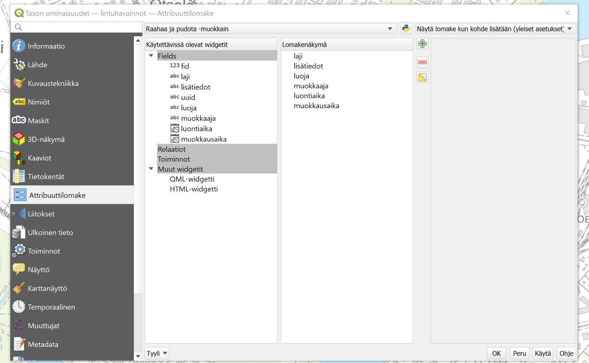
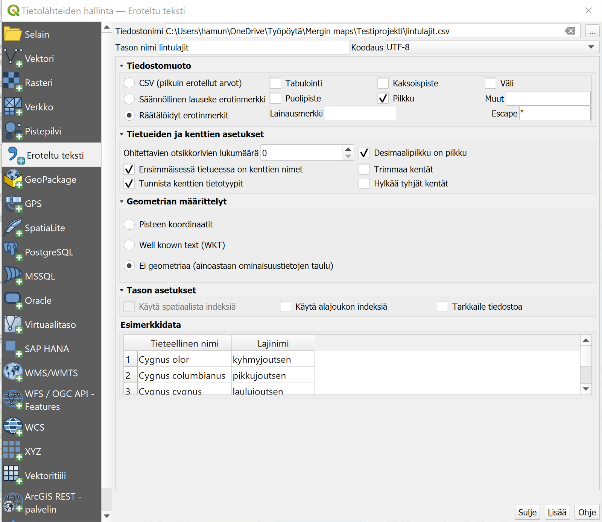
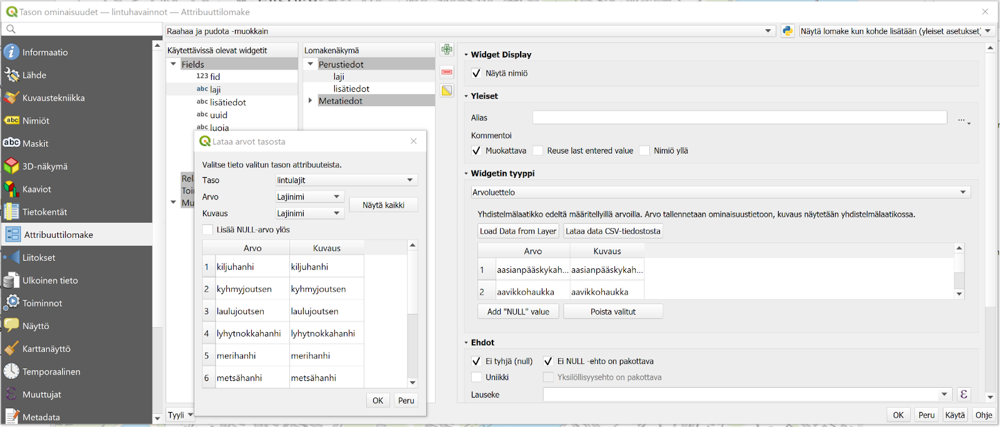
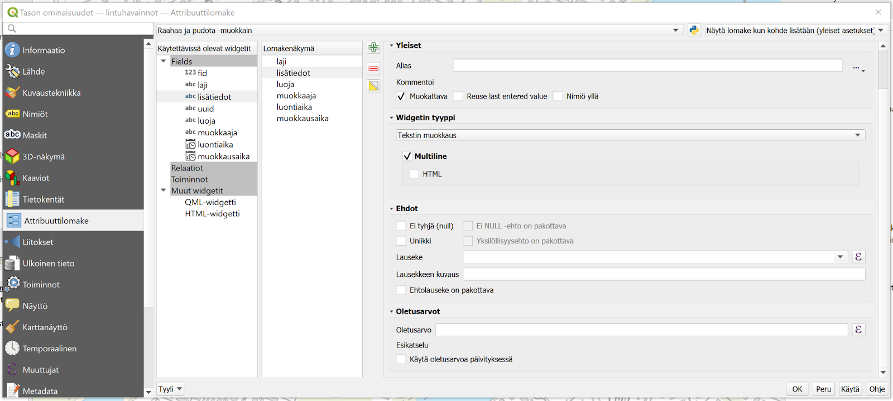
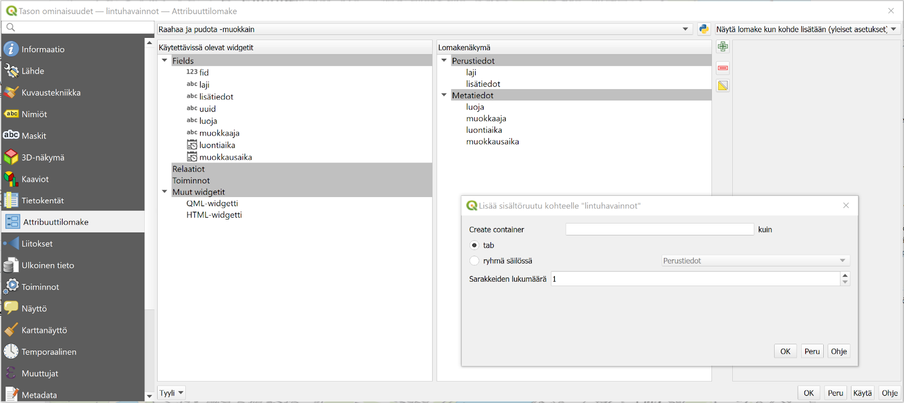
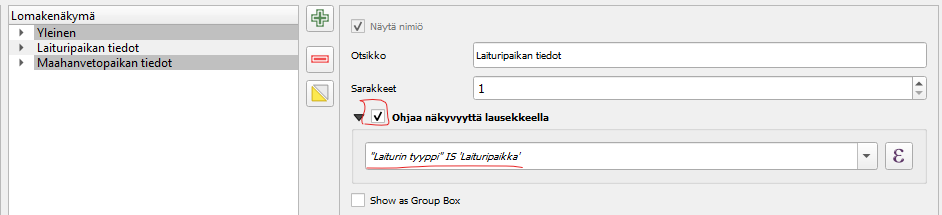
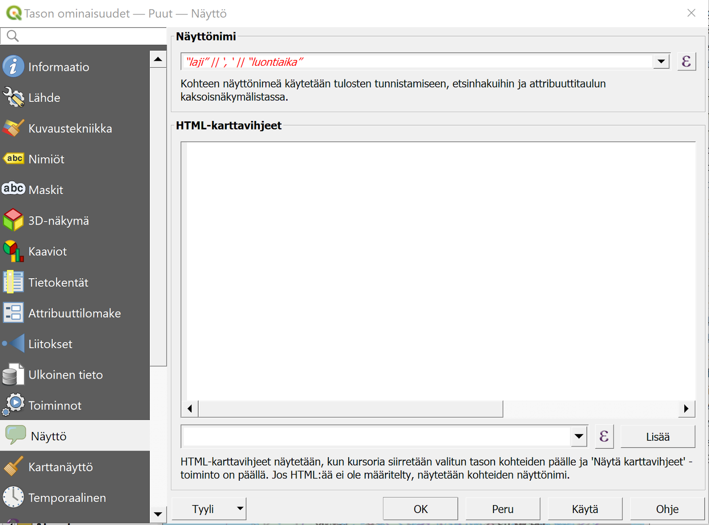
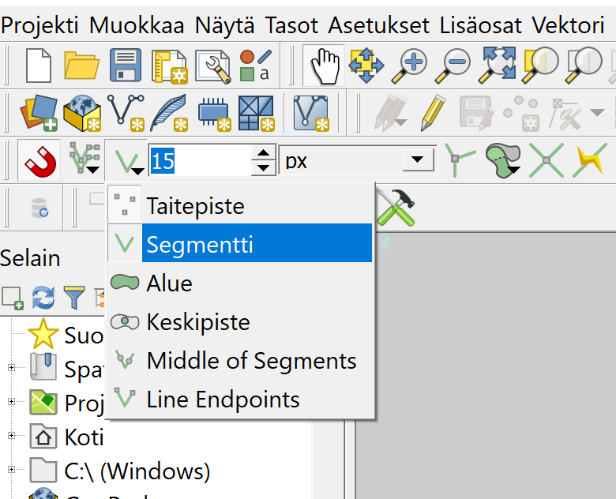
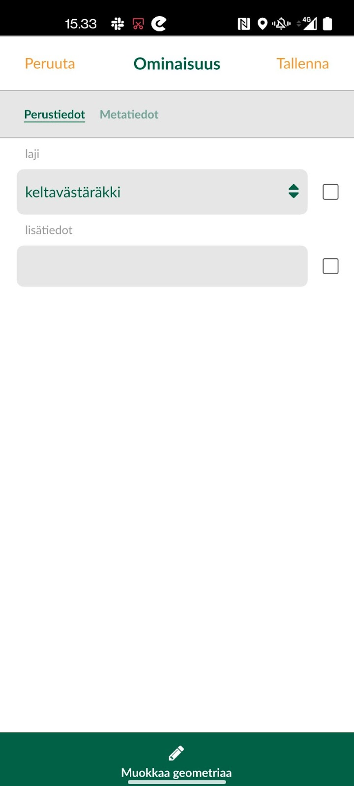
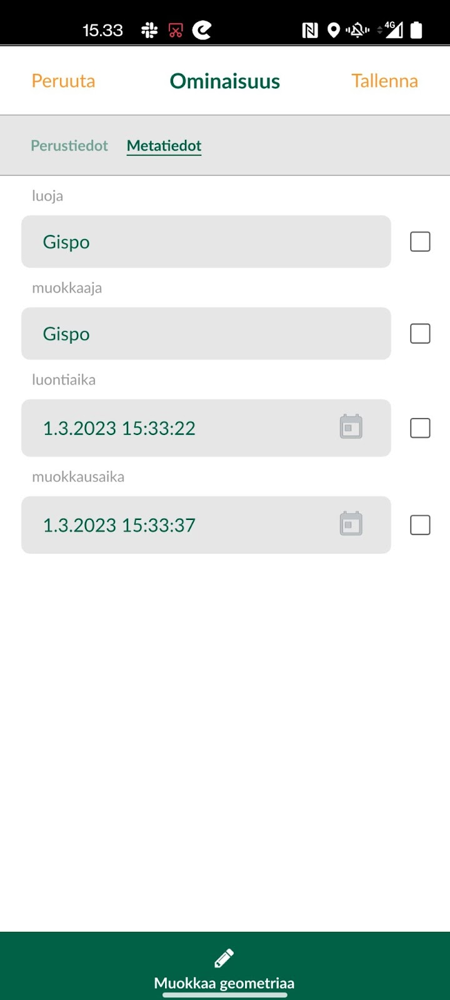

# **Harjoitus 3: Lomakkeet**

**Harjoituksen sisältö**

Tässä harjoituksessa muokataan projektissa olevien tasojen tietojen syötön lomakkeita digitoinnin helpottamiseen ja tehostamiseen.

**Harjoituksen tavoite**

Kouluttautuja oppii muokkaamaan tiedon syöttötapoja QGISin widgettejä käyttäen, sekä osaa tunnistaa mobiilitiedonkeruussa ja etenkin Mergin Mapsissä tähän liittyvät erityispiirteet.

**Arvioitu kesto**

45 min.

## **Valmistautuminen**

Avaa QGIS tietokoneellasi ja avaa siellä aiemmin luomasi QGIS-projekti (**Projekti \> Avaa**), siirry oikeaan kansioon, valitse projektitiedosto (**"Mergin-kurssiprojekti tai vastaava")** ja paina **Avaa**.

## **Taustatietoja**

Tässä harjoituksessa muokataan projektissa olevien tasojen tietojen syötön lomakkeita digitoinnin helpottamiseen ja tehostamiseen. QGISissa on erityyppisille tiedoille ja niiden syöttötavoille valittavissa monenlaisia vimpaimia (widgets). Tuettujen widget-tyyppien ajantasaisen listan näet dokumentaatiosta: <https://merginmaps.com/docs/layer/settingup_forms/>

## **Ominaisuustietolomakkeen muokkaus**

Avaa QGISissa **Lintuhavainnot**-tason ominaisuudet klikkaamalla hiiren oikealla napilla **Tasot**-paneelista tason kohdalta. Valitse **Ominaisuudet...** ja mene **Attribuuttilomake**-välilehdelle. Valitse välilehdellä ylhäällä olevasta pudotusvalikosta **Drag and Drop Designer** -tila (suom. Raahaa ja pudota -muokkain) automaattisen sijaan. Tässä lomakkeeseen sisällytettävät kentät on välilehden keskimmäisessä, **Lomakenäkymä**-nimisessä (ent. taitosta) sarakkeessa. Tähän voidaan lisätä objekteja vasemmanpuolimmaisesta sarakkeesta keskimmäiseen raahaamalla. Samoin tarpeettomia vimpaimia ja kenttiä voi poistaa lomakkeen taitosta klikkaamalla kyseistä objektia ja poistamalla se punaisesta miinus-nappulasta (kts. kuva). Drag and Drop Designer -näkymässä voidaan myös ryhmitellä lomakkeen kenttiä esimerkiksi eri välilehtiin ja nämä ryhmitykset toimivat myös Mergin Maps käyttöliittymässä.

Pidetään nyt kuitenkin kaikki kentät samassa välilehdessä. Poistetaan sen sijaan lomakenäkymästä kentät **fid** sekä **uuid**, joita ei lomakkeessa haluta manuaalisesti lisätä. **Lomakenäkymä** -sarakkeessa voi myös muuttaa lomakkeen kenttien järjestystä raahaamalla. Muokkaa nyt kenttien järjestys alla olevan kuvan **Taitosta**-osion  mukaiseksi.

## **Laji-tietokenttä**

Ruvetaan nyt muokkaamaan tietojen syöttötapoja. Ennen kuin lähdetään muuttamaan arvojen sisältöä, lisätään uusi taso, joka voidaan linkittää osaksi laji-kenttää. Lisää nyt harjoituskansiossa oleva tekstitiedosto **lintulajit** projektiin. Tekstitiedoston pääset lisäämään **tasot - tietolähteiden hallinta** ja välilehdeltä **eroteltu teksti.** Etsi lintulajit-tiedosto "tiedostonimi" -kohtaan ja täytä tason asetukset kuvan mukaisesti:

Paina **Lisää**.

Tuplaklikkaa nyt lintuhavainnot-tasoa ja mene attribuuttilomakkeelle. Klikkaa keskimmäisessä Lomakenäkymä-sarakkeessa **laji**-kenttää. Valitse oikeaan sarakkeeseen aukeavasta Widgetin tyyppi -pudotusvalikosta **Arvoluettelo** Tekstin muokkaus -tyypin sijasta. Tällä tavoin lajitieto lisätään digitoidessa suoraan luettelosta (jossa on valmiit arvot). Tällöin kirjoitusasu säilyy yhdenmukaisena ja esimerkiksi aineiston myöhempi analyysi helpottuu.

Avautuvaan taulukkoon kohtaan **Arvo** voit syöttää manuaalisesti lintulajien nimiä, mutta jos lajilista on laaja, kannattaa arvot hakea taulukkoon suoraan tiedostosta. Tätä varten lisäämämme lintulajit-taulukko onkin luotu. Paina laatikosta "Load Data From Layer" ja valitse tasoksi "lintulajit", arvoksi "lajinimi" sekä kuvaukseksi "lajinimi". Paina OK.

Aseta tämän jälkeen vielä **Ehdot**-osioon alle ruksi valintalaatikkoon **Ei tyhjä (null)** sekä **ei NULL -ehto on pakottava**, jolloin ainakin tämä tieto on aina täytettävä.

## **Lisätiedot-tietokenttä**

Tähän kenttään on tarkoitus lisätä vapaamuotoisia lisähuomioita, joten kentän voi pitää oletusasetuksilla **Tekstin muokkaus** -tyyppisenä. Valitaan tähän alle lisäksi **Monirivi** (Multiline), jolloin pidemmätkin huomiot voi lisätä kätevästi. Koska huomioita ei toisaalta välttämättä ole, jätetään **Ei tyhjä** -ehto valitsematta.

## **Luoja- ja muokkaaja-tietokenttien automatisointi**

Luoja- ja muokkaaja-kentät ovat teksti-muotoisia kenttiä, jotka sisältävät tiedon muokkauksen tekijästä. Pidä siis widgettinä **Tekstin muokkaus**. Koska muokkaaja tietyllä laitteella on yleensä yksi ja sama henkilö, tätä ei haluta joka kerta lisätä manuaalisesti, vaan automaatio on suotavaa, ja se voidaan saavuttaa **Oletusarvot**-kohdan avulla. Olemme aiemmin määritelleet Merginin asetuksissa käyttäjän oman muuttujan **username**. Tällaiseen muuttujan arvoon voi QGISissa viitata **\@**-merkillä. Kirjoita siis tähän Oletusarvo-kohtaan Luonti- ja muokkauskentille kummallekin erikseen **\@mergin_username**, jolloin Mergin osaa lisätä kohteelle käyttäjänimen.

Luonti ja muokkaus eroavat toisistaan siinä, että kohde luodaan vain kerran, kun taas sitä voidaan muokata moneen kertaan. **Muokkaaja**-tietokentälle pitääkin varmistaa, että tässä on **Yleistä**-kohdassa valittuna **Muokattava** ja **Oletusarvo**-kohdassa **Käytä oletusarvoa päivityksessä**. Vastaavasti **Luoja**-tietokentässä nämä kaksi kohtaa eivät saa olla valittuna, jotta tietojen syöttö toimisi kuten haluamme! Sen sijaan kohteella tulee aina olla luoja, joten laitetaan sille vielä **Ehdot**-kohdassa ehdot **Ei tyhjä (null)** ja **EI NULL -ehto on pakottava**.

## **Luonti- ja muokkausaika-tietokentät**

Myös luonti- ja muokkausaika-kentille pätee sama, mitä edellä sanottiin luonnista ja muokkauksesta, ja ne käsitellään kumpikin melko samalla tavalla. Valitse kummallekin Widgetin tyypiksi **Päivä/Aika**. Näidenkin tietojen syöttö halutaan automatisoida, ja tämä onnistuu käyttämällä QGISin sisäistä funktiota **now()**, joka kirjoitetaan **Oletusarvo**-kohtaan kummallekin kentälle. **Muokattava, oletusarvon päivitys** ja **null-ehdot** määritetään täsmälleen kuten edellä **Luoja-** ja **Muokkaaja**-kentille ohjeistettiin.

::: hint-box
Jos haluat muotoilla Päivä/Aika-muotoa käytä format_date komentoa. Esim. format_date(now(),'dd.MM.yyyy klo hh:MM') muotoilee päiväyksen ja kellonajan esimerkiksi näin 03.08.2023 klo 14:08
:::

## **Kohteen uuid-kenttä**

Vaikka uuid-tietokenttä poistettiinkin taitosta tarpeettomana tietona, määritetään nyt miten kyseinen tieto kohteelle syötetään. Tässäkin apuun tuleen QGISin sisäinen funktio nimeltä **uuid()**, joka luo tarvittavan UUID-koodin. Klikkaa vasemmanpuoleisesta Käytettävissä olevat widgetit -sarakkeesta kohtaa uuid. Pidä widgetin tyyppinä **Tekstin muokkaus**, mutta mene jälleen **Oletusarvo**-osioon ja kirjoita oletusarvoksi funktio **uuid()**. Poista myös **Muokattava**- sekä **Käytä oletusarvoa päivityksessä** -valinnat, sillä kun kohde on luotu, UUID:n ei tule enää muuttua.

::: hint-box
Mikä on UUID? UUID (**U**niversal **U**nique **Id**entifier) on Open Software Foundationin (OSF) määrittelemä yksilöintijärjestelmä. Tällä tarkoitetaan kohteen kiinteän kokoista uniikkia tunnistetta. Generointi toteutetaan valmiiksi ohjelmointiympäristössä suoraan funktiokutsun avulla.
:::

## **Lomakkeen välilehdet**

Kun täytettäviä ominaisuustietokenttiä on paljon, niiden jaotteleminen eri välilehdille saattaa helpottaa työskentelyä. Myös Mergin Maps tukee välilehtien käyttöä. Välilehti-ominaisuus luodaan QGISissa samassa näkymässä, jossa juuri määrittelimme tietojen syöttötavat eri kentille.

Vaikka lisättäviä ominaisuustietoja ei nykyisessä projektissamme ole valtavasti, saattaa olla kätevää jaotella metatiedot omalle välilehdelleen, sillä nämä liittyvät toisiinsa eikä niitä myöskään täytetä manuaalisesti. Klikkaa vihreää plus-merkkiä lisätäksesi uuden välilehden (kts. kuva). Anna välilehdelle (tab) nimeksi "metatiedot" ja sarakkeiden lukumääräksi 1. Paina OK, jolloin välilehti ilmestyy Taitosta-sarakkeeseen. Raahaa metatieto-kentät välilehden päälle ja irrota, jolloin ne sisältyvät välilehteen alla olevan kuvan mukaisesti. Lisää sitten toinen välilehti ja anna sille nimeksi "perustiedot". Raahaa loput ominaisuustietokentät tähän välilehteen. Huomaa että pystyt muokkaamaan välilehtien ja niiden sisältämien kenttien järjestystä sopivaksi samaan tapaan raahaamalla.

Tämän jälkeen voit klikata OK, jolloin attribuuttilomakkeen muutokset tulevat voimaan QGIS-projektissa. Muista tallentaa myös projektitiedosto pikanäppäimellä **CTRL + T** tai päävalikosta **Projekti \> Tallenna**. Muista myös synkronoida projekti Mergin Maps pilvipalveluun.

::: hint-box
Voit asettaa myös välilehdille ehdot joiden mukaan ne tulevat näkyviin. Esimerkiksi, kun käyttäjä antaa johonkin kenttään tietyn arvon, ilmestyy haluttu välilehti näkyviin. Lisää tästä ominaisuudesta [dokumentaatiossa](https://merginmaps.com/docs/layer/settingup_forms_settings/#tabs-and-groups "Show and hide field depending on a field value").

:::

## **Näyttö ja kohdelistaus**

Huomasimme edellisen harjoituksen lopussa, että kohdelistauksesta oli hankala erottaa kohteita toisistaan selkeyttävien kohdenimien puuttuessa. Tilannetta voi helpottaa QGISin Näyttö-valikon avulla. Avaa siis jälleen lintuhavainnot-tason ominaisuudet, ja avaa tällä kertaa **Näyttö**-välilehti. Siellä voidaan määrittää **Näyttönimi**, joka on nimi, joka kohdelistauksessa näkyy. Varsinaisia nimiä lajikohteillamme ei nyt ole, mutta voimme yrittää erotella kohteita toisistaan esimerkiksi laji-kentän ja jonkin muun kentän, esimerkiksi luontiajan, arvon avulla. Lausekkeen voi kirjoittaa suoraan kuvassakin näkyvään laatikkoon, tai voi käyttää apuna **Lausekkeen muokkaus** -ikkunaa painamalla "epsilon"-ikonia laatikon oikealta puolelta. Muista, että kenttien nimet tulevat tavallisten, kaksinkertaisten lainausmerkkien sisälle ("laji"), kun taas muut tekstipätkät yksinkertaisten heittomerkkien sisälle (','). Esimerkkinä karttavihjeelle voisi siis olla: **"laji" \|\| ',' \|\| "luontiaika"**. Kirjoita tämä tai muu haluamasi lauseke näyttönimeksi, ja paina OK.

## **Tarttumisen asetukset**

Määritellään tässä kohtaa projektille vielä toinen digitointia käytännössä helpottava asetus, nimittäin **tarttuminen** (snapping), vaikka tätä tarkastellaankin lähemmin vasta harjoituksessa 5. Mikäli QGISin työkalupalkissa ei näy alla olevan kuvan kaltaista magneetti-ikonia, avaa ylävalikosta: **Näytä \> Työkalut \> Tarttumisen työkalut**. Jotta tarttuminen toimisi Merginissä, on nämä asetukset määriteltävä QGIS-projektille. Voit käyttää kuvassa näkyviä asetuksia, eli

-   magneetti-ikoni on aktivoituna,

-   "kaikki tasot" valittuna,

-   Taitepiste ja Segmentti valittuna

-   etäisyysarvo on 15 pikseliä (px).

::: hint-box
Mergin Maps projektin tarttumisasetuksia voidaan vielä tarkemmin räätälöidän Projektin ominaisuuksissa. Projekti --\> Ominaisuudet. Voit valita noudattaako Mergin Maps oletustartuntaa, noudattaako se QGISin tartuntaa tai valita, ettei tartuntaa ole ollenkaan.

:::

## **Lomakkeet Mergin Mapsissa**

Voit testata nyt miltä lomake näyttää tehdyillä muutoksilla. Päivitä projekti jälleen Merginin pilvipalveluun ja testaa Mergin Mapsissa. Voit lisätä uusia kohteita tai vain selata olemassa olevien kohteiden attribuuttitietoja. Kummassakin tapauksessa näet aukeavassa lomakkeessa luodut välilehdet (perustiedot ja metatiedot). Pääset liikkumaan välilehdeltä toiselle joko klikkaamalla välilehden otsikkoa tai liu'uttamalla näyttöä sormella sivulle.

::: hintbox
Psst! Koulutuksen jälkeen saat henkilökohtaista tukea Gispon tukipalvelusta. Lähetä kysymyksesi tai kommenttisi osoitteeseen koulutustuki\@gispo.fi!
:::

\
