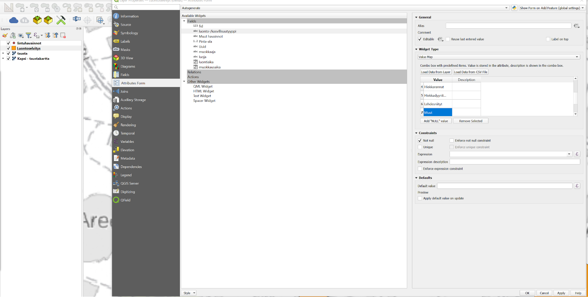
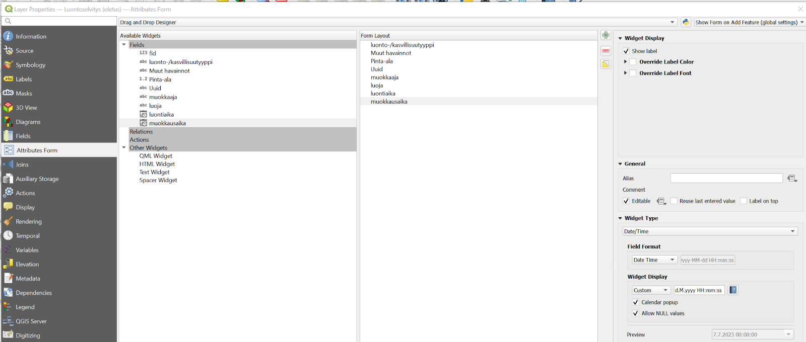
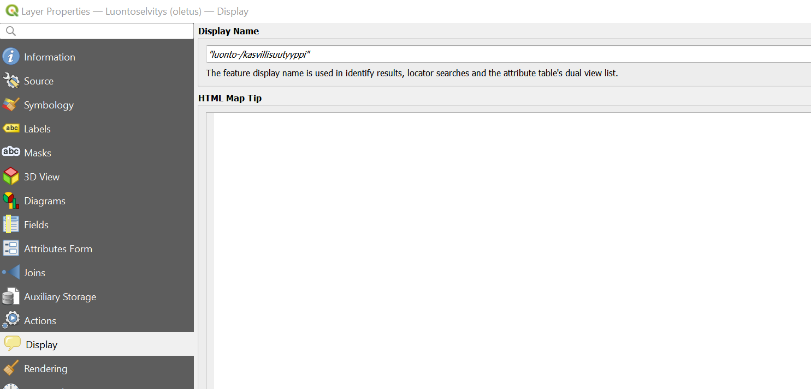
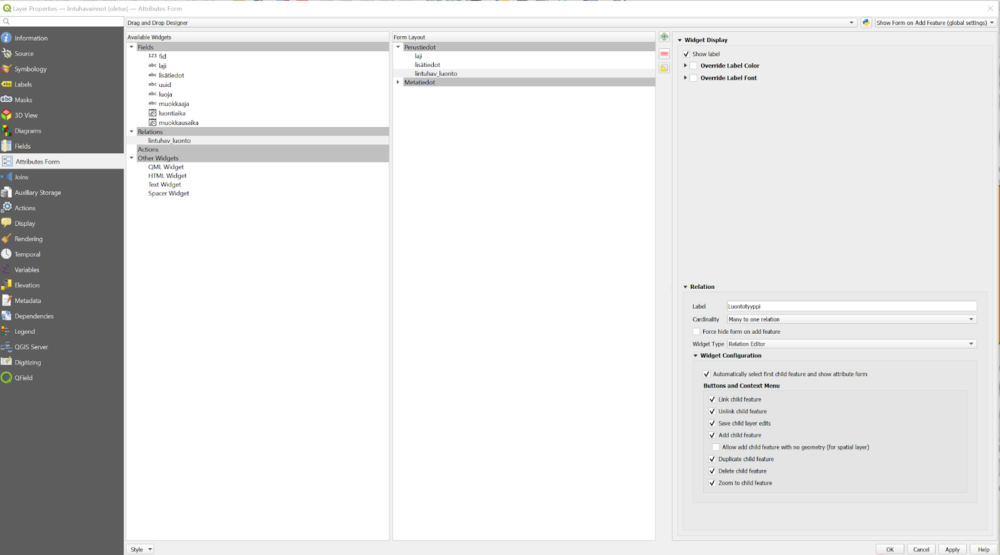
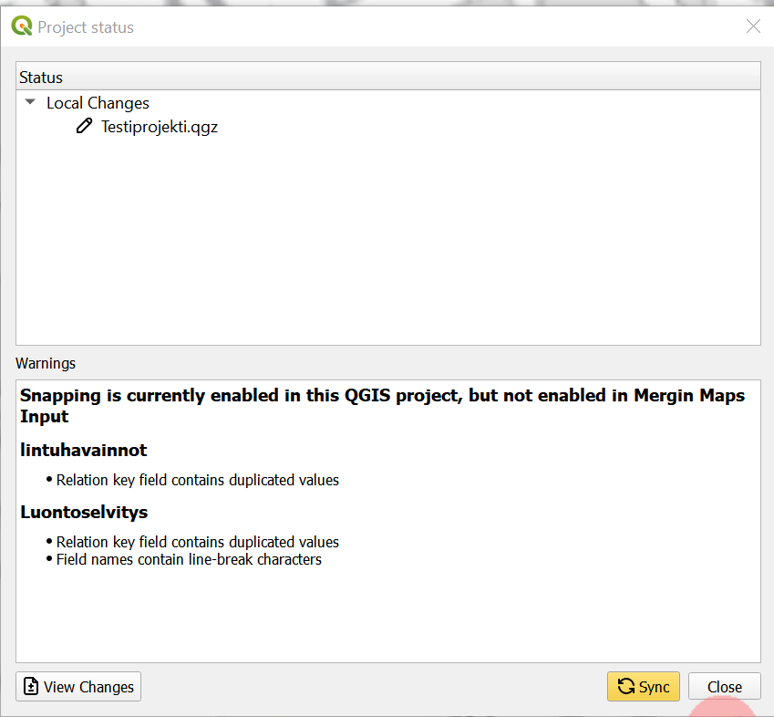
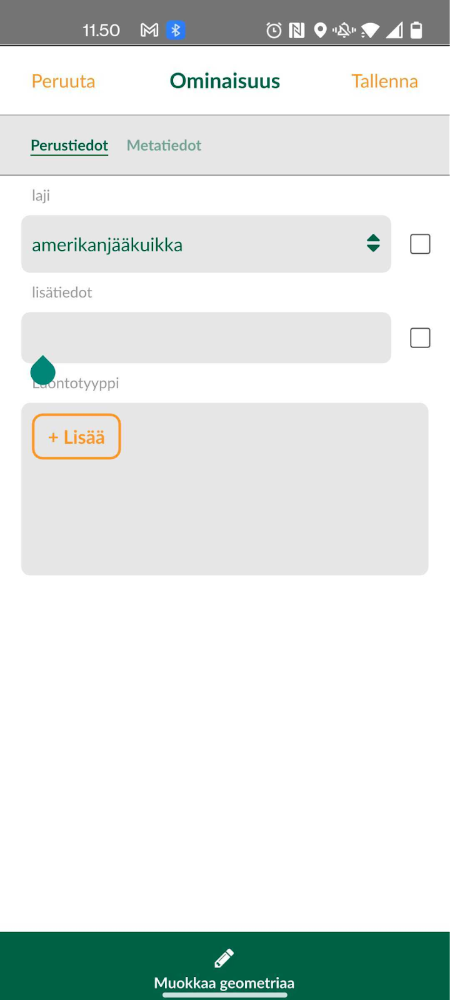
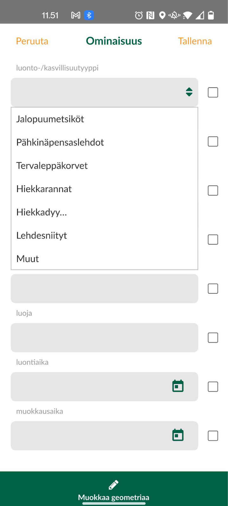

# **Harjoitus 4: Relaatioiden käyttö**

**Harjoituksen sisältö**

Harjoituksessa luodaan QGIS-projektiin relaatio, jonka avulla kerättäviin lintuhavainnot-tason kohteisiin lisätään tietoa ympäröivästä luontotyypistä. Tasojen välille luodaan relaatio, jonka avulla kyseinen vanhempi-lapsi-suhde saadaan rakennettua kohteille.

**Harjoituksen tavoite**

Koulutettava oppii määrittelemään relaatioita tasojen välille QGISin projektin asetuksia käyttäen ja ottamaan tässä huomioon Mergin Mapsin ja mobiilikeruun ominaispiirteet.

**Arvioitu kesto**

30 min.

## **Valmistautuminen**

Avaa QGIS tietokoneellasi ja avaa siellä aiemmin luomasi QGIS-projekti (**Projekti \> Avaa**), siirry oikeaan kansioon, valitse projektitiedosto (**"MerginMaps-kurssiprojekti tai vastaava")** ja paina **Avaa**.

## **Kasvualusta-taso**

Äskeisessä harjoituksessa jalostimme lintuhavainnot tason attribuuttitiedot varsin pitkälle. Hyödynnetään nyt Luontoselvitys-tasoa relaation muodostamisessa. Relaation muodostaminen mahdollistaa lintuhavainnon yhteydessä lisätä myös havaintopaikan luontotyypin/kasvillisuustyypin, joka tallentuu toiselle tasolle samasta kohteesta.

Ennen relaation luomista tehdään Luontoselvitys-tasolle muutama ennalta määritetty luontotyyppi. Luodaan lista muutamista luonnonsuojelulaissa määritetyistä luontotyypeistä, jotka voisivat ilmetä kyseisellä alueella. tehdään Luontoselvitys-tason attribuuttilomakkeella tasolle "luonto-/kasvillisuustyyppi" listaus valitsemalla widget-tyypiksi "Value map" ja lisätään arvot:

- Jalopuumetsiköt

- Pähkinäpensaslehdot

- Tervaleppäkorvet

- Hiekkarannat

- Hiekkadyynit

- Lehdesniityt

- Muut

Paina OK.

## **Relaatioiden luonti**

Mene QGISin päävalikosta **Projekti** \> **Ominaisuudet...** välilehdelle **Relaatiot** ja luo siellä relaatio kohdasta **Lisää relaatio** (vihreästä plus-kuvake). Anna relaatiolle kuvaava nimi, esimerkiksi lintuhav_luonto ja seuraavat kuvanmukaiset asetukset:

-   Referenced layer (parent): Lintuhavainnot

-   Referenced field: uuid

-   Referencing layer (child): Luontoselvitys

-   Referencing field: luonto-/kasvillisuustyyppi

-   Relationship strength: Association

Paina OK ja uudelleen OK sulkeaksesi projektin ominaisuudet saattaaksesi asetukset voimaan.

## **Lomakkeen asetusten määrittäminen**

Määritetään nyt miten Lintuhavainnot kohteisiin liitettävien luontotyyppi-tason tiedot syötetään. Klikkaa siis QGISissa Luontoselvitys-tason kohdalta hiiren oikealla näppäimellä ja valitse **Ominaisuudet...** ja sieltä **Attribuuttilomake**-välilehti. Valitseylhäältä pudotusvalikosta **Drag and Drop Designer** (suom. Raahaa ja pudota -muokkain). Muokkaa lomaketta siten, että Lomakenäkymä-kohtaan tulee vain kuvassa näkyvät kentät. Näiden kenttien syöttötavat ovat hyvin samantapaisia kuin ne, joita olemme käsitelleet jo aikaisemmin.

Lisätään luontyypeille tunniste Mergin Mapsin kohdelistausta varten. Mene siis vielä Tason ominaisuudet -ikkunassa Näyttö-välilehdelle, ja kirjoita näyttönimeksi "luonto-/kasvillisuutyyppi". Katso alla olevasta kuvasta mallia. Paina tämän jälkeen OK.

Lisätään **Lintuhav_luonto**-relaatio vielä **Lintuhavainnot**-attribuuttilomakkeeseen kuvan mukaisesti. Eli avaa Puut-tason ominaisuudet ja raahaa Attribuuttilomake-välilehden Drag and Drop Designer -näkymässä käytettävissä olevista widgeteistä lomakenäkymä-sarakkeen perustieto-välilehden viimeiseksi kentäksi:

Paina lopuksi OK. Tallenna myös projekti (**Projekti \> Tallenna**). Pakkaa ja synkronoi muokattu projektitiedosto jälleen Mergin Maps -lisäosalla. Katso tehdyt muutokset ja kuittaa OK. Kun olet valmis, tallenna projektitiedosto kurssihakemistoon pikanäppäimellä **CTRL + T** tai päävalikosta **Projekti \> Tallenna**.

## **Lapsikohteiden luominen Mergin Mapsissa**

Avaa jälleen kurssiprojekti viimeisine muutoksineen puhelimen Mergin Mapsissa. Luodaan nyt Lintuhavainnot-tasolle uusi kohde, jolle lisätään lapsikohteena tietoa luontotyypistä. Aktivoi digitointitila ja valitse Lintuhavainnot-taso. Digitoi tasolle uusi piste. Attribuuttilomakkeen ilmestyessä huomaat, että perustiedot-välilehdelle on ilmestynyt **Luontotyyppi**-valinta, joka on mahdollista aktivoida täytettyäsi vaadittavat tiedot Lintuhavainnot-tasolle lisättävästä kohteesta. Täytä tarvittavat tiedot, ja lisää digitoimallesi havainnolle sen luontotyyppi/-tyypit.

\

::: hintbox
Psst! Koulutuksen jälkeen saat henkilökohtaista tukea Gispon tukipalvelusta. Lähetä kysymyksesi tai kommenttisi osoitteeseen koulutustuki\@gispo.fi!
:::
