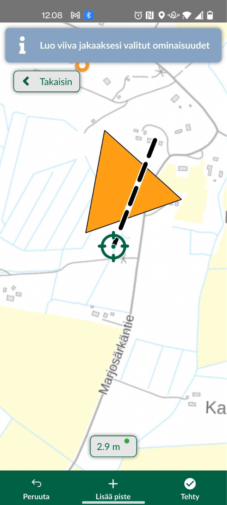

# **Harjoitus 5: Lisäominaisuudet ja kenttätyö**

**Harjoituksen sisältö**

Harjoituksessa syvennytään Mergin Mapsin edistyneempiin ominaisuuksiin, joita ei vielä ole käsitelty ja jotka voivat olla hyödyllisiä paikkatietojen mobiilikeruun tehostamiseksi käytännössä.

**Harjoituksen tavoite**

Kouluttautuja oppii käyttämään etenkin mobiililaitteen paikannusta mobiilikeruun tehostamiseksi Mergin Mapsin kanssa toimiessa.

**Arvioitu kesto**

30 min.

## **Valmistautuminen**

Avaa Mergin Maps ja klikkaa sen etusivulta viimeisin versio Mergin Maps -kurssiprojektista. Tämän harjoituksen aikana helpottaa, jos pystyt hieman liikkumaan lähiympäristössä. Varaudu siis tarvittaessa käymään lyhyesti ulkona.

## **Laitteen paikannuksen käyttäminen**

Kun paikannus laitteen GPS:llä on sallittu, pystyy kartan keskittämään omaan sijaintiin oikean alareunan paikannus-napilla. Tätä voi hyödyntää myös lisättäessä tasoille uusia kohteita. Kun digitointi-tila on päällä, GPS-nappi työtilan vasempaan alakulmaan. Asetukset-välilehdeltä voi paikannuksen myös kiinnittää sijaintiin "Seuraa GPS-sijaintia kartalla" -painikkeella.

Testaa nyt paikannuksen käyttöä, jotta niiden sujuva käyttö onnistuu. Käytön toteamiseksi joutunet liikkumaan hieman esimerkiksi ulkona rakennuksesta tms. Voit käyttää tähän n. 5 minuuttia.

## **Edistyneemmät digitointityökalut**

Edellä käsitellyn jäljitystoiminnon lisäksi, Mergin Mapsissa on mukana useita QGISista tuttuja toiminnallisuuksia, jotka ovat hyödyllisiä etenkin viiva- ja monikulmiotasoja editoidessa: tarttuminen, topologinen editointi, taitepistetyökalu sekä halkaisu-, uudelleenmuotoilu- ja Täytä piiri -työkalut. Tutustutaan nyt näistä yleisempiin.

## **Tarttuminen sekä topologinen editointi**

Määritimme harjoituksessa 3 QGIS-projektissa tarttumisen asetukset (etäisyys 15 px jne.). Nämä asetukset ovat tulevat nyt voimaan suoraan Mergin Mapsissa. Avaa siis Mergin Mapsissa valikko, laita editointi-moodi päälle ja Luontoselvitys-taso aktiiviseksi. Aloita digitoimaan Alueet-tasolle monikulmiokohdetta. Lisää siis tarvittavat taitepisteet aluemaiselle kohteelle oikean alakulman "Lisää"-symbolista. Kun tarvittavat kulmapisteet on lisätty, klikkaa viereisestä Valmis-painikkeesta ja lisää ominaisuustiedot kohteelle.

## **Taitepiste- ja halkaisutyökalut**

Luotujen kohteiden geometriaa pystyy jälkikäteen muokkaamaan edellä mainituilla työkaluilla. Nämä työkalut saat käyttöösi valitsemalla geometrian, jota haluat muokata, eli:

-   Klikkaamalla kohdetta kartalla ja painamalla kynä-symbolia ja alhaalta "muokkaa geometriaa"

-   Valitsemalla kohteen kohdelistasta ja klikkaamalla geometrian editoinnin kuvaketta aukeavan ikkunan yläpalkista (kynä ja viiva taitepisteineen)

Avaa jonkin tason muokkausvalikko ja klikkaa alhaalta "Edistynyt". Täällä pääset työkaluun "Jaa geometriat", jonka avulla pystyt jakamaan olemassa olevan tason useaan osaan. Lisää jakoviiva kahdella tai useammalla pistellä ja klikkaa "Tehty".

## **Lyhyt ohjeistus kenttätöihin**

**Mistä ja miten?**

-   Liiku lähiympäristössä, riippuen siitä millainen ympäristö on.

-   Kulje digitoimallasi alueella ja digitoi vaikka lintuhavainto tai luontotyyppi jokaisesta erillisestä puistikosta tai aiemmin muodostamiesi alueiden sisältä.

**Mitä kaikkea kerätään?**

-   Tietoa havainnoista ja luontotyypeistä

-   Täytä eri ominaisuustiedot: ominaisuustietolista, valokuva, muut huomiot...

-   Kuljettu reitti, eli **aseta seuranta** aluksi lähtöpisteessäsi Luontotyyppi-tasolle

**Kesto ja muita huomioita?**

-   n. 30 min, tai esimerkiksi n. 10 kerättyä kohdetta

-   Kiinnitetään huomiota mobiilikeruun tehokkuuteen. Montako kohdetta voisi kerätä esim. tunnissa?

-   Voisiko joitakin tietojen syöttötapoja käyttää tehokkaammin?

\
